Siin on tõlge eesti keelde, säilitades kogu Markdown-formaadi, logid, URL-id ja jättes alles professionaalse tooni IT-õppijatele:

# 🔍 Sissejuhatus logimisesse, seiresse ja vaatlusesse

> 💡 "Kaasaegses IT-maailmas ei ole süsteemi tervise pimeduses olemine valik"

## 📚 Sisukord

- [Mis on logimine?](#mis-on-logimine)
- [Mis on seire?](#mis-on-seire)
- [Mis on vaatlus?](#mis-on-vaatlus)
- [Mis on jälgimine?](#mis-on-jalgimine)
- [Logimise ja seire tähtsus](#logimise-ja-seire-tahtsus)
- [Ajalugu ja areng](#logimise-ja-seire-evolutsioon)
- [Logihalduse protsessid](#praktiline-rakendamine)
- [Linuxi logimise tööriistad](#vaatluse-tooriistad)
- [Seire ja vaatluse tööriistad](#vaatluse-tooriistad)

---

# 🌟 Sissejuhatus

Logimine, seire ja vaatlus on hädavajalikud praktikad kaasaegses IT-s, küberturvalisuses ja süsteemide haldamises. Need kontseptsioonid moodustavad turvaliste, töökindlate ja tõhusate süsteemide aluse.

## 📝 Mis on logimine?

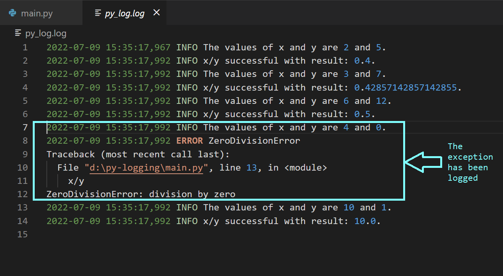

Logimine on süsteemis toimuvate sündmuste salvestamise protsess. Mõelge sellest kui oma süsteemi päevikust - salvestades kõike kasutajate sisselogimistest süsteemi vigadeni ja turvanõrkusteni.

### 🎯 Logimise eesmärk

**1. Süsteemi seire**
- Reaalajas ülevaade süsteemi käitumisest
- Liiklusvoogude tuvastamine
- Teenuste tõrgete tuvastamine
- Jõudluse jälgimine

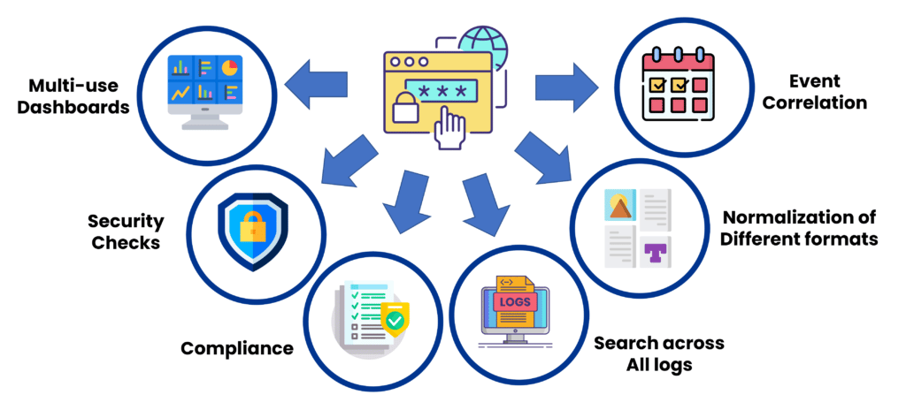

**2. Veaotsing**
- Loob detailsed sündmuste ajateljed
- Aitab probleeme diagnoosida
- Salvestab veateated
- Võimaldab kiiret probleemide lahendamist

**3. Auditeerimine**
- Tagab vastavuse (GDPR, HIPAA)
- Säilitab kontrollimise kirjed
- Jälgib kasutajate tegevusi
- Dokumenteerib süsteemi muudatused

**4. Turvalisus**
- Tuvastab volitamata juurdepääsu
- Jälgib kahtlast tegevust
- Jälgib sisselogimiskatseid
- Hoiatab potentsiaalsete ohtude eest

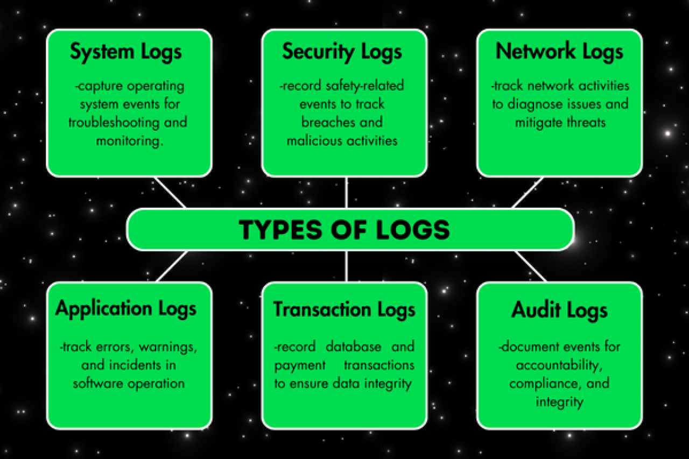

### ✨ Logimise näited

1. **Veebiserveri logid** 🌐
Salvestavad iga veebiserveri päringu, sealhulgas üksikasjad nagu kliendi IP-aadress, taotletud URL ja vastuse olek.
   - Kliendi IP-aadressid
   - Taotletud URL-id
   - Vastuse olekukoodid
   - Juurdepääsu ajatemplid

2. **Rakenduse logid** 💻
Talletavad tarkvara poolt genereeritud sündmusi, nagu kasutajate tegevused, süsteemivead või tehingute üksikasjad, pakkudes ülevaadet rakenduse toimimisest.
   - Kasutajate tegevused
   - Süsteemivead
   - Tehingute üksikasjad
   - Jõudlusmõõdikud

3. **Turvalogid** 🔐
Jälgivad süsteemi turvalisusega seotud tegevusi, sealhulgas ebaõnnestunud sisselogimiskatseid, kasutajaõiguste muudatusi ja tulemüüri aktiivsust.
   - Sisselogimiskatsed
   - Õiguste muudatused
   - Tulemüüri tegevused
   - Turvahoiatused

### 🎓 Parimad tavad logimises

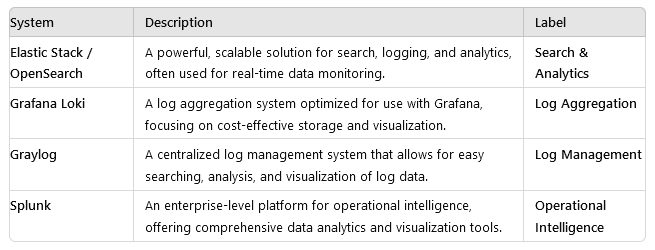

**1. Tsentraliseeritud logimine**
Selle asemel, et logid oleksid hajutatud erinevate süsteemide vahel, tsentraliseerige need ühte asukohta. See muudab nende otsimise, analüüsimise ja haldamise lihtsamaks.
- ✅ Üks asukoht kõikidele logidele
- ✅ Lihtsam otsing ja analüüs
- ✅ Lihtsustatud haldamine
- ✅ Parem turvalisuse kontroll

**2. Logide rotatsioon ja säilitamine**
Logid võivad kiiresti kasvada, seega on oluline rakendada logide rotatsiooni põhimõtteid vanade logide arhiveerimiseks ja ruumi vabastamiseks. Veenduge, et olulised logid säilitatakse sobiva perioodi jooksul, eriti vastavuse eesmärkidel.
- 🔄 Automaatne arhiveerimine
- 📊 Ruumi haldamine
- 💾 Vastavuse järgimine
- 🗑️ Selged kustutamise põhimõtted

**3. Logiformaadi standardiseerimine**
Standardiseeritud logiformaadi kasutamine tagab järjepidevuse, muutes logide analüüsimise ja töötlemise lihtsamaks erinevate süsteemide vahel.
- 📝 Järjepidev struktuur
- 🔍 Lihtne töötlemine
- 📈 Parem analüüs
- 🔧 Lihtsustatud hooldus

### ⚠️ Levinud ohukohad, mida vältida
1. Ebajärjepidevad logiformaadid
2. Oluliste sündmuste puudumine
3. Ebapiisavad säilitamispoliitikad
4. Kehv otsitavus

### 💡 Professionaalsed näpunäited
- Lisage alati ajatemplid standardformaadis
- Logige asjakohast konteksti, mitte ainult sündmusi
- Rakendage korralik logide rotatsioon
- Kaitske tundlikke logiandmeid

# 📊 Mis on seire?

> 💡 "Seire on nagu tervisekontroll kogu teie IT-süsteemile"

Mõelge seirest kui süsteemi elutähtsate näitajate monitorist - pidevalt jälgides jõudlust, kättesaadavust ja üldist tervist.
Seire hõlmab süsteemi jõudluse, kättesaadavuse ja üldise tervise pidevat jälgimist. Erinevalt logimisest, mis salvestab diskreetseid sündmusi, keskendub seire mõõdikutele ja näitajatele, mis peegeldavad süsteemi töökorda ajas.

### Miks seire on oluline

**Tehnoloogia kontrolli all hoidmine:**
Kujutage ette, et käitate mänguserverit või äpplikatsiooni sõpradele. Seire aitab märgata probleeme enne, kui need kontrolli alt väljuvad. See on nagu kuues meel teie süsteemi tervise jaoks! Jälgides selliseid aspekte nagu CPU kasutus, mälu ja võrguliiklus, saate varakult tuvastada anomaaliaid.

🕵️‍♂️ **Näide:** Teie serveri CPU läheb äkitselt ülekoormuse alla (võib-olla keegi püüab seda tahtlikult koormata või esineb viga). Seiretööriist annab teile märku enne, kui teie mäng hakkab viibima või kokku jookseb. Kriis on ära hoitud!

**Jõudluse parandamine:**
Seire annab teile kõik olulised andmed süsteemi toimimise kohta. See on nagu jõudlusnäitajate jälgimine - märkate trende, leiate nõrgad kohad ja aja jooksul parandate tulemusi. Kasutage seda teavet süsteemi jõudluse parandamiseks ja planeerige ressursse kõrgete koormuste aegadeks.

⚡ **Näide:** Aja jooksul märkate, et teie rakendus aeglustub iga reede õhtul. Seire näitab, et põhjuseks on kasutajate liikluse hüppeline tõus. Nüüd teate, et reedeti on vaja rohkem ressursse.

**Alati töökorras:**
Keegi ei taha tööseisaku ajal probleemidega tegeleda, eriti kui olulised protsessid on pooleli. Seire jälgib teie süsteeme ööpäevaringselt, et kui midagi juhtub, saate sellest kohe teada. Parandage probleem kiiresti ja jätkake töötamist.

🌐 **Näide:** E-kaubanduse veebisait võib seisakute ajal kaotada palju raha, samamoodi võib mänguserveri tõrge turniiri ajal kasutajaid frustreerida. Seire aitab seda vältida.

## 🎯 Olulised süsteemi mõõdikud

Süsteemi jälgimisel on vaja keskenduda kindlatele võtmekomponentidele, et tagada sujuv toimimine:

### 1. **Süsteemi elutähtsad näitajad**
Need on teie süsteemi südametöö, hingamine ja energiatase. Nende jälgimine näitab süsteemi üldist seisundit:

- **LoadAvg ja CPU kasutus**  
  CPU on süsteemi aju. LoadAvg ja CPU kasutuse näitajad näitavad, kui palju tööd CPU teeb. Kui see on pidevalt maksimumpiiri lähedal, võib see olla ülekoormatud ja vajada rohkem ressursse!

- **Mälu/ketta kasutus**  
  Mälu (RAM) on süsteemi lühiajaline mälu, ketas on pikaajaline salvestusruum. Kui üks neist on peaaegu täis, võib süsteem aeglustuda või isegi kokku joosta. Regulaarne kontroll aitab vältida "mälu otsas" probleeme.

- **Võrgu jõudlus (bps/pps)**  
  See näitab, kui kiiresti andmed süsteemi sisse ja välja liiguvad. Bitte sekundis (bps) ja pakette sekundis (pps) näitavad, kas teie võrk toimib sujuvalt või on "ummikus".

- **Ketta koormus**  
  See mõõdab, kui palju teie salvestusseadmed töötavad. Ülekoormuse korral võib esineda aeglasemat jõudlust või isegi rikkeid. Selle jälgimine aitab kaitsta teie faile ja rakendusi.

---

### 2. **Süsteemi tervise näitajad**
Need mõõdikud on regulaarsed kontrollid, et näha, kas süsteem "tunneb end hästi" ja töötab tõhusalt:

- **📝 Süsteemilogide "puhtus"**  
  Logid on nagu süsteemi päevik – need salvestavad kõik, mis kulisside taga toimub. Kui need on täis veateateid või hoiatusi, on see märk probleemist.  
  Olulised jälgitavad logid:  
  - `dmesg`: Kerneli logid – mis toimub süsteemi tuumas.  
  - `messages`: Üldised süsteemisündmused – nagu igapäevane päevik teie arvutile.

- **💾 Varunduse oleku asjakohasus**  
  Varukoopiad on teie turvavõrk. Nende oleku jälgimine tagab, et teil on oluliste andmete ajakohased koopiad. Kui midagi läheb valesti (näiteks riistvara rike), saate taastuda ilma oluliste andmete kaotuseta. Hoidke varukoopiad värskena ja kontrollige neid töökindluse tagamiseks!

Nende mõõdikute jälgimine ei aita ainult süsteemi töös hoida – see tagab, et süsteem on optimeeritud, turvaline ja valmis kõigeks.

## 🔍 Seire tüübid

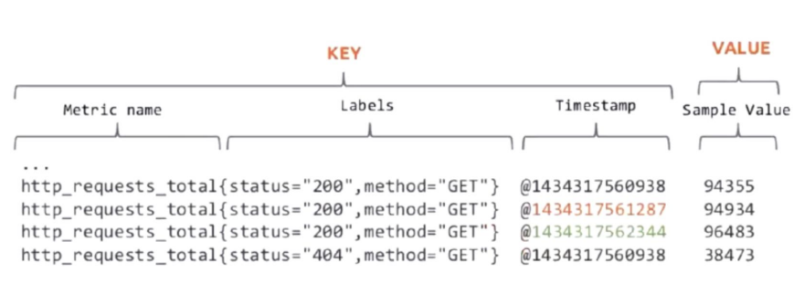

Seire ei ole universaalne lahendus; see on pigem tööriistakomplekt erinevate ülesannete jaoks. Järgnevalt ülevaade:

---

### 1. **Infrastruktuuri seire** 🏗️  
See on nagu hoone vundamendi ja ehituse kontrollimine – tagab, et süsteemi põhikomponendid on stabiilsed.  

- **Füüsilised komponendid**: Jälgib servereid, toiteallikaid ja jahutussüsteeme. Kas riistvara on liiga kuum? Kas ketas on riknemas? Jääge probleemidest sammu võrra ette!  
- **Virtuaalsed ressursid**: Jälgib virtuaalmasinaid (VM), konteinereid ja pilveteenuste instantse. Need on kaasaegsete süsteemide paindlikud ehitusblokid.  
- **Võrguseadmed**: Jälgib ruutereid, lüliteid ja modemeid. Kui tekib võrgu pudelikael, märkate seda siin.  
- **Salvestussüsteemid**: Tagab, et andmesalvestus ei saa täis ega esine jõudlusprobleeme.  

🛠️ **Miks see on oluline:** Infrastruktuuri seire aitab tuvastada riistvara või ressursside piiranguid enne, kui need süsteemi aeglustavad.

---

### 2. **Rakenduse jõudluse seire (APM)** 💻  
Teie rakendused on etenduse staarid ja APM tagab, et need toimiksid kasutajate jaoks parimal võimalikul viisil.  

- **Reageerimisajad**: Kui kiiresti reageerib teie rakendus kasutaja tegevustele? Aeglased reageerimisajad võivad põhjustada frustratsiooni ja kasutajate loobumist.  
- **Veamäärad**: Jälgib probleeme nagu ebaõnnestunud päringud või vead. Kõrged veamäärad on punased lipud, mis vajavad kiiret parandamist.  
- **Kasutaja rahulolu**: Mõõdab kasutajakogemusi, sageli selliste mõõdikute abil nagu Apdex (rakenduse jõudlusindeks). Õnnelikud kasutajad tähendavad edukat rakendust!  
- **Tehingute vood**: Visualiseerib andmete ja tegevuste liikumist läbi rakenduse, aidates tuvastada pudelikaelu.  

🎮 **Miks see on oluline:** APM aitab hoida rakendused sujuvad, kiired ja kasutajasõbralikud.

---

### 3. **Turvaseire** 🔐  
See on valvekoer, mis kaitseb teie süsteemi pahatahtliku tegevuse ja volitamata juurdepääsu eest.  

- **Sisselogimiskatsed**: Jälgib ebaõnnestunud ja õnnestunud sisselogimisi. Mitu ebaõnnestunud katset? Võib olla keegi püüab sisse murda.  
- **Juurdepääsukontroll**: Jälgib, kes ja millele ligi pääseb, tagades, et ainult volitatud kasutajad saavad läbi.  
- **Tulemüüri aktiivsus**: Jälgib blokeeritud või kahtlast võrguliiklust.  
- **Turvarikkumised**: Tuvastab anomaaliaid või rikkumisi reaalajas, et saaksite kiiresti reageerida ja kahju minimeerida.  

🛡️ **Miks see on oluline:** Pidevate küberühtude maailmas on turvaseire teie esimene kaitseliin.

---

Kombineerides neid seire tüüpe, saate tervikliku pildi oma süsteemi tervisest, jõudlusest ja turvalisusest. 

## 📈 Teenuse mõõdikute näide

### "Diagnostilise päringu" lähenemine
Mõelge sellest kui süsteemi tervisekontrollist:
- Kaasab enamik süsteemi komponente
- Mõõdab reageerimis-/töötlemisaega
- Jälgib päringuid ajaühikus
- Jälgib samaaegseid päringuid

### 🕒 "Mõõdik = Aegrida"

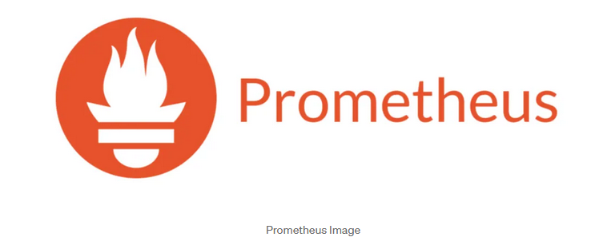

Mõõdikud on seiresüsteemide põhitoode ning neid jäädvustatakse sageli **aegridadena**. Mõelge aegridadest kui sündmuste ajateljest – iga andmepunkt jutustab loo sellest, mis konkreetsel hetkel toimub.

---

#### Mis teeb hea aegrea?

Et seire oleks tõhus, peaksid teie aegrea andmed täitma mõned võtmetingimused:

---

1. **Ajaline orientatsioon** ⏰  
   Aegrea andmed on seotud millegi toimumise ajaga, seega on ajatemplid olulised!  

   - **Igal andmepunktil on ajatempel:** See aitab mõista mitte ainult *mis* toimub, vaid ka *millal*.  
   - **Järjestikune salvestamine:** Andmed kogutakse järjekorras, mis muudab mustrite jälgimise lihtsamaks.  
   - **Nähtavad ajalised mustrid:** Sündmuste jada vaadates saate märgata trende, tippe või langusi mõõdikutes.  

   🕵️‍♂️ **Näide:** Kujutage ette, et teie rakenduse reageerimisaeg tõusis järsult eile kell 14. Ajatempel aitab tuvastada, millal probleem algas, et saaksite uurida selle põhjust.

---

2. **Ainult lisamine** ➕  
   Kui andmepunkt on lisatud, seda enam ei muudeta. See säilitab ajaloo analüüsimiseks.  

   - **Ajalugu säilitamine:** Saate tagasi vaadata ja analüüsida mineviku trende, et ennustada tulevast käitumist.  
   - **Trendide analüüs:** Tahate teada, kuidas teie süsteem toimis eelmise aasta pühadeliikluse ajal? Ainult lisatavatele andmetega on teil kogu ajalooline ülevaade käeulatuses.  

   🛠️ **Miks see on oluline:** Mõõdikud nagu CPU kasutus või veamäärad ajas näitavad, mis on teie süsteemi jaoks "normaalne" ja millal asjad tavapärasest kõrvale kalduvad.

---

3. **Värske andmete fookus** 🆕  
   Kuigi ajalugu on kasulik, on seire kõige tõhusam, kui see prioriseerib olevikku.  

   - **Prioriseerib värsket teavet:** Reaalajas andmed hoiavad teid kursis sellega, mis toimub *praegu*.  
   - **Reaalajas analüüs:** Kohene ülevaade võimaldab tuvastada ja lahendada probleeme kohe, kui need ilmnevad.  
   - **Kiire reageerimise võimekus:** Kas saite hoiatuse äkilisest serveri tõrkest? Värsked andmed aitavad kiiresti reageerida.  

   🚀 **Näide:** Kui jälgite sisselogimiskatseid, on praeguse hetke ebaõnnestunud katsete järsk tõus palju kasulikum info kui sama märkamine tunde hiljem.

---

### Aegrea visualiseerimine

Aegrea andmete mõistmiseks on visualiseerimistööriistad hädavajalikud.  

- 📊 **Graafikud ja juhtpaneelid:** Näitavad selgelt mustreid, trende ja anomaaliaid.  
- 🔍 **Suurendamine või vähendamine:** Süvenege konkreetsetesse ajaperioodidesse või saage ülevaade üldisest jõudlusest.  

Heade aegrea andmete ja õigete tööriistadega olete alati sammu võrra ees oma süsteemi mõistmises ja haldamises. 🕒✨

## 🛠️ Seire tööriistad

Seire tööriistad on teie usaldusväärsed kaaslased süsteemide tervise ja jõudluse jälgimisel. Igal tööriistal on unikaalsed tugevused, seega õige valiku tegemine sõltub teie vajadustest. Vaatame lähemalt mõnda populaarset valikut:

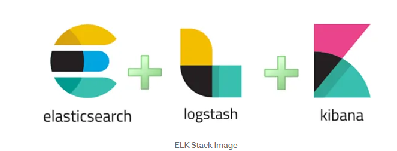

---

### Populaarsete tööriistade võrdlus  

| **Tööriist**    | **Parim kasutus**     | **Põhiomadused**                                          |
|-----------------|----------------------|-----------------------------------------------------------|
| **Nagios**      | **Infrastruktuur**   | Usaldusväärne ja töökindel, ideaalne serverite, võrguseadmete ja rakenduste jälgimiseks. Klassikaline ja laialt kasutatav. |
| **Zabbix**      | **Ettevõtted**       | Kõik-ühes seire lahendus tugeva toega kohandatud integratsioonidele ja elegantse kasutajaliidesega. Skaleerub hästi suurte organisatsioonide jaoks. |
| **Prometheus**  | **Pilvetehnoloogiad**| Loodud pilvekeskkondade jaoks, silmapaistev aegrea andmete kogumisel, paindlikul päringul ja teavitamisel. Populaarne Kubernetesega koos kasutamiseks. |
| **Grafana**     | **Visualiseerimine** | Muudab toorandmed uskumatuteks juhtpaneelideks, integreerub sujuvalt Prometheuse, InfluxDB ja teistega. Ideaalne trendide jälgimiseks ja silmapaistvate aruannete loomiseks. |

---
### Tööriistade esiletõstmised  

- **Nagios:**  
  Nagios on seire tööriistade vanaisaks. See on eksisteerinud kaua ja sobib suurepäraselt süsteemi töökindluse ja tervise jälgimiseks. Kuigi selle liides on pisut vanamoeline, muudavad selle usaldusväärsus ja lihtsus selle infrastruktuuri seireks heaks valikuks.  

- **Zabbix:**  
  Zabbix paistab silma oma võimsate ettevõttetaseme funktsioonidega. See suudab hakkama saada kõigega alates rakenduse seirest kuni võrguseadmete jälgimiseni, kõik ühes kohas. Eelehitatud mallid ja integratsioonid muudavad seadistamise kiireks ja lihtsaks.  

- **Prometheus:**  
  Loodud modernsete, dünaamiliste keskkondade jaoks, spetsialiseerub Prometheus aegrea andmetele ja on silmapaistev pilvetehnoloogia lahendustes. Kui töötate Kubernetese või mikroteenustega, on Prometheus tööriist, mida kasutada mõõdikute kogumiseks ja hoiatuste saatmiseks, kui midagi valesti läheb.  

- **Grafana:**  
  Grafana ei kogu andmeid, kuid särab visualiseerimisplatvormina. See võtab andmed tööriistadest nagu Prometheus või InfluxDB ning muudab need juhtpaneelideks, mis on mitte ainult funktsionaalsed, vaid ka ilusad. Alates jõudluse jälgimisest kuni trendide prognoosimiseni on Grafana täiuslik viis andmete tähenduslikuks muutmiseks.  

---

### 🚨 Teavitusmeetodid

Tõhus teavitamine on seiresüsteemide süda – oluline on tagada, et teid teavitatakse õigel ajal ja õigel viisil. Euroopas arvestab teavitamine sageli piirkondlike eripäradega, nagu vastavus GDPR-ile ja konkreetsete tööriistade kättesaadavus.

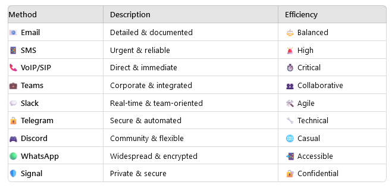

---

## ✅ Parimad tavad seires

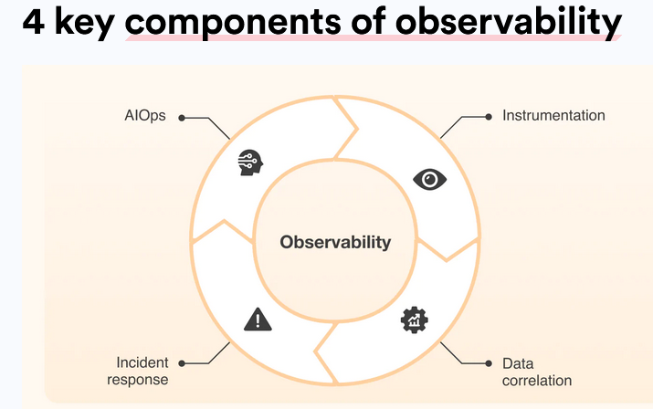

Hea seire ei seisne ainult tööriistades ja mõõdikutes – see tähendab nende *õiget* kasutamist. Siin on juhised, kuidas seadistada seiresüsteem, mis on arukas, tõhus ja jätkusuutlik:

---

### 1. **Selged mõõdikud ja hoiatused**  
- **Määratlege konkreetsed künnised:** Vältige ebamääraseid hoiatusi nagu "CPU kõrge" – olge täpne (nt "CPU kasutus > 80% 5 minuti jooksul").  
- **Seadke tähendusrikkad hoiatused:** Keskenduge sellele, mis on tõeliselt oluline – teavitage ainult probleemidest, mis vajavad tegevust.  
- **Vältige hoiatuste väsimust:** Liiga palju hoiatusi võib teie meeskonna üle koormata, põhjustades kriitiliste hoiatuste märkamata jätmist. Prioriseerige tõsiduse järgi ja summutage vähemolulised.  
- **Dokumenteerige hoiatuste reaktsioonid:** Iga hoiatuse jaoks veenduge, et on olemas selge juhend, kuidas probleemi uurida ja lahendada.  

💡 **Professionaalne nõuanne:** Kasutage hoiatuste eskalatsiooni – alustage madala prioriteediga hoiatustest ja eskaleerige ainult siis, kui probleemi ei lahendata.

---

### 2. **Regulaarne ülevaatusprotsess**  
Seire ei ole "sea ja unusta". Peate pidevalt parendama:  

- **Analüüsige seireandmeid:** Kasutage ajaloolisi trende oma seadistuse täiustamiseks ja potentsiaalsete probleemide ennustamiseks.  
- **Kohandage künniseid vastavalt vajadusele:** Kui süsteem muutub, võivad ka künnised vajada muutmist.  
- **Uuendage seirereegleid:** Lisage uusi mõõdikuid või loobuge iganenutest, et püsida asjakohane.  
- **Kontrollige hoiatuste tõhusust:** Testiga hoiatusi, et tagada nende käivitumine vajalikul hetkel ja kriitiliste stsenaariumide märkamine.  

📈 **Näide:** Kui liikluspiik põhjustab valehäireid, muutke künniseid või lisage tingimusi, et vähendada ebavajalikku müra.

---

### 3. **Integratsiooni parimad tavad**  
Muutke seire oma töövoo sujuvaks osaks:  

- **Ühendage intsidendihaldusega:** Integreerige tööriistadega nagu PagerDuty, Opsgenie või Slack reaalajas hoiatuste ja koostöö jaoks.  
- **Looge selged töövood:** Määratlege, kes millega tegeleb, kui hoiatus käivitub – ei mingit aimamist!  
- **Automatiseerige levinud reaktsioonid:** Korduvate probleemide puhul (nt teenuse taaskäivitamine) automatiseerige vastused aja säästmiseks.  
- **Dokumenteerige protseduurid:** Looge käsiraamatud levinud intsidentide jaoks lahenduste kiirendamiseks.

🤖 **Professionaalne nõuanne:** Kasutage veebikonkse või API-sid, et käivitada automatiseeritud tegevusi otse hoiatustest.

---

### ⚠️ Levinud seire probleemid  

Vältige neid tavalisi lõkse, mis võivad teie seiresüsteemi nõrgestada:  

Jätkan tõlke teist osa:

1. **Liiga palju hoiatusi:** Meeskonna üleujutamine teavitustega viib tundlikkuse vähenemiseni ja kriitiliste probleemide märkamata jätmiseni.  
2. **Kehvad künnisseadistused:** Liiga tundlikud või liiga leebed künnised muudavad hoiatused tähendusetuks.  
3. **Oluliste mõõdikute puudumine:** Võtmenäitajate jälgimise puudumine võib jätta teid teadmatusse suurte probleemide suhtes.  
4. **Ebapiisav dokumentatsioon:** Ilma selgete juhisteta muutub hoiatustele reageerimine oletamiseks.

---

### 💡 Professionaalsed näpunäited seire edukuseks  

Siin on, kuidas viia oma seire järgmisele tasemele:  

1. **Alustage oluliste mõõdikutega:** Keskenduge CPU-le, mälule, kettale ja võrgu kasutusele — laiendage järk-järgult vastavalt vajadusele.  
2. **Ehitage järk-järgult:** Ärge proovige kõike korraga jälgida. Alustage põhiasjadest, seejärel lisage keerukust.  
3. **Dokumenteerige kõik:** Alates hoiatuste konfiguratsioonidest kuni veaotsingu sammudeni, hoidke selget ja ligipääsetavat dokumentatsiooni.  
4. **Regulaarsed ülevaatused ja uuendused:** Tehke seirest regulaarne tegevus, et tagada efektiivsus.  
5. **Koolitaga meeskonda:** Õpetage kõigile, kuidas hoiatustele reageerida, seiretööriistu kasutada ja järgida eskalatsiooni töövoogusid.

---

# 🔭 Mis on vaatlus?  

> 💡 "Vaatlus on nagu röntgennägemine teie süsteemi sisemiste tööprotsesside jälgimiseks."

Kui seire ütleb teile *mis toimub*, siis vaatlus aitab teil mõista *miks*. See on võime süveneda teie süsteemi väljunditesse — logid, mõõdikud ja jäljed — et avastada sisemist olekut ja lahendada probleeme kiiremini.

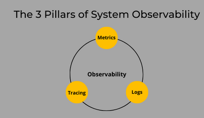

---

## 🎯 Põhikontseptsioon  

Vaatlus ei ole lihtsalt moesõna; see on seire evolutsioon. See pakub rikkalikku ülevaadet keerulistest süsteemidest nende väljundite analüüsimise kaudu. Mis teeb selle eriliseks:  

- **Logid** 📝: Talletavad sündmuste, vigade ja protsesside üksikasju.  
- **Mõõdikud** 📊: Pakuvad numbrilisi hetkvõtteid süsteemi jõudlusest ja tervisest.  
- **Jäljed** 🔍: Kaardistab päringute teekonda läbi teenuste, et avastada pudelikaelu ja sõltuvusi.  

Koos moodustavad need komponendid võimsa tööriistakomplekti süsteemide diagnoosimiseks ja parendamiseks.

---

## 🏗️ Vaatluse komponendid  

### 1. **Logid** 📝  
Logid on nagu teie süsteemi päevik — need talletavad üksikasjalikke sündmusi, mis aja jooksul toimuvad.  

- **Üksikasjalikud sündmuste kirjed:** Need ütlevad teile *mis* juhtus, *millal* ja *kus*.  
- **Kontekstuaalne teave:** Logid sisaldavad rikkalikke üksikasju nagu veakoodid, kasutaja ID-d või veaotsingud, mis aitavad probleeme lahendada.  
- **Ajatemplid ja järjestused:** Need võimaldavad jälgida sündmuste kulgu samm-sammult.  
- **Silumise teave:** Kui midagi läheb katki, on logid teie esimene peatus juurpõhjuse leidmiseks.

🛠️ **Näide:** Veebiserveri logi võib näidata, et konkreetne API kutsung ebaõnnestus puuduva autentimissalasõna tõttu.  

---

### 2. **Mõõdikud** 📊  
Mõõdikud pakuvad kvantifitseeritavat ülevaadet teie süsteemi jõudlusest ja ressursside kasutamisest.  

- **Kvantitatiivsed mõõtmised:** Jälgige CPU kasutust, mälu tarbimist, ketta I/O-d ja muud.  
- **Jõudlusnäitajad:** Mõõdikud nagu reageerimisaeg või läbilaskevõime näitavad, kui hästi teie süsteem toimib.  
- **Ressursside kasutamine:** Jälgige ressursside tarbimist, et vältida ülekoormust või alakasutust.  
- **Äri KPI-d:** Minge tehnikast kaugemale — jälgige selliseid mõõdikuid nagu kasutajate kaasatus või müük, et siduda süsteemi jõudlus äriliste eesmärkidega.

📈 **Näide:** Järsk tõus CPU kasutuses koos suurenenud lehelaadimisajaga viitab jõudluse pudelikaelale.  

---

### 3. **Jäljed** 🔍  
Jäljed jälgivad ühe päringu või tehingu teekonda läbi teie süsteemi, näidates, kuidas erinevad teenused omavahel suhtlevad.  

- **Päringute teekond:** Mõistke, kuidas andmed liiguvad kasutaja sisendist andmebaasi päringuteni ja tagasi.  
- **Teenuste suhtlus:** Näete, kuidas erinevad süsteemi komponendid omavahel suhtlevad.  
- **Jõudluse pudelikaelad:** Tuvastage viivitused või vead päringute teekonnal.  
- **Süsteemi sõltuvused:** Kaardistage, millised teenused üksteisest sõltuvad, aidates tuvastada järjestikuseid tõrkeid.

🔎 **Näide:** Jäljed võivad paljastada, et viivitus teie maksetöötlussüsteemis on tingitud aeglasest vastusest kolmanda osapoole API-lt.  

---

### 🌟 Miks vaatlus on oluline  

Tänapäeva keerukates, hajutatud süsteemides pole ainult seirest piisav. Vaatlus annab teile tööriistad:  

- Kiiresti probleeme lahendada selgete ülevaadete abil.  
- Mõista süsteemi käitumist, isegi ettearvamatutes stsenaariumites.  
- Optimeerida jõudlust ja parandada kasutajakogemust.  

Vaatlusega te mitte ainult ei jälgi oma süsteemi — vaid olete selle meister. 🚀

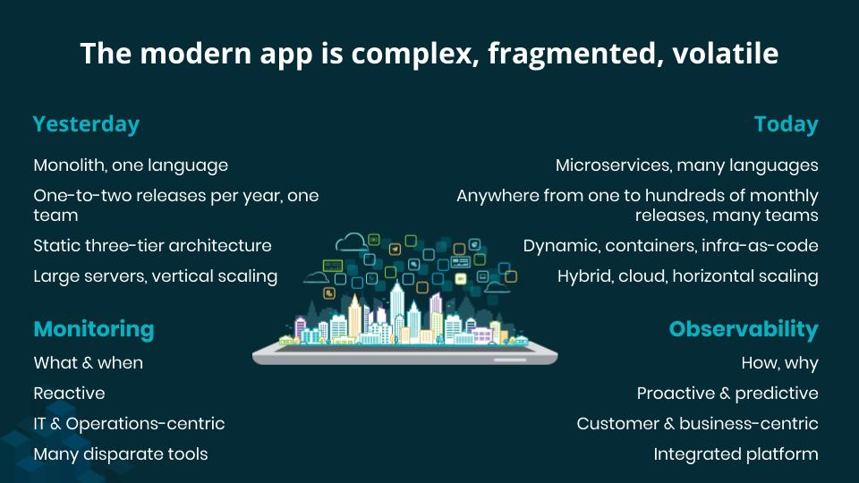

---

## 🌟 Roll kaasaegsetes süsteemides

### Keerukate süsteemide haldamine
Mõelge sellest kui GPS-st teie mikroteenuste jaoks:
- 🗺️ Kaardistab teenuste suhtluse
- 🔍 Jälgib päringute voogusid
- ⚡ Tuvastab pudelikaelu
- 🔧 Võimaldab kiireid parandusi

### Proaktiivne vs reaktiivne lähenemine

| Traditsiooniline seire | Kaasaegne vaatlus |
|----------------------|---------------------|
| Reageerib probleemidele | Hoiab probleeme ära |
| Piiratud nähtavus | Täielik süsteemi ülevaade |
| Fikseeritud juhtpaneelid | Dünaamiline uurimine |
| Teadaolevad tundmatud | Tundmatud tundmatud |

---

## 🛠️ Vaatluse tööriistad

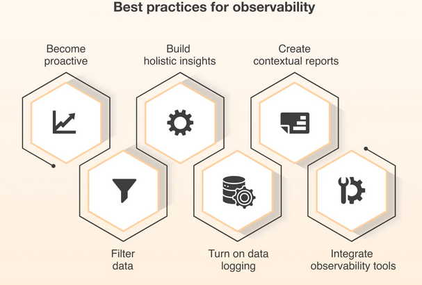

### Jälgimise tööriistad
1. **Jaeger** 
   - Hajutatud jälgimine
   - Jõudluse seire
   - Juurpõhjuse analüüs

2. **Zipkin**
   - Päringute voo jälgimine
   - Latentsuse analüüs
   - Teenuste sõltuvuste kaardistamine

### Integreeritud platvormid
1. **OpenTelemetry**
   - Standardne raamistik
   - Mitmed andmetüübid
   - Lihtne integreerimine

2. **Honeycomb & Datadog**
   - Laiahaardeline seire
   - Täiustatud analüütika
   - Reaalajas ülevaated

---

## ✅ Vaatluse parimad tavad

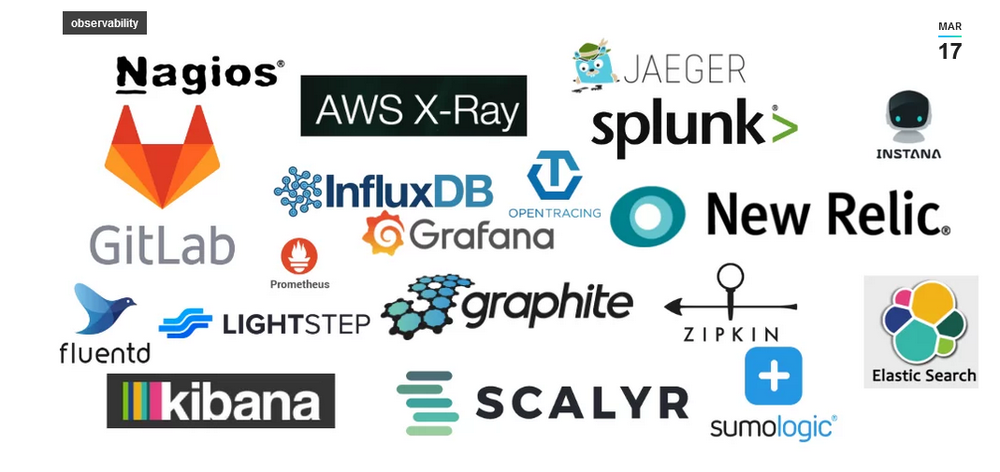

| **Kategooria**                | **Parimad tavad**                                                                                                                                             |
|------------------------------|-----------------------------------------------------------------------------------------------------------------------------------------------------------------|
| **1. Ühtne lähenemine**      | - 🔄 Integreerige kõik andmeallikad - 📊 Tagage järjepidev mõõdikute kogumine - 🔍 Kasutage standardiseeritud analüüsimeetodeid - 📱 Looge ühtne vaade süsteemi tervisele |
| **2. Keskendumine ärimõjule** | - 💼 Jälgige kriitilisi tehinguid - 📈 Jälgige kasutajakogemust - 💰 Mõõtke ärimõõdikuid - 🎯 Prioriseerige võtmeteenuseid                                  |
| **3. Pidev parendamine** | - 📝 Viige läbi regulaarseid ülevaatustsükleid - 🔄 Uuendage seirestrateegiad - 📊 Täiustage mõõdikute kogumist - 🎓 Pakkuge meeskonnale koolitust                           |

| **Levinud probleemkohad**          | **Professionaalsed näpunäited**                                                                                                                                                   |
|------------------------------|-----------------------------------------------------------------------------------------------------------------------------------------------------------------|
| 1. Tööriistade vohamine        | - Alustage äriliselt kriitiliste teedega                                                                                                                           |
| 2. Andmete eraldatus                | - Ehitage järk-järgult                                                                                                                                              |
| 3. Puuduv kontekst           | - Automatiseerige kus võimalik                                                                                                                                   |
| 4. Hoiatuste väsimus             | - Dokumenteerige kõik ja koolitaga oma meeskonda                                                                                                                      |

---

## 🔄 Praktiline rakendamine

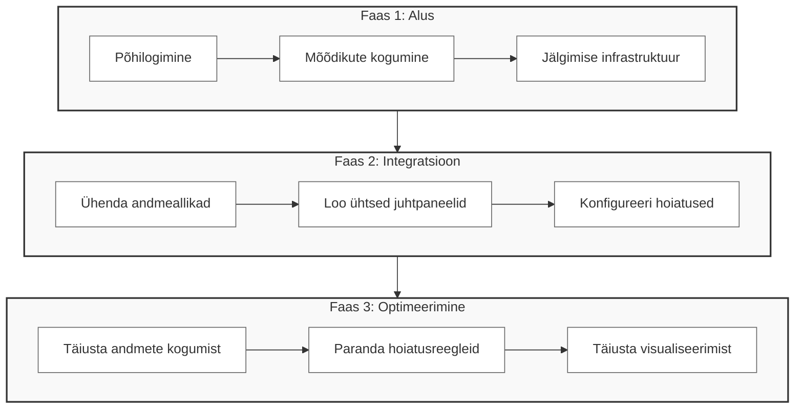

# 🔍 Mis on jälgimine?

> 💡 "Jälgimine on nagu GPS teie päringutele, kui need läbivad teie süsteemi"

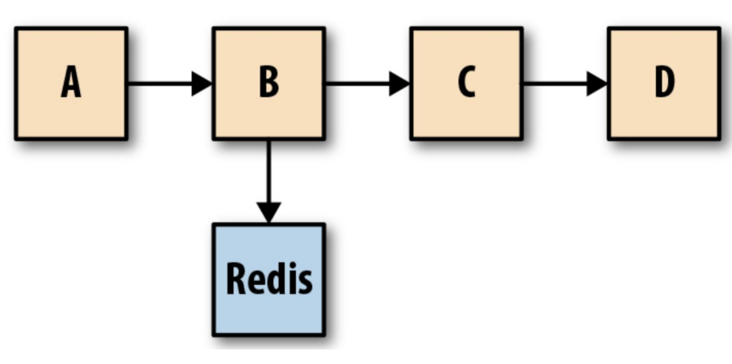

## 🎯 Põhieesmärk
Jälgimine (tracing) jälgib päringute liikumist läbi erinevate teenuste või komponentide hajutatud süsteemides, eriti mikroteenuste arhitektuurides.

---

| **Võtmevõime**        | **Kirjeldus**                                                                                                                                   |
|----------------------------|---------------------------------------------------------------------------------------------------------------------------------------------------|
| **1. Täitmisaja mõõtmine** ⏱️ | - Operatsiooni kestuse jälgimine - Aeglaste komponentide tuvastamine - Teenuse latentsuse mõõtmine - Jõudlustrendide jälgimine                              |
| **2. Päringute profileerimine** 📊  | - Päringumustrite analüüsimine - Ressursikasutuse mõõtmine - Kasutajateekondade jälgimine - Pudelikaelte tuvastamine                                           |
| **3. Sõltuvuste kaardistamine** 🗺️  | - Teenuste ühenduste avastamine - Päringuvoogude visualiseerimine - Süsteemiarhitektuuri mõistmine - Teenuste vahelise suhtluse jälgimine                        |
| **4. Jõudlusanalüüs** 📈 | - Süsteemi läbilaskevõime mõõtmine - Vastuse viivituste analüüsimine - Ressursikasutuse jälgimine - Süsteemi võimekuse jälgimine                                 |

---

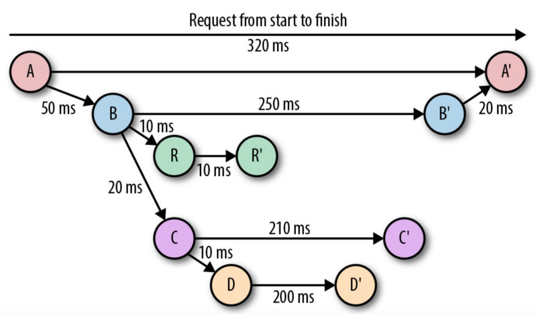

## 🛠️ Jälgimise tööriistad

---

| **Tööriist**           | **Omadused**                                                                                                  |
|---------------------|--------------------------------------------------------------------------------------------------------------|
| **1. Zipkin**       | - Hajutatud jälgimissüsteem - Päringuvoo visualiseerimine - Jõudlusanalüüs - Teenuste sõltuvuste kaardistamine |
| **2. Grafana Tempo** | - Skaleeritav jälgimise tagataust - Sujuv Grafana integratsioon - Kõrgjõudluslik disain - Lihtne visualiseerimine         |
| **3. OpenTelemetry** | - Avatud lähtekoodiga raamistik - Standardiseeritud instrumenteerimine - Tugi mitmetele programmeerimiskeeltele - Lihtne integreerimine       |

---

# 🚨 Logimise ja seire tähtsus

## Intsidentide haldamine

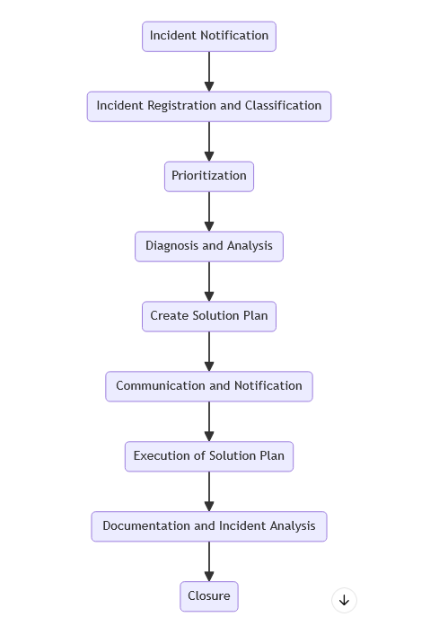

Kujutage ette, et teie rakendus jookseb kokku suure lansseerimise keskel. Mida teete? Just siin tuleb appi **intsidentide haldamine**!  

### **Võtmeisikud**  
Siin on meeskond, kelle kutsute tegevusse:  
- **Arendustiim:** Vigade parandamine professionaalselt.  
- **Käitusvõistkond:** Hoiab serverid töös nagu õlitatud masin.  
- **SRE spetsialistid:** Võlurid, kes tagavad, et süsteemid mitte ainult ei üle ela, vaid õitseksid.  
- **ITIL raamistik:** Mõelge sellest kui reeglistikust kaose haldamiseks.  

---

### **Professionaalsed näpunäited efektiivseks intsidentide haldamiseks**  
1. **Probleemide klassifitseerimine:** Kas tegemist on väikese vea või täiemahulise katkestusega? Teadke vahet.  
2. **Omage plaani:** Ärge sattuge paanikasse. Järgige eelkirjutatud reageerimissamme probleemide kiiremaks lahendamiseks.  
3. **Harjutamine teeb meistriks:** Regulaarsed õppused tagavad, et teie meeskond teab, mida teha tõelise kriisi korral.  
4. **Dokumenteerige kõik:** Hoidke juhtunust logid, et vigu mitte korrata.  

---

## 🔐 Turvalisus ja vastavus

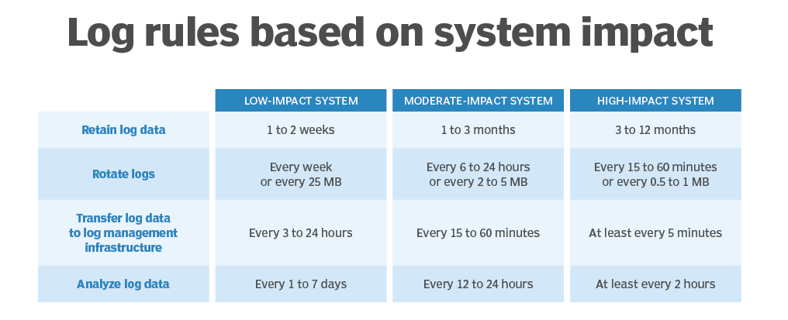

Kas olete kuulnud häkkeritest, kes püüavad süsteemidesse sisse murda? Teie seire tööriistad on nagu kindluse valvurid.  

### **Kuidas seire tuvastab halbu asju**  
- **Reaalajas jälgimine:** Nagu otseülekande turvakaamera teie süsteemi jaoks.  
- **Mustrite tuvastamine:** Märkate veidraid asju varakult (nt "Miks see IP üritab sisse logida 100 korda?").  
- **Anomaaliate tuvastamine:** Märkab, kui midagi tundub *vale* — nagu äkiline andmepiik.  
- **Ohtude hindamine:** Selgitab välja, kas tegemist on lihtsalt uudishimuliku lapsega või täiemahulise rünnakuga.  

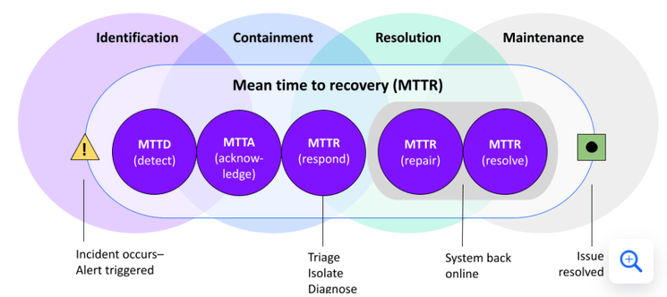

---

### **Kuidas vältida probleeme vastavusega**  
Valitsustel ja tööstustel on reeglid ning nende rikkumine võib põhjustada suuri probleeme.  

1. **Hoidke auditeerimise jälge:** Logid on nagu päevik toimunust — kes pääses millele ligi, millal ja miks.  
   - Kas keegi üritas sisse murda? Logid on teie toeks.  
   - Kas teie süsteem muutus? Teate, kes seda tegi.  

2. **Järgige reegleid:** Erinevatel piirkondadel ja tööstustel on ranged suunised, mida järgida:  
   - **GDPR:** Kaitseb kasutajate privaatsust Euroopas.  
   - **HIPAA:** Hoiab meditsiiniandmeid turvalisena.  
   - **SOX:** Tagab, et finantsaruanded oleksid korrektsed.  
   - **Tööstusreeglid:** Olenemata teie valdkonnast on tõenäoliselt olemas järgimist vajav reeglistik.

---

## 🔧 Kuidas professionaalselt probleeme lahendada  

Kui IT-s midagi katkeb, on veaotsing teie supervõime! Siin on, kuidas jõuda "Mis just juhtus?!" olukorrast "Kriis lahendatud!" olukorrani. 

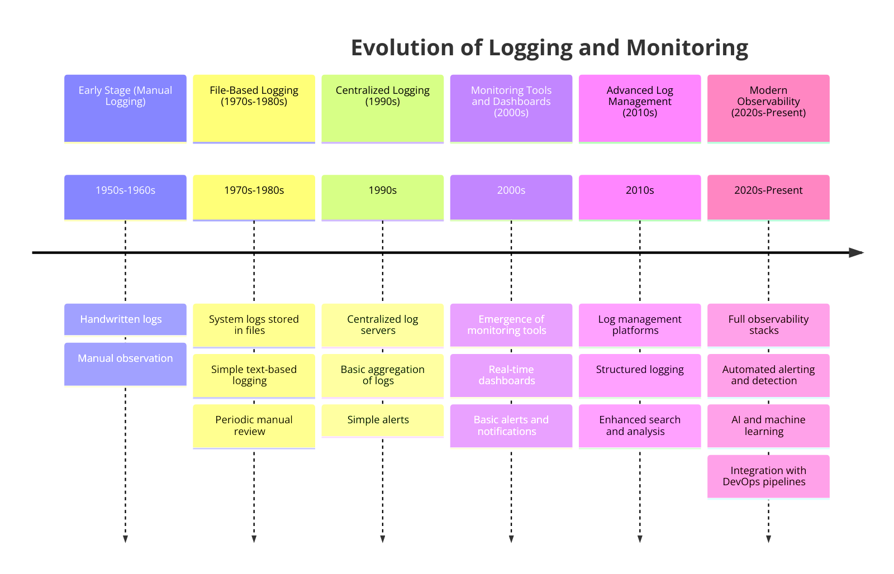

---

### **Teie 3-sammuline plaan päeva päästmiseks**  

#### **1. Esialgne detektiivitöö 🕵️‍♂️**  
Alustage vihjete kogumisega, nagu mõistatuse lahendamisel:  
- Tuvastage sümptomid — mis käitub veidralt?  
- Kontrollige logisid — need on nagu teie süsteemi päevik.  
- Süvenege seire juhtpaneelidesse reaalajas uuenduste saamiseks.  
- Vaadake üle hiljutised muudatused — kas keegi uuendas süsteemi või lisas uue funktsiooni?  

---

#### **2. Leidke juurpõhjus 🌟**  
Nüüd süvenege sügavamale, et avastada, mis läks valesti:  
- Otsige mustreid logides — kas samad vead korduvad?  
- Analüüsige mõõdikuid — kas CPU, mälu või võrgukasutus suurenes järsult?  
- Leidke seoseid — kas probleem algas pärast konkreetset sündmust?  
- Tuvastage päästikud — mis põhjustas rikke?  

---

#### **3. Lahendage ja kinnitage 🛠️**  
Aeg päev päästa:  
- Rakendage lahendused — taaskäivitage teenus, parandage viga või uuendage konfiguratsioone.  
- Testige veendumaks, et probleem on tõesti kadunud.  
- Kirjutage kõik üles — mis juhtus, kuidas te seda parandasite ja õppetunnid.  
- Uuendage protseduure, et vältida probleemi kordumist.  

---

### ⚠️ **Levinud takistused (ja kuidas neid ületada!)**  

1. **Puuduvad logid:** Logid pole korralikult seadistatud? Tunnete end pimedana.  
   💡 Professionaalne nõuanne: Konfigureerige alati üksikasjalikud logid.  
2. **Pole mõõdikuid:** Ilma seireta lendate ilma instrumentideta.  
   💡 Professionaalne nõuanne: Kasutage selliseid tööriistu nagu Grafana või Prometheus.  
3. **Kehv korrelatsioon:** Kui te ei suuda ühendada punkte, jääb teil suur pilt hoomamata.  
   💡 Professionaalne nõuanne: Kasutage juhtpaneele, mis näitavad mõõdikuid ja logisid koos.  
4. **Nõrk dokumentatsioon:** Märkmete puudumine = õppetundide puudumine.  
   💡 Professionaalne nõuanne: Kirjutage üles kõik, isegi väiksemad detailid!  

---

---

# 📚 Logimise ja seire evolutsioon  

> 💡 "Alustades lihtsatest tekstifailidest kuni võimsate tööriistadeni, mis tunduvad maagilised – logimine ja seire on läbinud pika tee."

---

## 🕰️ **Kunagi ammu: Seire varajased päevad**  

Enne kõiki neid uhkeid juhtpaneele ja reaalajas hoiatusi oli logimine ja seire nii lihtne kui võimalik.

### **Põhitööriistad ja lähenemised**  
- **Tekstilised logifailid:** Logid olid lihtsalt tekstifailid – ilma kaunistuste, visualiseerimiste, lihtsalt tavaline tekst.  
- **Põhilised süsteemikäsud:** Tööriistu nagu `tail` või `grep` kasutati logide läbikammimiseks rida-realt.  
- **Käsitsi ülevaatus:** Probleemide leidmine tähendas lõputut logides kerimist ja lootmist, et probleem silma hakkab.  
- **Piiratud seire:** Ei mingeid uhkeid graafikuid, ainult aeg-ajalt kontrolliti, et asjad poleks täiesti katki.  

---

### **Probleemid olid tõelised**  

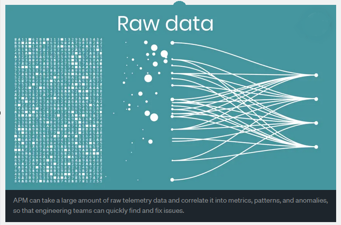

#### 🚫 **Suured probleemid varaste meetoditega:**  
1. **Käsitsi töö hullumeelsus:** Kõik tehti käsitsi, mis oli aeglane ja valus.  
2. **Skaleerimisprobleemid:** Süsteemide kasvades ei suutnud see lähenemine sammu pidada.  
3. **Reaalajas ülevaate puudumine:** Probleemid võisid jääda märkamata tundideks või kauemaks.  
4. **Keeruline veaotsing:** Probleemi põhjuse leidmine oli nagu nõela otsimine heinakuhjast.

---

## 🌟 **Tere tulemast seire kaasaegsesse ajastusse**  

Nüüd on seiretööriistad kiired, targad ja äärmiselt võimekad. Nii on need arenenud:  

---

### **Järgmise taseme tööriistad: Tehnoloogia evolutsioon**  

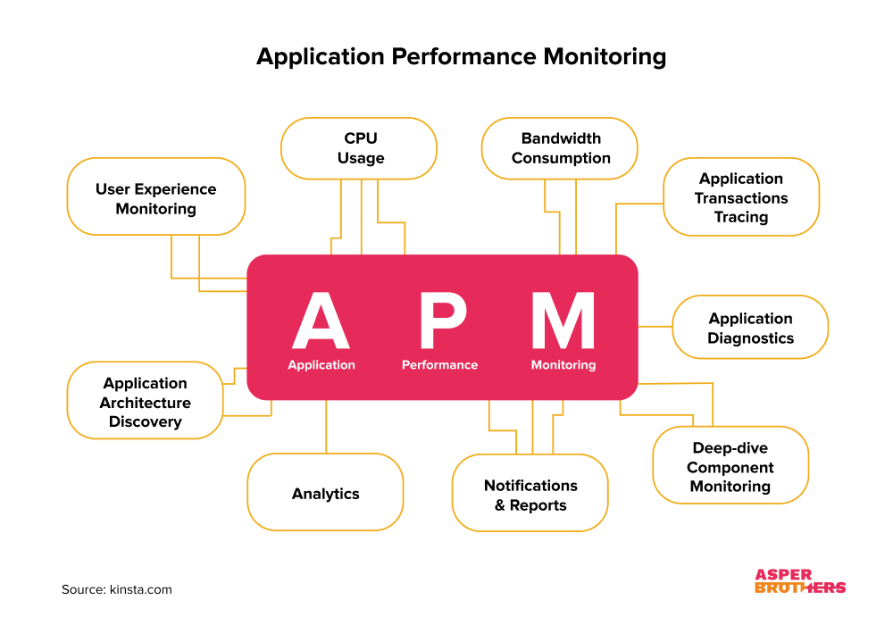

#### **1. Prometheus**  
- **Avatud lähtekoodiga võimsus:** Loodud kaasaegsetele, pilvepõhistele seadistustele.  
- **Reaalajas hoiatused:** Saage kohe teada, kui midagi läheb valesti.  
- **Täiustatud päringud:** Küsige väga spetsiifilisi küsimusi oma andmete kohta.  
- **Pilvetehnoloogiatega ühilduv:** Töötab suurepäraselt süsteemidega nagu Kubernetes.

---

#### **2. ELK Stack (Elasticsearch, Logstash, Kibana)**  
- **Logide meisterlikkus:** Hallake ja otsige tohutust logide hulgast vaevata.  
- **Reaalajas ülevaated:** Tuvastage trende või probleeme nende tekkimise hetkel.  
- **Professionaalne otsing:** Leidke täpselt see, mida vajate, välgukiirete päringutega.  
- **Juhtpaneelid:** Muutke toorandmed silmapaistvateks visualiseeringuteks.

---

#### **3. Grafana**  
- **Kõik-ühes visualiseeringud:** Kombineerige andmeid mitmest allikast ühel juhtpaneelil.  
- **Interaktiivsed juhtpaneelid:** Klõpsake, suurendage ja uurige oma andmeid reaalajas.  
- **Hoiatused:** Seadistage nutikad hoiatused, mis teavitavad teid ainult vajadusel.  
- **Hulk pluginaid:** Lisage funktsioone ja integratsioone hõlpsalt.

---

### 🚀 **Miks see on oluline**  

Kaasaegne logimine ja seire ei ole ainult probleemide tuvastamiseks — need on süsteemi mõistmiseks, probleemide ennustamiseks ja kõige sujuva töö tagamiseks.  

Tekstilogides kaevamisest kuni tööriistadeni, mis annavad teile röntgennägemuse teie süsteemidesse, oleme läbinud pika tee. Ja arvake mis? Vaatluse tulevik on veelgi helgem. 🌟

---

## 💪 **Miks kaasaegsed seire tööriistad on olulised**  

Kaasaegsed seire tööriistad ei tee elu lihtsalt lihtsamaks — need on nagu superlaaditud assistent, kes kunagi ei maga. Siin on, miks need on olulised:

---

### **1. Skaleeritavus** 🚀  
Jätke hüvasti piirangutega. Kaasaegsed tööriistad kasvavad koos teie süsteemiga, olenemata sellest, kui suureks see muutub.  

- **Haldavad tohutuid andmehulki:** Miljonid logid? Pole probleemi.  
- **Toetavad hajussüsteeme:** Ideaalne pilvetehnoloogiate või mitmes kohas töötavate rakenduste jaoks.  
- **Pilvetehnoloogiatega ühilduvad:** Töötavad sujuvalt tööriistadega nagu Kubernetes ja AWS.  
- **Paindlik juurutamine:** Kasutage neid pilves, kohapeal või kombineeritult.

---

### **2. Automatiseerimine** 🤖  
Laske tööriistadel teha raske töö, samal ajal kui teie keskendute põnevatele asjadele.  

- **Automatiseeritud andmete kogumine:** Unustage käsitsi sisestused — tööriistad tõmbavad andmeid reaalajas.  
- **Nutikad hoiatused:** Saate teavitusi *ainult* siis, kui midagi olulist juhtub — enam mitte rämpsteadaandeid!  
Jätkan tõlke kolmandat osa:

- **Planeeritud aruanded:** Tööriistad toimetavad ülevaateid otse teie postkasti (või juhtpaneelile) nagu kellavärk.  
- **Automatiseeritud parandused:** Seadistage reaktsioonid levinud probleemidele — parandused toimuvad, kui teie magate.

---

### **3. Reaalajas analüüs** ⏱️  
Kaasaegsed tööriistad ei piirdu jälgimisega — nad tegutsevad kiiresti.  

- **Kohesed ülevaated:** Näete, mis teie süsteemis toimub *praegusel hetkel*.  
- **Kiire probleemide tuvastamine:** Märkate probleeme kohe nende ilmnemisel.  
- **Välkkiire reaktsioon:** Lahendage probleeme enne, kui need katastroofikse muutuvad.  
- **Tuleviku ennustamine:** Arenenud tööriistad suudavad isegi prognoosida probleeme trendide põhjal.

---

## 🔄 **Üleminek vaatlusele**  

Üleminek põhiliselt seirelt täielikule vaatlusele on nagu binoklitest teleskoobile üleminek — saate palju selgema ja sügavama pildi oma süsteemidest.

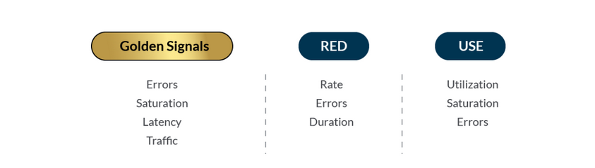

---

### **Peamised vaatlusmeetodid**  

Vaatlus ei ole lihtsalt andmete kogumine — see on *õigete* andmete kogumine ja nende mõtestamine. Siin on peamised meetodid, mis tuleks omandada:

#### **1. USE meetod** 🚀  
(Utilization, Saturation, Errors — Kasutus, Küllastus, Vead)  
Ideaalne teie süsteemi ressursside seisundi jälgimiseks:  
- **Kasutus:** Näete, kui palju teie ressurssidest (CPU, mälu jne) on kasutuses.  
- **Küllastus:** Märkate, kas teie süsteem läheneb oma piiridele.  
- **Vead:** Jälgite probleeme nagu ebaõnnestunud päringud või süsteemi rikked.  
- **Eesmärk:** Tagada, et teie süsteem oleks tõhus ja pudelikaelata.

---

#### **2. RED meetod** 📊  
(Rate, Errors, Duration — Sagedus, Vead, Kestus)  
Peamiselt teenuste nagu API-de või rakenduste jälgimiseks:  
- **Sagedus:** Kui palju päringuid saabub?  
- **Vead:** Kui paljud neist ebaõnnestuvad?  
- **Kestus:** Kui kaua iga päring võtab?  
- **Eesmärk:** Tagada, et teie teenus pakuks kõrget kvaliteeti ja jääks reageerivaks.

---

#### **3. Neli kuldset signaali** 🌟  
Mõelge neist kui teie süsteemi olulisimatest tervise näitajatest:  
- **Latentsus:** Kui kiiresti teie süsteem vastab?  
- **Liiklus:** Kui palju andmeid või päringuid töödeldakse?  
- **Vead:** Mis läheb katki?  
- **Küllastus:** Kui täis on teie ressursid?  
- **Eesmärk:** Hoida süsteem kasutajate jaoks sujuvalt töötamas.

---

### 🎯 **Peamised fokuseerimispiirkonnad**  

#### **1. Vigade analüüs** 🛠️  
- Määratlege selgelt, mis loetakse veaks (ärge liialdage!).  
- Vältige valepositiivseid tulemusi, mis ujutavad teid tarbetute hoiatustega.  
- Leidke mustreid vigades — kas need on juhuslikud või millegagi seotud?  
- Mõistke *mõju* — kas see mõjutab kasutajaid või ainult taustaprotsesse?  

---

#### **2. Latentsuse jälgimine** ⏱️  
- Jälgige, kui kiiresti teie süsteem vastab — keegi ei taha oodata!  
- Tuvastage pudelikaelad — mis aeglustab asju?  
- Mõõtke kasutajakogemust — rahulolevad kasutajad tähendavad, et kõik toimib.  
- Seadke jõudluse alustasemed — teadke, milline on "normaalne", et probleeme kiiresti märgata.  

---

#### **3. Ressursside haldamine** ⚡  
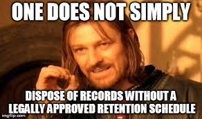  
Ressursside haldamine on nagu eelarvehaldur teie süsteemi jaoks:  
- **Jälgige kasutust:** Kontrollige, kui palju CPU-d, mälu ja kettaruumi te kasutate.  
- **Jälgige küllastust:** Märkate, kui ressursid hakkavad otsa saama.  
- **Ennustage vajadusi:** Planeerige tippaegadeks, et teid ei tabaks ootamatult.  
- **Skaleerige arukalt:** Lisage ressursse vastavalt vajadusele, kuid ärge kulutage liigselt.  

---

## 🛠️ **Kaasaegne logihaldus: Kaasaegne viis logide käsitlemiseks**  

Logid on nagu teie süsteemi salajane päevik, salvestades kõike, mis toimub. Nende hea haldamine võib teha teist tõelise IT-professionaali!  

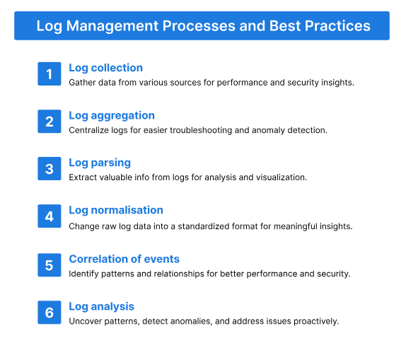

---

### **Parimad tööriistad logihalduseks**  

#### **1. Splunk** 🚀  
Splunk on nagu logihalduse tööriistade geenius - see teeb rohkem kui lihtsalt logide salvestamine:  
- **Täiustatud analüüs:** Süvenege andmetesse, et leida mustreid.  
- **Masinõpe:** Ennustage probleeme enne nende tekkimist.  
- **Reaalajas jälgimine:** Näete, mis teie süsteemis praegu toimub.  
- **Kohandatud juhtpaneelid:** Muudavad teie andmed elegantseks ja organiseerituks.  

---

#### **2. ELK Stack komponendid** 🌟  
ELK Stack on täiuslik isetegemise tööriistakomplekt logihalduseks:  
- **Elasticsearch:** Otsingumootor, mis muudab logide leidmise välgukiireks.  
- **Logstash:** Kogub ja töötleb logisid kogu teie süsteemist.  
- **Kibana:** Muudab teie logid ilusateks diagrammideks ja graafikuteks.  

---
