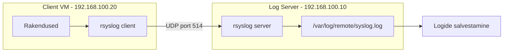

# Linux Logimise Labor: Keskse Logiserveri Ehitamine

**Eeldused:** Linux põhikäsud, võrgu alused, VirtualBox kasutamine • **Platvorm:** Ubuntu Server 22.04 LTS, VirtualBox • **Kestus:** 2-3h

## Õpiväljundid

Selle labori lõpuks oskad:

1. **Seadistada** kahest virtuaalmasinast koosneva keskse logiserveri süsteemi
2. **Konfigureerida** rsyslog teenust nii serveris kui kliendis
3. **Edastada** logisid võrgu kaudu kliendist serverisse
4. **Testida** logide edastamist ja kontrollida nende saabumist
5. **Lahendada** levinumaid logimise probleeme (võrk, õigused, tulemüür)

## Mida me ehitame?

Ehitame keskse logiserveri süsteemi, kus üks masin (LogServer) kogub logisid teiselt masinalt (LogClient). See on tüüpiline IT-taristu lahendus, kus kõik süsteemide logid tulevad ühte kohta, kus neid on lihtsam jälgida ja analüüsida.



---

## 1. Keskkonna Ettevalmistamine

### 1.1 Nõutav tarkvara

Enne labori alustamist kontrolli, et sul on:

| Tarkvara | Versioon | Otstarve |
|----------|----------|----------|
| VirtualBox | 7.0+ | Virtuaalmasinate jaoks |
| Ubuntu Server ISO | 22.04 LTS | Operatsioonisüsteem |
| Vaba kettaruumi | ~50GB | Kahe VM jaoks |
| RAM | 4GB+ | VM-ide jaoks |

### 1.2 Virtuaalmasinate loomine

Loome kaks virtuaalmasinat VirtualBoxis. Esimene on logiserver (kogub logisid), teine on klient (saadab logisid).

**VM1 - LogServer:**

1. Ava VirtualBox → **New**
2. Seadista järgmised parameetrid:

```
Name: LogServer
Type: Linux
Version: Ubuntu (64-bit)
Memory: 2048 MB (2GB)
Hard Disk: 20GB (VDI, Dynamically allocated)
Network: NAT Network (loome järgmises sammus)
```

**VM2 - LogClient:**

```
Name: LogClient
Type: Linux
Version: Ubuntu (64-bit)
Memory: 1024 MB (1GB)
Hard Disk: 20GB (VDI, Dynamically allocated)
Network: NAT Network (sama mis VM1-l)
```

**Miks need seadistused?**
- LogServer vajab rohkem RAM-i, sest ta salvestab logisid
- NAT Network võimaldab VM-idel omavahel suhelda, aga on eraldatud host süsteemist
- 20GB on piisav lihtsa logiserveri jaoks

### 1.3 Võrgu seadistamine

Enne VM-ide käivitamist loome neile eraldi võrgu. See on oluline, et VM-id näeksid teineteist.

**Loo NAT Network VirtualBoxis:**

1. VirtualBox → **File** → **Preferences** → **Network**
2. **NAT Networks** tab → kliki **+** (Add)
3. Seadista:

```
Network Name: LogLab
Network CIDR: 192.168.100.0/24
Enable DHCP: ✓ (märgitud)
```

4. Kliki **OK**

**Määra mõlemale VM-le see võrk:**

1. Vali VM → **Settings** → **Network**
2. Adapter 1:
   - Attached to: **NAT Network**
   - Name: **LogLab**

### 1.4 Ubuntu Server paigaldamine

Paigalda Ubuntu Server mõlemale VM-le. See protsess on identne mõlema jaoks.

**Käivita VM ja järgi paigaldusviisardit:**

1. Vali ISO fail (ubuntu-22.04-live-server-amd64.iso)
2. Vali **Ubuntu Server (minimized)**
3. Võrgu seadistus: **DHCP** (praegu, muudame hiljem staatiliseks)
4. Ketta partitsioneerimine: **Use entire disk**
5. Loo kasutaja:
   - Nimi: `sysadmin`
   - Parool: (vali turvaline)
6. Märgi: **Install OpenSSH server** ✓
7. Lõpeta paigaldus ja taaskäivita

Korda samu samme mõlema VM jaoks (LogServer ja LogClient).

**Kontrolli kas mõlemad VM-id töötavad:**

```bash
# Logi sisse kui sysadmin
# Kontrolli süsteemi
uname -a
ip addr show
```

Peaksid nägema Ubuntu kerneli versiooni ja võrgu liidese teavet.

---

## 2. Staatiliste IP-aadresside Seadistamine

Praegu kasutavad VM-id DHCP-d, mis tähendab, et nende IP-aadressid võivad muutuda. Logiserveri jaoks vajame kindlat IP-aadressi, mida klient teab.

### 2.1 Netplan konfiguratsiooni muutmine

**VM1 (LogServer) - 192.168.100.10:**

```bash
# Muuda netplan konfiguratsioonifaili
sudo nano /etc/netplan/00-installer-config.yaml
```

Asenda sisu järgmisega:

```yaml
network:
  ethernets:
    enp0s3:
      addresses: [192.168.100.10/24]
      routes:
        - to: default
          via: 192.168.100.1
      nameservers:
        addresses: [8.8.8.8]
  version: 2
```

**Selgitus:**
- `addresses: [192.168.100.10/24]` - VM1 saab staatilise IP 192.168.100.10
- `via: 192.168.100.1` - gateway (VirtualBoxi NAT Network gateway)
- `nameservers: [8.8.8.8]` - Google DNS (et saaks internetti)

Salvesta fail (`Ctrl+O`, `Enter`, `Ctrl+X`).

**VM2 (LogClient) - 192.168.100.20:**

```bash
sudo nano /etc/netplan/00-installer-config.yaml
```

```yaml
network:
  ethernets:
    enp0s3:
      addresses: [192.168.100.20/24]
      routes:
        - to: default
          via: 192.168.100.1
      nameservers:
        addresses: [8.8.8.8]
  version: 2
```

Salvesta fail.

### 2.2 Rakenda võrguseadistused

Mõlemas VM-s:

```bash
# Rakenda uued seadistused
sudo netplan apply

# Kontrolli IP-aadressi
ip addr show enp0s3
```

Peaksid nägema:
```
inet 192.168.100.10/24  # või .20 kliendis
```

**Testi võrguühendust:**

```bash
# Testi internetti
ping -c 3 8.8.8.8

# Kliendis testi serverit
ping -c 3 192.168.100.10

# Serveris testi klienti
ping -c 3 192.168.100.20
```

Kui kõik 3 testi töötavad - võrk on valmis! Kui mõni ei tööta, vaata troubleshooting sektsiooni.

---

## 3. rsyslog Paigaldamine ja Põhiseadistamine

rsyslog on juba Ubuntu Serveris olemas, aga me kontrollime ja uuendame süsteemi.

### 3.1 Pakettide paigaldamine

Mõlemas VM-s:

```bash
# Uuenda pakettide nimekirja
sudo apt update

# Paigalda rsyslog (kui ei ole juba)
sudo apt install -y rsyslog

# Kontrolli rsyslog versiooni
rsyslogd -v
```

Peaksid nägema midagi sellist:
```
rsyslogd 8.2112.0 ...
```

**Kontrolli kas rsyslog töötab:**

```bash
systemctl status rsyslog
```

Peaks olema:
```
● rsyslog.service - System Logging Service
     Loaded: loaded
     Active: active (running)
```

Kui näed "inactive (dead)", käivita see:

```bash
sudo systemctl start rsyslog
sudo systemctl enable rsyslog
```

---

## 4. Logiserveri (VM1) Seadistamine

Nüüd muudame VM1 logiServeriks, mis võtab vastu logisid võrgust. Vaikimisi rsyslog EI kuula võrku - me peame selle sisse lülitama.

### 4.1 Luba UDP logide vastuvõtt

rsyslog saab kuulata logisid nii UDP (port 514) kui TCP (port 514) kaudu. Me kasutame UDP, kuna see on kiirem ja piisav õppeotstarbelel.

```bash
# Muuda rsyslog põhikonfiguratsioon
sudo nano /etc/rsyslog.conf
```

**Lisa faili lõppu järgmised read:**

```
# Luba UDP syslog vastuvõtt
module(load="imudp")
input(type="imudp" port="514")
```

**Selgitus:**
- `module(load="imudp")` - laeb UDP sisendmooduli
- `input(type="imudp" port="514")` - kuulab UDP port 514-l (standard syslog port)

Salvesta fail.

### 4.2 Loo kaust kauglogidele

Loome eraldi kausta, kuhu saabuvad kliendi logid. See hoiab asjad korraldatud.

```bash
# Loo kaust
sudo mkdir -p /var/log/remote

# Määra õigused
sudo chmod 755 /var/log/remote
sudo chown syslog:adm /var/log/remote
```

**Miks need õigused?**
- `755` = owner (syslog) saab kirjutada, teised ainult lugeda
- `syslog:adm` = rsyslog protsess (töötab kasutajana "syslog") saab kirjutada

### 4.3 Seadista logide marsruutimine

Nüüd ütleme rsyslog'ile, et kõik saabuvad logid pannakse `/var/log/remote/syslog.log` faili.

```bash
# Loo uus konfiguratsioonifail
sudo nano /etc/rsyslog.d/remote.conf
```

Lisa sinna:

```
# Kõik saabuvad logid → remote faili
*.* /var/log/remote/syslog.log
```

**Selgitus:**
- `*.*` = kõik facility'd (auth, kern, mail, jne) ja kõik severity'd (info, warning, error, jne)
- `/var/log/remote/syslog.log` = salvestamise asukoht

Salvesta fail.

### 4.4 Taaskäivita rsyslog

```bash
# Taaskäivita teenus
sudo systemctl restart rsyslog

# Kontrolli kas käivitus õnnestus
systemctl status rsyslog
```

Peaks olema "active (running)".

**Kontrolli kas rsyslog kuulab pordil 514:**

```bash
sudo netstat -uln | grep 514
```

Või kui netstat ei ole paigaldatud:

```bash
sudo ss -uln | grep 514
```

Peaksid nägema:
```
udp   0.0.0.0:514   0.0.0.0:*
```

See tähendab, et rsyslog kuulab UDP port 514 kõikidel võrguliidestel. Kui ei näe - kontrolli konfiguratsiooni vigu:

```bash
sudo rsyslogd -N1
```

---

## 5. Kliendi (VM2) Seadistamine

Nüüd seadistame VM2, et see saadaks kõik oma logid VM1-le (logiserveri).

### 5.1 Konfigureeri logide edastamine

```bash
# Loo edastamise konfiguratsioon
sudo nano /etc/rsyslog.d/forward.conf
```

Lisa sinna:

```
# Edasta kõik logid logiserveri (VM1)
*.* @192.168.100.10:514
```

**Selgitus:**
- `*.*` = kõik logid (nagu serveris)
- `@192.168.100.10:514` = saada UDP kaudu VM1 IP-le port 514
  - `@` = UDP (üks @ märk)
  - `@@` = TCP (kaks @ märki) - oleks usaldusväärsem, aga aeglasem

**Miks UDP?**
- Kiirem
- Väiksem režii
- Piisav õppeotstarbelel (production'is võiks kasutada TCP või TCP+TLS)

Salvesta fail.

### 5.2 Taaskäivita rsyslog

```bash
sudo systemctl restart rsyslog

# Kontrolli staatust
systemctl status rsyslog
```

Peaks olema "active (running)".

---

## 6. Testimine ja Kontrollimine

Nüüd on aeg testida, kas logid liiguvad kliendist serverisse!

### 6.1 Testi logger käsuga

`logger` käsk võimaldab käsitsi saata testsõnumeid syslog'i.

**VM2 (kliendis):**

```bash
# Saada testlogi
logger "TEST: Tere logiserver! See on test kliendilt."
```

Peaksid nägema terminalis midagi (või mitte - oleneb seadistusest). Aga oluline on kontrollida, kas logi jõudis serveri.

**VM1 (serveris):**

```bash
# Vaata remote logifaili lõppu
tail -f /var/log/remote/syslog.log
```

Peaksid nägema oma testsõnumit:

```
Dec  9 10:15:32 LogClient sysadmin: TEST: Tere logiserver! See on test kliendilt.
```

**Kui näed sõnumit - õnnitleme! Logide edastamine töötab!**

(Vajuta `Ctrl+C` et `tail -f` peatada)

### 6.2 Logi generaatori skript

Testime põhjalikumalt - loome skripti, mis genereerib pidevalt logisid.

**VM2 (kliendis):**

```bash
# Loo logi generaatori skript
cat << 'EOF' > ~/generate_logs.sh
#!/bin/bash
# Lihtsne logi generaator testimiseks

counter=1
while true; do
    logger "Automaatne testlogi #$counter: $(date '+%Y-%m-%d %H:%M:%S')"
    echo "Saadetud logi #$counter"
    counter=$((counter + 1))
    sleep 5
done
EOF

# Anna skriptile käivitamisõigus
chmod +x ~/generate_logs.sh
```

**Käivita skript:**

```bash
./generate_logs.sh
```

Peaksid nägema:
```
Saadetud logi #1
Saadetud logi #2
Saadetud logi #3
...
```

**VM1 (serveris - teises terminali aknas või SSH sessioon is):**

```bash
# Vaata logisid reaalajas
tail -f /var/log/remote/syslog.log
```

Peaksid nägema, kuidas logid ilmuvad iga 5 sekundi tagant!

```
Dec  9 10:20:01 LogClient sysadmin: Automaatne testlogi #1: 2024-12-09 10:20:01
Dec  9 10:20:06 LogClient sysadmin: Automaatne testlogi #2: 2024-12-09 10:20:06
Dec  9 10:20:11 LogClient sysadmin: Automaatne testlogi #3: 2024-12-09 10:20:11
```

**Peata logi generaator kliendis:** Vajuta `Ctrl+C`

### 6.3 Kontrolli logide arvu

**VM1 (serveris):**

```bash
# Loe mitu rida on remote logis
wc -l /var/log/remote/syslog.log

# Otsi konkreetseid sõnumeid
grep "Automaatne testlogi" /var/log/remote/syslog.log | wc -l

# Vaata viimast 10 rida
tail -10 /var/log/remote/syslog.log
```

---

## 7. Tulemüüri Seadistamine (Valikuline)

Ubuntu Server 22.04 vaikimisi ei ole tulemüür aktiivne, aga production keskkonnas peaks see olema. Õpime kuidas seda seadistada.

### 7.1 Kontrolli tulemüüri staatust

**VM1 (serveris):**

```bash
sudo ufw status
```

Kui näed "Status: inactive" - tulemüür ei ole aktiivne. Kui on aktiivne ja logid ei jõua kohale, pead lisama reegli.

### 7.2 Lisa rsyslog reegel

```bash
# Luba UDP port 514
sudo ufw allow 514/udp

# Luba SSH (ära lukusta ennast välja!)
sudo ufw allow 22/tcp

# Aktiveeri tulemüür
sudo ufw enable

# Kontrolli reegleid
sudo ufw status numbered
```

Peaksid nägema:
```
Status: active

     To                         Action      From
     --                         ------      ----
[ 1] 22/tcp                     ALLOW IN    Anywhere
[ 2] 514/udp                    ALLOW IN    Anywhere
```

**Testi uuesti logger käsuga VM2-s:**

```bash
logger "TEST: Kontrollin pärast tulemüüri seadistamist"
```

Kontrolli VM1-s, kas logi saabus.

---

## 8. Probleemide Lahendamine

Kui midagi ei tööta, kontrolli neid asju järjekorras.

### Probleem 1: Logid ei jõua serverisse

**Sümptom:** `tail -f /var/log/remote/syslog.log` ei näita saabuvaid logisid.

**Lahendus:**

1. **Kontrolli võrguühendust:**

```bash
# Kliendis (VM2)
ping -c 3 192.168.100.10
```

Kui ping ei tööta - võrguseadistus on vale. Mine tagasi §2 juurde.

2. **Kontrolli kas rsyslog kuulab serveris:**

```bash
# Serveris (VM1)
sudo ss -uln | grep 514
```

Kui ei näe midagi - rsyslog ei kuula. Kontrolli `/etc/rsyslog.conf` seadistust (§4.1).

3. **Kontrolli rsyslog staatust mõlemas VM-s:**

```bash
systemctl status rsyslog
```

Kui näed "failed" või "inactive" - taaskäivita:

```bash
sudo systemctl restart rsyslog
```

4. **Kontrolli konfiguratsiooni vigu:**

```bash
sudo rsyslogd -N1
```

Kui näed vigu - paranda need ja taaskäivita rsyslog.

5. **Vaata rsyslog logisid:**

```bash
# Serveris
sudo journalctl -u rsyslog -f
```

Võid näha vigu või hoiatusi, mis aitavad probleemi tuvastada.

### Probleem 2: Õiguste vead

**Sümptom:** rsyslog logib viga "cannot open file /var/log/remote/syslog.log"

**Lahendus:**

```bash
# Serveris (VM1)
# Kontrolli kausta õigusi
ls -ld /var/log/remote

# Kui õigused on valed:
sudo chown syslog:adm /var/log/remote
sudo chmod 755 /var/log/remote

# Kontrolli faili õigusi
ls -l /var/log/remote/syslog.log

# Kui fail eksisteerib, aga õigused on valed:
sudo chown syslog:adm /var/log/remote/syslog.log
sudo chmod 644 /var/log/remote/syslog.log

# Taaskäivita rsyslog
sudo systemctl restart rsyslog
```

### Probleem 3: Tulemüür blokeerib

**Sümptom:** Ping töötab, aga logid ei jõua kohale.

**Lahendus:**

```bash
# Serveris (VM1)
# Kontrolli tulemüüri
sudo ufw status

# Kui on aktiivne, aga reeglit ei ole:
sudo ufw allow 514/udp

# Kontrolli kas port on avatud
sudo ss -uln | grep 514
```

### Probleem 4: Vale IP-aadress konfiguratsioonis

**Sümptom:** Logid ei jõua kohale, aga kõik muu tundub töötavat.

**Lahendus:**

```bash
# Kliendis (VM2)
# Kontrolli edastamise konfiguratsiooni
cat /etc/rsyslog.d/forward.conf
```

Peab olema:
```
*.* @192.168.100.10:514
```

Kui IP on vale - paranda ja taaskäivita rsyslog.

### Probleem 5: netplan apply annab vea

**Sümptom:** `sudo netplan apply` annab YAML süntaksi vea.

**Lahendus:**

YAML on tundlik taanete (indentation) suhtes! Kasuta alati **tühikuid, mitte tabulaatoreid**.

```bash
# Kontrolli konfiguratsioon
sudo netplan try
```

See rakendab konfiguratsioonile 120 sekundiks - kui midagi läheb valesti, rullib automaatselt tagasi.

Kui viga on YAML süntaksis, paranda fail:

```bash
sudo nano /etc/netplan/00-installer-config.yaml
```

Veendu, et:
- Kõik taanded on 2 tühikut
- Ei ole tabulaatoreid
- Loendid (addresses, routes) on õigesti taandatud

---

## 9. Kontrollnimekiri

Veendu, et kõik on tehtud:

### VM1 (LogServer)

- [ ] VM on loodud ja Ubuntu Server paigaldatud
- [ ] Staatiline IP: 192.168.100.10
- [ ] rsyslog on paigaldatud ja käivitatud
- [ ] UDP port 514 kuulatakse (`ss -uln | grep 514`)
- [ ] Kaust `/var/log/remote` on loodud õigete õigustega
- [ ] Konfiguratsioon `/etc/rsyslog.conf` sisaldab imudp moodulit
- [ ] Konfiguratsioon `/etc/rsyslog.d/remote.conf` on loodud
- [ ] Logid saabuvad `/var/log/remote/syslog.log` faili
- [ ] Tulemüür lubab porti 514/udp (kui ufw on aktiivne)

### VM2 (LogClient)

- [ ] VM on loodud ja Ubuntu Server paigaldatud
- [ ] Staatiline IP: 192.168.100.20
- [ ] rsyslog on paigaldatud ja käivitatud
- [ ] Konfiguratsioon `/etc/rsyslog.d/forward.conf` on loodud
- [ ] Edastamine serveri IP-le toimib
- [ ] Logger käsk genereerib logisid
- [ ] Logid jõuavad serverisse

### Funktsionaalsus

- [ ] Ping töötab mõlemas suunas (VM1 ↔ VM2)
- [ ] `logger "test"` käsk kliendis → logi ilmub serverisse
- [ ] `tail -f /var/log/remote/syslog.log` näitab saabuvaid logisid
- [ ] Logi generaatori skript töötab

---

## 10. Edasised Sammud (Lisapraktika)

Kui oled põhilabori lõpetanud, proovi neid väljakutseid:

### 10.1 Eraldatud logikategooriad

Praegu lähevad kõik logid ühte faili. Professionaalses keskkonnas eraldatakse logid kategooriate kaupa (auth, mail, daemon).

**Ülesanne:** Muuda `/etc/rsyslog.d/remote.conf`, et:
- Auth logid → `/var/log/remote/auth.log`
- Kõik ülejäänud → `/var/log/remote/syslog.log`

**Vihje:** Kasuta `facility.severity` süntaksit (õppis loengus).

### 10.2 logrotate seadistamine

Praegu kasvab `/var/log/remote/syslog.log` lõpmatult. Õpi kuidas logrotate seda haldab.

**Ülesanne:** Loo `/etc/logrotate.d/remote` konfiguratsioon, mis:
- Pöörab logisid iga päev
- Hoiab 7 päeva logisid
- Kompresseerib vanad logid

**Vihje:** Vaata `/etc/logrotate.d/rsyslog` näidet.

### 10.3 TCP edastamine

Vaheta UDP edastamine TCP vastu (usaldusväärsem).

**Ülesanne:**
1. Serveris lae `imtcp` moodul (mitte `imudp`)
2. Kliendis muuda `@` → `@@` (kaks @-märki)
3. Testi kas logid jõuavad kohale

### 10.4 Hostname-põhine eraldamine

Praegu lähevad kõik klientide logid samasse faili. Professionaalses keskkonnas luuakse igale kliendile oma kaust.

**Ülesanne:** Muuda `/etc/rsyslog.d/remote.conf`, et kasutada template'i:

```
$template RemoteLogs,"/var/log/remote/%HOSTNAME%/syslog.log"
*.* ?RemoteLogs
```

Nüüd peaks tekkima kaust `/var/log/remote/LogClient/syslog.log`.

---

## 11. Labori Lõpetamine

### 11.1 Dokumenteerimine

Loo fail `lab_report.txt` järgmise sisuga:

```bash
# VM1-s
cat > ~/lab_report.txt << EOF
Linux Logimise Labor - Aruanne
================================

Õpilane: [Sinu Nimi]
Kuupäev: $(date '+%Y-%m-%d')

VM Konfiguratsioon:
-------------------
LogServer IP: 192.168.100.10
LogClient IP: 192.168.100.20

rsyslog Versioon:
-----------------
$(rsyslogd -v | head -1)

Võrgu Staatus:
--------------
$(ip addr show enp0s3 | grep inet)

rsyslog Staatus:
----------------
$(systemctl status rsyslog | head -3)

Kuulatavad Pordid:
------------------
$(sudo ss -uln | grep 514)

Testimise Tulemus:
------------------
$(tail -5 /var/log/remote/syslog.log)

Probleemid ja Lahendused:
--------------------------
[Kirjelda siia mis probleeme kohtasid ja kuidas lahendasid]

Järeldused:
-----------
[Mis sa õppisid? Mis oli keeruline? Mis oli lihtne?]
EOF

cat ~/lab_report.txt
```

### 11.2 Puhastamine (Cleanup)

Kui tahad säilitada VM-id tulevikuks, võta snapshot:

**VirtualBoxis:**
1. Seiska VM
2. Vali VM → **Snapshots** → **Take**
3. Anna nimi: "Linux Logging Lab - Working"

Kui tahad VM-id kustutada:

1. Seiska mõlemad VM-id
2. VirtualBox → vali VM → **Remove** → **Delete all files**

---

## Kas vajad abi?

Kui jääd hätta:

1. **Kontrolli troubleshooting sektsiooni** (§8) - 90% probleemidest on seal kirjeldatud
2. **Vaata rsyslog logisid:** `sudo journalctl -u rsyslog -f`
3. **Kontrolli konfiguratsiooni:** `sudo rsyslogd -N1`
4. **Küsi õpetajalt** - nad on abiks!
5. **Google täpse veateate** - lisa "ubuntu 22.04 rsyslog" otsingusse
6. **Vaata dokumentatsiooni:** [https://www.rsyslog.com/doc/](https://www.rsyslog.com/doc/)

**Edu laboriga!** Sa ehitad õige IT-taristu komponendi - keskse logiserveri, mida kasutatakse igas suuremas organisatsioonis.
