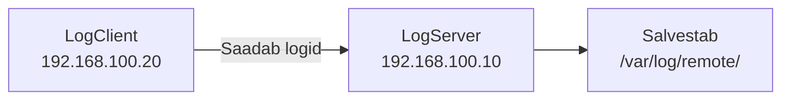

# Linux Logimise Labor: Keskse Logiserveri Ehitamine

**Eeldused:** Linux põhikäsud, võrgu alused, VirtualBox kasutamine  
**Platvorm:** Ubuntu Server 22.04 LTS, VirtualBox  
**Kestus:** 2-3h

## Mida me täna teeme?

Täna ehitame süsteemi, kus üks arvuti (LogServer) kogub logisid teiselt arvutilt (LogClient). See on nagu postkontor - kõik kirjad tulevad ühte kohta, kus neid on lihtsam hallata.



**Miks see on kasulik?**
- ✅ Kui üks server katki läheb, logid on juba turvaliselt teises kohas
- ✅ Saad vaadata kõiki logisid ühest kohast
- ✅ Päris IT-firmades tehakse täpselt nii!

---

## Samm 1: Loo kaks virtuaalmasinat

### 1.1 Mis sul vaja läheb?

| Asi | Kui palju | Miks |
|-----|-----------|------|
| VirtualBox | versioon 7.0+ | Virtuaalmasinate jaoks |
| Ubuntu Server ISO | 22.04 LTS | Operatsioonisüsteem |
| Vaba kettaruum | ~50GB | Kahe masina jaoks |
| Vaba RAM | 4GB+ | Et VM-id töötaksid |

### 1.2 Loo esimene VM (LogServer)

1. Ava VirtualBox
2. Kliki **New** (uus masin)
3. Täida väljad:

```
Nimi: LogServer
Tüüp: Linux
Versioon: Ubuntu (64-bit)
RAM: 2048 MB (2GB)
Kõvaketas: 20GB
```

**Miks 2GB RAM-i?** See server salvestab logisid, seega vajab rohkem mälu.

### 1.3 Loo teine VM (LogClient)

Korda samu samme, aga väiksema mäluga:

```
Nimi: LogClient
Tüüp: Linux
Versioon: Ubuntu (64-bit)
RAM: 1024 MB (1GB)
Kõvaketas: 20GB
```

### 1.4 Seadista võrk (et masinad näeksid teineteist)

**Loo ühine võrk:**

1. VirtualBox → **File** → **Preferences** → **Network**
2. **NAT Networks** → kliki **+** (pluss)
3. Seadista:
   - **Name:** LogLab
   - **CIDR:** 192.168.100.0/24
   - **Enable DHCP:** ✓ (märgi linnuke)
4. Kliki **OK**

**Ühenda mõlemad VM-id selle võrguga:**

1. Vali VM → **Settings** → **Network**
2. **Adapter 1:**
   - Attached to: **NAT Network**
   - Name: **LogLab**

💡 **Mis on NAT Network?** See on nagu privaatne WiFi ainult sinu VM-ide jaoks.

### 1.5 Paigalda Ubuntu Server

Tee seda mõlemas VM-is (kaks korda sama protsess):

1. Käivita VM
2. Vali Ubuntu Server ISO fail
3. Vali **Ubuntu Server (minimized)**
4. Võrk: **DHCP** (praegu automaatne)
5. Ketas: **Use entire disk**
6. Loo kasutaja:
   - Username: `sysadmin`
   - Password: (vali mingi parool)
7. Märgi: **Install OpenSSH server** ✓
8. Lõpeta ja taaskäivita

**Kontrolli kas töötab:**

```bash
# Logi sisse
# Kirjuta:
uname -a
ip addr show
```

Peaksid nägema Ubuntu versiooni ja IP aadressi.

---

## Samm 2: Anna masinatele kindlad IP aadressid

**Probleem:** Praegu on IP aadressid automaatsed (DHCP) ja võivad muutuda.  
**Lahendus:** Anname igale masinale kindla IP aadressi.

### 2.1 LogServer → 192.168.100.10

**VM1-s (LogServer):**

```bash
sudo nano /etc/netplan/00-installer-config.yaml
```

Kustuta kõik mis seal on ja kirjuta see:

```yaml
network:
  version: 2
  ethernets:
    enp0s3:
      addresses: [192.168.100.10/24]
      routes:
        - to: default
          via: 192.168.100.1
      nameservers:
        addresses: [8.8.8.8]
```

**TÄHTIS!** 
- Kasuta tühikuid, MITTE Tab klahvi
- `routes:` ja `addresses:` peavad olema joondatud
- Salvesta: `Ctrl+O`, `Enter`, `Ctrl+X`

💡 **Mis see tähendab?**
- `192.168.100.10` = selle masina IP
- `192.168.100.1` = värav (gateway)
- `8.8.8.8` = Google DNS (et saaks internetti)

### 2.2 LogClient → 192.168.100.20

**VM2-s (LogClient):**

```bash
sudo nano /etc/netplan/00-installer-config.yaml
```

```yaml
network:
  version: 2
  ethernets:
    enp0s3:
      addresses: [192.168.100.20/24]
      routes:
        - to: default
          via: 192.168.100.1
      nameservers:
        addresses: [8.8.8.8]
```

Sama nagu enne, aga IP on `.20` lõpus.

### 2.3 Rakenda muudatused

**Mõlemas VM-is:**

```bash
# Testi (120 sekundit aega, siis tagasi rullitakse kui ei tööta)
sudo netplan try

# Kui kõik OK, vajuta ENTER

# Kontrolli IP-d
ip addr show enp0s3
```

Peaksid nägema:
- VM1: `192.168.100.10`
- VM2: `192.168.100.20`

### 2.4 Testi võrku

```bash
# VM1-s testi internetti:
ping -c 3 8.8.8.8

# VM2-s testi serveri:
ping -c 3 192.168.100.10

# VM1-s testi klienti:
ping -c 3 192.168.100.20
```

Kui kõik 3 töötavad → SUPER! Võrk on valmis! 🎉

Kui ei tööta → vaata hiljem "Probleemide lahendamine" osa.

---

## Samm 3: Paigalda rsyslog

rsyslog on programm, mis haldab logisid. Ubuntu-s on see juba olemas, aga kontrollime.

**Mõlemas VM-is:**

```bash
# Uuenda paketinimekirja
sudo apt update

# Paigalda rsyslog
sudo apt install -y rsyslog

# Kontrolli versiooni
rsyslogd -v
```

**Kontrolli kas töötab:**

```bash
systemctl status rsyslog
```

Peaksid nägema: `Active: active (running)` ✅

Kui näed `inactive` → käivita:

```bash
sudo systemctl start rsyslog
sudo systemctl enable rsyslog
```

💡 **Mis vahe on `start` ja `enable` vahel?**
- `start` = käivita praegu
- `enable` = käivita alati kui arvuti käivitub

---

## Samm 4: Seadista LogServer (VM1)

Nüüd muudame VM1 nii, et ta hakkab võtma logisid vastu.

### 4.1 Luba logide kuulamine

**VM1-s:**

```bash
sudo nano /etc/rsyslog.conf
```

Otsi selle faili lõpust ridu, mis algavad `#module(load="imudp")`.

**Kas leidsid?** Eemalda alguses olev `#` märk:

```
# Luba UDP logide kuulamine
module(load="imudp")
input(type="imudp" port="514")
```

**Ei leidnud?** Lisa faili lõppu:

```
# Luba UDP logide kuulamine
module(load="imudp")
input(type="imudp" port="514")
```

Salvesta: `Ctrl+O`, `Enter`, `Ctrl+X`

💡 **Mis see teeb?**
- rsyslog hakkab kuulama võrgust tulevaid logisid
- Port 514 on standardne port syslog logidele

### 4.2 Loo kaust logidele

```bash
# Loo kaust
sudo mkdir -p /var/log/remote

# Määra õigused
sudo chmod 755 /var/log/remote
sudo chown syslog:adm /var/log/remote
```

💡 **Miks need õigused?**
- `syslog` kasutaja saab kirjutada
- `adm` grupp saab lugeda
- Teised saavad ainult lugeda

### 4.3 Ütle kuhu logid salvestada

```bash
sudo nano /etc/rsyslog.d/remote.conf
```

Kirjuta sinna:

```
# Kõik saabuvad logid lähevad siia:
*.* /var/log/remote/syslog.log
```

Salvesta fail.

💡 **Mis see tähendab?**
- `*.*` = kõik logid (kõik tüübid, kõik tasemed)
- `/var/log/remote/syslog.log` = salvestamise koht

### 4.4 Taaskäivita rsyslog

```bash
sudo systemctl restart rsyslog
```

**Kontrolli kas töötab:**

```bash
systemctl status rsyslog
```

**Kontrolli kas kuulab porti 514:**

```bash
sudo ss -uln | grep 514
```

Peaksid nägema midagi nagu: `udp   0.0.0.0:514`

✅ Kui näed → rsyslog kuulab!  
❌ Kui ei näe → midagi läks valesti, vaata troubleshooting osa

---

## Samm 5: Seadista LogClient (VM2)

Nüüd ütleme VM2-le, et saada kõik logid VM1-le.

### 5.1 Seadista edastamine

**VM2-s:**

```bash
sudo nano /etc/rsyslog.d/forward.conf
```

Kirjuta sinna:

```
# Saada kõik logid serverisse
*.* @192.168.100.10:514
```

Salvesta fail.

💡 **Mis see tähendab?**
- `*.*` = kõik logid
- `@` = UDP protokoll (kiire)
- `192.168.100.10:514` = serveri IP ja port

**Kas on `@@` parem?**
- `@` = UDP = kiirem, aga võib logisid kaotada
- `@@` = TCP = aeglasem, aga usaldusväärsem
- Õppimiseks on `@` piisav

### 5.2 Taaskäivita rsyslog

```bash
sudo systemctl restart rsyslog
systemctl status rsyslog
```

Peab olema `active (running)` ✅

---

## Samm 6: TESTI!

Nüüd on aeg testida kas töötab!

### 6.1 Saada testlogi

**VM2-s (klient):**

```bash
logger "TERE! See on testlogi kliendilt!"
```

### 6.2 Kontrolli serveris

**VM1-s (server):**

```bash
tail -f /var/log/remote/syslog.log
```

**Mida peaksid nägema?**

```
Oct  9 10:15:32 LogClient sysadmin: TERE! See on testlogi kliendilt!
```

✅ **Näed oma sõnumit?** → SUPER! See töötab! 🎉  
❌ **Ei näe?** → Mine jaotise 8 juurde (Probleemide lahendamine)

Vajuta `Ctrl+C` et `tail -f` peatada.

### 6.3 Tee automaatne testija

**VM2-s loo skript:**

```bash
cat << 'EOF' > ~/test-logs.sh
#!/bin/bash
counter=1
while true; do
    logger "Testlogi #$counter: $(date)"
    echo "Saadetud: #$counter"
    counter=$((counter + 1))
    sleep 5
done
EOF

chmod +x ~/test-logs.sh
```

**Käivita:**

```bash
./test-logs.sh
```

Peaksid nägema:
```
Saadetud: #1
Saadetud: #2
Saadetud: #3
```

**VM1-s vaata logisid:**

```bash
tail -f /var/log/remote/syslog.log
```

Peaksid nägema iga 5 sekundi tagant uut logi! 🎉

Peata testija: `Ctrl+C`

---

## Samm 7: Tulemüür (kui vaja)

Ubuntu Server vaikimisi ei ole tulemüür peal, aga õpime kuidas seda seadistada.

### 7.1 Kontrolli kas tulemüür töötab

**VM1-s:**

```bash
sudo ufw status
```

Kui näed `Status: inactive` → tulemüür ei ole aktiivne (OK!)

Kui näed `Status: active` → peame lisama reegli.

### 7.2 Lisa reegel

```bash
# Luba port 514
sudo ufw allow 514/udp

# Luba SSH (et saaks sisse logida)
sudo ufw allow 22/tcp

# Lülita tulemüür sisse
sudo ufw enable
```

**Testi uuesti:**

```bash
# VM2-s
logger "TEST pärast tulemüüri"

# VM1-s
tail /var/log/remote/syslog.log
```

---

## Samm 8: Kui midagi ei tööta

### Probleem: Logid ei jõua serverisse

**Kontrolli sammhaaval:**

**1. Kas võrk töötab?**

```bash
# VM2-s
ping -c 3 192.168.100.10
```

❌ Ei tööta → mine tagasi Samm 2 juurde ja kontrolli IP aadresse

**2. Kas rsyslog kuulab serveris?**

```bash
# VM1-s
sudo ss -uln | grep 514
```

❌ Ei näe midagi → kontrolli `/etc/rsyslog.conf` (Samm 4.1)

**3. Kas rsyslog töötab?**

```bash
# Mõlemas VM-s
systemctl status rsyslog
```

❌ Näed `failed` → vaata vigu:

```bash
sudo journalctl -u rsyslog -n 50
```

**4. Kas konfiguratsioonis on vigu?**

```bash
sudo rsyslogd -N1
```

Kui näed vigu → paranda need failis ja taaskäivita:

```bash
sudo systemctl restart rsyslog
```

### Probleem: Õiguste viga

```bash
# Serveris kontrolli:
ls -ld /var/log/remote

# Paranda:
sudo chown syslog:adm /var/log/remote
sudo chmod 755 /var/log/remote
sudo systemctl restart rsyslog
```

### Probleem: Vale IP aadress

```bash
# Kliendis kontrolli:
cat /etc/rsyslog.d/forward.conf
```

Peab olema: `*.* @192.168.100.10:514`

Kui on vale → paranda ja:

```bash
sudo systemctl restart rsyslog
```

---

## Kontrollnimekiri

Veendu, et kõik on tehtud:

### LogServer (VM1)

- [ ] IP on 192.168.100.10
- [ ] rsyslog kuulab porti 514
- [ ] Kaust `/var/log/remote` on olemas
- [ ] Fail `/etc/rsyslog.d/remote.conf` on olemas
- [ ] Logid saabuvad faili

### LogClient (VM2)

- [ ] IP on 192.168.100.20
- [ ] Fail `/etc/rsyslog.d/forward.conf` on olemas
- [ ] Logger käsk saadab logisid
- [ ] Logid jõuavad serverisse

### Testimine

- [ ] Ping töötab mõlemas suunas
- [ ] `logger "test"` → logi ilmub serveris
- [ ] Automaatne testija töötab

---

## Lisaülesanded (kui jõuad)

### Ülesanne 1: Eralda auth logid

**Eesmärk:** Pane SSH logid eraldi faili.

**Serveris muuda `/etc/rsyslog.d/remote.conf`:**

```
auth,authpriv.* /var/log/remote/auth.log
*.* /var/log/remote/syslog.log
```

**Testi:**

```bash
# Kliendis
sudo su   # sisene root kasutajana
exit

# Serveris vaata
tail /var/log/remote/auth.log
```

### Ülesanne 2: TCP edastamine

**Eesmärk:** Kasuta TCP-d UDP asemel (usaldusväärsem).

**Serveris `/etc/rsyslog.conf`:**

```
module(load="imtcp")
input(type="imtcp" port="514")
```

**Kliendis `/etc/rsyslog.d/forward.conf`:**

```
*.* @@192.168.100.10:514
```

(Pane tähele `@@` - kaks @ märki!)

**Mõlemas:**

```bash
sudo systemctl restart rsyslog
```

**Testi:**

```bash
# Kliendis
logger "TEST TCP edastamine"

# Serveris
tail /var/log/remote/syslog.log
```

### Ülesanne 3: Logide pööramine

**Eesmärk:** Ära lase logidel ketast täita.

**Serveris:**

```bash
sudo nano /etc/logrotate.d/remote
```

```
/var/log/remote/*.log {
    daily
    rotate 7
    compress
    delaycompress
    missingok
    notifempty
    create 0644 syslog adm
}
```

**Testi:**

```bash
sudo logrotate -f /etc/logrotate.d/remote
ls -lh /var/log/remote/
```

---

## Kokkuvõte

### Mida sa õppisid?

- ✅ Kuidas seadistada kahte VM-i
- ✅ Kuidas anda staatiline IP aadress
- ✅ Kuidas rsyslog logisid võrgus edastab
- ✅ Kuidas teste teha (logger käsk)
- ✅ Kuidas probleeme lahendada

### Mis järgmiseks?

- Proovi lisaülesandeid
- Loo kolmas VM ja saada tema logid ka serverisse
- Õpi kuidas seda TLS-iga turvaliseks teha

**Palju õnne! Sa tegid päris IT-taristu komponendi! 🎉**

---

## Abi vajad?

1. Kontrolli troubleshooting osa (Samm 8)
2. Vaata logisid: `sudo journalctl -u rsyslog -f`
3. Kontrolli konfigi: `sudo rsyslogd -N1`
4. Küsi õpetajalt
5. Google: "ubuntu 22.04 rsyslog" + sinu viga