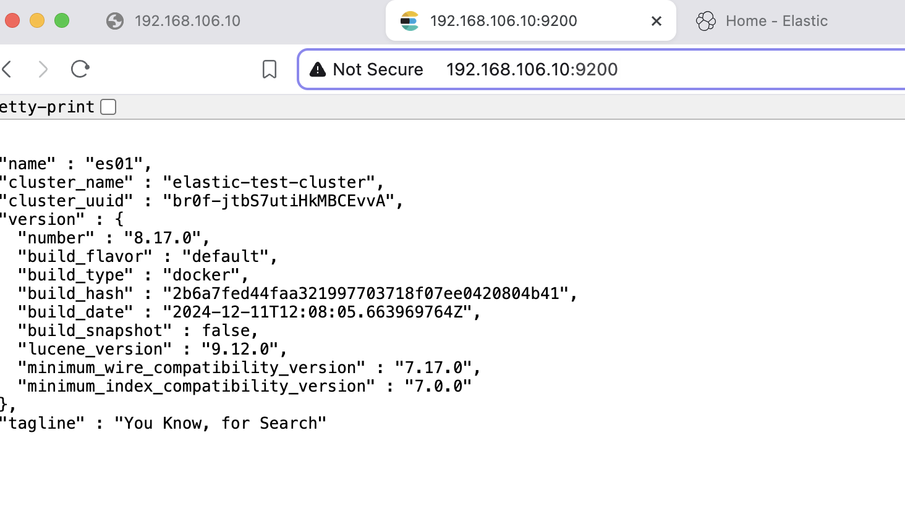
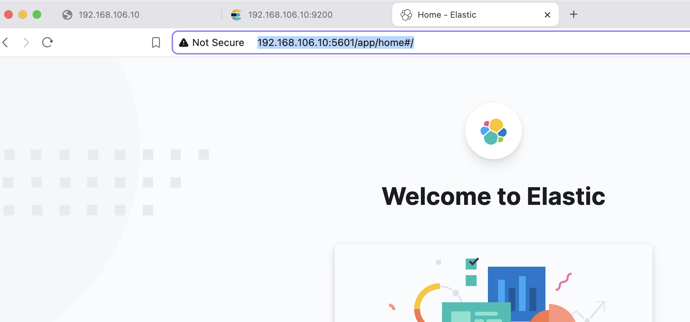

## Lab 1: Setting Up Elasticsearch and Kibana with Docker (Without Security)

### **1. Prerequisites**

#### **Step 1.1: Install Docker**
1. Follow the [official Docker installation guide](https://docs.docker.com/engine/install/).
2. Verify the installation:
   ```bash
   docker --version
   ```

#### **Step 1.2: Install Docker Compose**
1. Follow the [official Docker Compose installation guide](https://docs.docker.com/compose/install/linux/).
2. Verify the installation:
   ```bash
   docker compose --version
   ```

#### **Step 1.3: Set System Parameters**
Elasticsearch requires `vm.max_map_count` to be set properly for its operation:
1. Set it temporarily:
   ```bash
   sudo sysctl -w vm.max_map_count=262144
   ```
2. To make it persistent:
   ```bash
   echo "vm.max_map_count=262144" | sudo tee -a /etc/sysctl.conf
   sudo sysctl -p
   ```

#### **Step 1.4: Create a Docker Network**
For multi-container setups:
```bash
docker network create elastic
```

#### **Step 1.5: Get the Multipass IP Address**
To access the Multipass instance from your host, find its IP address:
```bash
multipass info elastic-node
```
Look for the `IPv4` field. Replace `<MULTIPASS_IP>` in the steps below with the IP address you find.

---

### **2. Single-Node Elasticsearch Setup**

#### **Step 2.1: Pull the Elasticsearch Docker Image**
Download the official Elasticsearch Docker image:
```bash
docker pull docker.elastic.co/elasticsearch/elasticsearch:8.17.0
```

#### **Step 2.2: Start a Single Elasticsearch Node**
Run the container with security disabled:
```bash
docker run --name es01 --net elastic -p 9200:9200 \
  -e "discovery.type=single-node" \
  -e "xpack.security.enabled=false" \
  -d docker.elastic.co/elasticsearch/elasticsearch:8.17.0
```

- **Key Flags**:
  - `discovery.type=single-node`: Tells Elasticsearch to run as a standalone node.
  - `xpack.security.enabled=false`: Disables authentication and security.

#### **Step 2.3: Verify Elasticsearch**
Check if Elasticsearch is running:
```bash
curl -X GET "http://<MULTIPASS_IP>:9200"
```
Replace `<MULTIPASS_IP>` with your Multipass instance IP.

Expected response:
```json
{
  "name" : "es01",
  "cluster_name" : "docker-cluster",
  "version" : {
    "number" : "8.17.0",
    ...
  },
  ...
}
```

---

### **3. Multi-Node Elasticsearch Cluster**

#### **Step 3.1: Start Elasticsearch Nodes**

Commands that worked:

##### **Node 1 (Master Node)**:
```bash
docker network create elastic
```
```bash
docker run -d --name es01 --net elastic -p 9200:9200 \
  -e "node.name=es01" \
  -e "cluster.name=elastic-test-cluster" \
  -e "discovery.seed_hosts=es02,es03" \
  -e "cluster.initial_master_nodes=es01,es02,es03" \
  -e "xpack.security.enabled=false" \
  -e "ES_JAVA_OPTS=-Xms512m -Xmx512m" \
  docker.elastic.co/elasticsearch/elasticsearch:8.17.0
```

##### **Node 2**:
```bash
docker run -d --name es02 --net elastic \
  -e "node.name=es02" \
  -e "cluster.name=elastic-test-cluster" \
  -e "discovery.seed_hosts=es01,es03" \
  -e "cluster.initial_master_nodes=es01,es02,es03" \
  -e "xpack.security.enabled=false" \
  -e "ES_JAVA_OPTS=-Xms512m -Xmx512m" \
  docker.elastic.co/elasticsearch/elasticsearch:8.17.0
```

##### **Node 3**:
```bash
docker run -d --name es03 --net elastic \
  -e "node.name=es03" \
  -e "cluster.name=elastic-test-cluster" \
  -e "discovery.seed_hosts=es01,es02" \
  -e "cluster.initial_master_nodes=es01,es02,es03" \
  -e "xpack.security.enabled=false" \
  -e "ES_JAVA_OPTS=-Xms512m -Xmx512m" \
  docker.elastic.co/elasticsearch/elasticsearch:8.17.0
```

### **What You Have**
- **Three Elasticsearch nodes (`es01`, `es02`, `es03`)** are running.
- **`es01` is exposing port 9200 to the host**, allowing you to interact with the cluster via `http://<MULTIPASS_IP>:9200`.
- All nodes are properly connected to the `elastic` Docker network.

---

#### **Step 3.2: Verify the Cluster**

#### 1. **Check Cluster Health**
Run the following command to check the health of your Elasticsearch cluster:
```bash
curl -X GET "http://<MULTIPASS_IP>:9200/_cluster/health?pretty"
```
- Replace `<MULTIPASS_IP>` with your Multipass instance IP.
- Expected response:
```json
{
  "cluster_name" : "elastic-test-cluster",
  "status" : "green",
  "timed_out" : false,
  "number_of_nodes" : 3,
  "number_of_data_nodes" : 3,
  ...
}
```

#### 2. **Check Nodes in the Cluster**
To confirm all three nodes are part of the cluster:
```bash
curl -X GET "http://<MULTIPASS_IP>:9200/_cat/nodes?v"
```
Expected output:
```plaintext
ip         heap.percent ram.percent cpu load_1m load_5m load_15m node.role   master name
172.21.0.4           60          97  12    0.85    0.45     0.73 cdfhilmrstw -      es03
172.21.0.3           30          97  43    0.85    0.45     0.73 cdfhilmrstw *      es02
172.21.0.2           35          97  53    0.85    0.45     0.73 cdfhilmrstw -      es01
```

---

### **4. Adding Kibana**

#### **Step 4.1: Pull the Kibana Docker Image**
```bash
docker pull docker.elastic.co/kibana/kibana:8.17.0
```

#### **Step 4.2: Start Kibana**
Run the following command:
```bash
docker run -d --name kib01 --net elastic -p 5601:5601 \
  -e "ELASTICSEARCH_HOSTS=http://es01:9200" \
  docker.elastic.co/kibana/kibana:8.17.0
```

---

#### **Step 4.3: Access Kibana**
1. Open your browser and go to:
   ```
   http://<MULTIPASS_IP>:5601
   ```
   Replace `<MULTIPASS_IP>` with your Multipass instance IP.
2. You should see the Kibana dashboard.

---

### **Optional: Port Forwarding for `localhost` Access**

If you'd prefer to access the services using `localhost` on your host machine, set up port forwarding between the Multipass instance and your host:

1. Use SSH Port Forwarding:
   ```bash
   ssh -L 9200:localhost:9200 -L 5601:localhost:5601 ubuntu@<MULTIPASS_IP>
   ```
   This forwards the ports from the Multipass instance to your local machine.

2. Access Services Locally:
   - **Elasticsearch**: `http://localhost:9200`
   - **Kibana**: `http://localhost:5601`

---

### **5. Visual Overview**

#### Elasticsearch Setup:


#### Kibana Dashboard:


---

### **Optional: Cleanup**

#### **Stop All Containers**:
```bash
docker stop es01 es02 es03 kib01
```

#### **Remove All Containers**:
```bash
docker rm es01 es02 es03 kib01
```

#### **Remove the Network**:
```bash
docker network rm elastic
```

### **References**

1. **Elasticsearch Docker Images**:  
   [https://www.elastic.co/downloads/elasticsearch](https://www.elastic.co/downloads/elasticsearch)

2. **Official Elasticsearch Docker Guide**:  
   [https://www.elastic.co/guide/en/elasticsearch/reference/current/docker.html](https://www.elastic.co/guide/en/elasticsearch/reference/current/docker.html)
