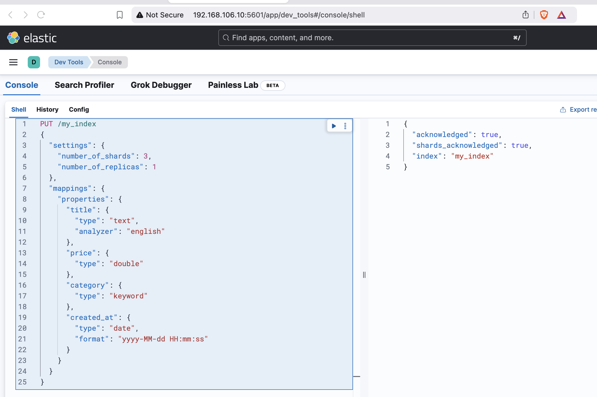

## Lab 2: Data Modeling

### Setting Up Your Environment
Ensure your Elasticsearch cluster is running. If it is not set up yet, refer to the provided Docker setup instructions.

---

### **Where to Perform These Steps**

The exercises in this lab can be performed in two environments:

1. **Kibana Dev Tools (Recommended)**: Use the Kibana GUI to run the Elasticsearch API requests interactively. This is ideal for experimenting and viewing results immediately. Access it via `http://<KIBANA_HOST>:5601`, and navigate to **Dev Tools** -> Console.

   > **Important**: **Kibana Dev Tools does not support comments in API requests.** If copying the examples directly into Dev Tools, remove all comments from the requests.

2. **Command Line Interface (CLI)**: Use tools like `curl` or HTTP clients to send API requests directly to your Elasticsearch cluster. Comments are supported in CLI scripts when prefixed with `#`.

---

### **Exercise 1: Creating an Index with Explicit Mappings**

#### Task:
Create an index named `my_index` with explicit mappings.

#### Steps:
1. Send a `PUT` request to create the index:

   **Explanation**:
   - **Settings**:
     - `number_of_shards`: Divides the data into 3 shards for scalability.
     - `number_of_replicas`: Adds 1 replica for high availability.
   - **Mappings**:
     - `title`: A full-text searchable field analyzed with the `english` analyzer.
     - `price`: A `double` field to store numerical values with decimals.
     - `category`: A `keyword` field for exact-match filtering and sorting.
     - `created_at`: A `date` field with a custom format for precise queries.

   **Request** (without comments for Kibana Dev Tools compatibility):
   ```bash
   PUT /my_index
   {
     "settings": {
       "number_of_shards": 3,
       "number_of_replicas": 1
     },
     "mappings": {
       "properties": {
         "title": {
           "type": "text",
           "analyzer": "english"
         },
         "price": {
           "type": "double"
         },
         "category": {
           "type": "keyword"
         },
         "created_at": {
           "type": "date",
           "format": "yyyy-MM-dd HH:mm:ss"
         }
       }
     }
   }
   ```

   > **Reminder**: If you are using the CLI (`curl`), you can include inline comments for reference.

2. Verify the index and its mappings:
   - Use the `GET` request to confirm the index was created and the mappings are correct.

   ```bash
   GET /my_index/_mapping
   ```



---

### **Exercise 2: Indexing a Document**

#### Task:
Index a document in the `my_index` index.

#### Steps:
1. Use the following `POST` request to add a document:

   ```bash
   POST /my_index/_doc/1
   {
     "title": "Getting Started with Elasticsearch",
     "price": 49.99,
     "category": "Books",
     "created_at": "2024-02-10 10:00:00"
   }
   ```

2. Verify the document was indexed:
   - This ensures the document can be retrieved.

   ```bash
   GET /my_index/_doc/1
   ```

---

### **Exercise 3: Updating a Document**

#### Task:
Update the `price` field in the document you created earlier.

#### Steps:
1. Use the `_update` endpoint with a `POST` request to update only the `price` field:

   ```bash
   POST /my_index/_update/1
   {
     "doc": {
       "price": 39.99
     }
   }
   ```

2. Verify the update:
   - Check that the `price` field now reflects the updated value.

   ```bash
   GET /my_index/_doc/1
   ```

---

### **Exercise 4: Deleting a Document**

#### Task:
Delete the document you created earlier.

#### Steps:
1. Use the `DELETE` request to remove the document:

   ```bash
   DELETE /my_index/_doc/1
   ```

2. Confirm the deletion:
   - Ensure the document no longer exists.

   ```bash
   GET /my_index/_doc/1
   ```

---

### **Exercise 5: Exploring Dynamic Mapping**

#### Task:
Index a document without predefining mappings and observe Elasticsearch’s dynamic mapping behavior.

#### Steps:
1. Index a new document in a non-existent index:

   ```bash
   POST /dynamic_index/_doc/1
   {
     "name": "Wireless Mouse",
     "price": 25.99,
     "features": ["Bluetooth", "Rechargeable"]
   }
   ```

2. Check the dynamically created mappings:

   ```bash
   GET /dynamic_index/_mapping
   ```

---

### **Exercise 6: Creating Nested Documents**

#### Task:
Index a nested document to represent hierarchical data.

#### Steps:
1. Define a mapping with a nested field:

   ```bash
   PUT /nested_index
   {
     "mappings": {
       "properties": {
         "product": {
           "type": "nested",
           "properties": {
             "name": { "type": "text" },
             "reviews": {
               "type": "nested",
               "properties": {
                 "user": { "type": "text" },
                 "rating": { "type": "integer" },
                 "comment": { "type": "text" }
               }
             }
           }
         }
       }
     }
   }
   ```

2. Index a nested document:

   ```bash
   POST /nested_index/_doc/1
   {
     "product": {
       "name": "Gaming Laptop",
       "reviews": [
         { "user": "Alice", "rating": 5, "comment": "Excellent!" },
         { "user": "Bob", "rating": 4, "comment": "Great value." }
       ]
     }
   }
   ```

3. Verify the nested document:

   ```bash
   GET /nested_index/_doc/1
   ```

---

### **Exercise 7: Cleaning Up**

#### Task:
Delete the indices created during the lab.

#### Steps:
1. Use the `DELETE` request to remove indices:

   ```bash
   DELETE /my_index
   DELETE /dynamic_index
   DELETE /nested_index
   ```

2. Confirm the deletions:

   ```bash
   GET /_cat/indices?v
   ```

---
