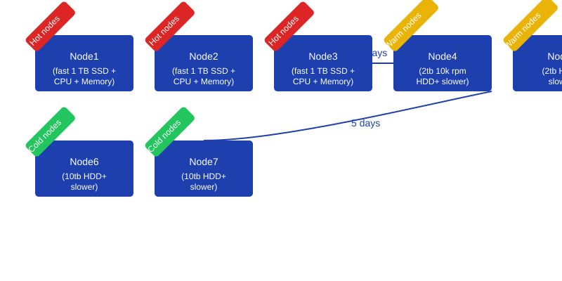
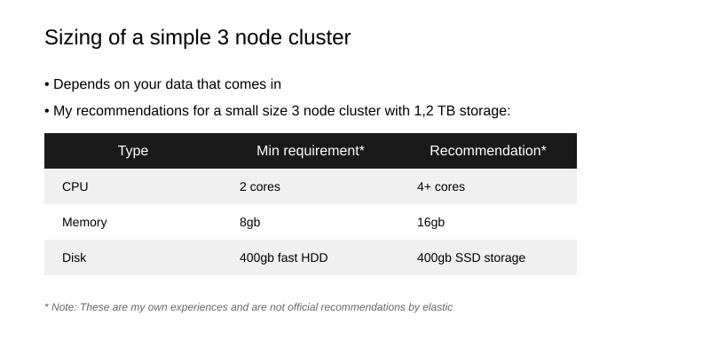

# Lecture 1: Elasticsearch Introduction

### Mis on ELK?

Elastic Stack on avatud lähtekoodiga tööriistade komplekt andmete analüüsiks, töötlemiseks, salvestamiseks ja visualiseerimiseks. Seda tuntakse kui ELK Stack (Elasticsearch, Logstash, Kibana), kuhu kuulub ka Beats.

### Mis on ELK Cluster?

## Kibana – andmete visualiseerimine
**Kibana** pakub sektordiagramme, joondiagramme, histogramme ja kaarte. Sellega saab visualiseerida Elasticsearchi andmeid ja kujundada soovitud viisil.

## Logstash – andmete töötlemine
**Logstash** kogub ja töötleb andmeid erinevatest allikatest ning saadab need Elasticsearchi.

*Introduction to Elasticsearch Architecture*

*Source: [Medium](https://medium.com)*

*Elasticsearch Scaling Strategies*

*Source: [Medium](https://medium.com)*

## Beats – andmete saatmine
**Beats** on kergkaalulised agendid, mis saadavad andmeid masinatest Logstashi või otse Elasticsearchi. Näiteks: **Filebeat** jälgib logifaile ja impordib need.

Elastic Stack tsentraliseerib andmed ja pakub võimsaid tööriistu analüüsiks ja visualiseerimiseks.

*ELK TLS Docker Architecture Diagram*

*Source: [Swimlane GitHub Wiki](https://github.com/swimlane/elk-tls-docker/wiki)*

### Beats Family Table

| **Beat**       | **Purpose**                                                                                                                                                                |
|-----------------|--------------------------------------------------------------------------------------------------------------------------------------------------------------------------|
| **Filebeat**   | Lightweight shipper for logs and other data. Collects logs from various sources like security devices, cloud, containers, hosts, and OT, simplifying log forwarding. (7)   |
| **Metricbeat** | Lightweight shipper for metric data. Gathers system and service metrics, such as CPU, memory, Redis, NGINX, and more. Simplifies system and service monitoring. (8)       |
| **Packetbeat** | Lightweight shipper for network data, enabling real-time monitoring of network activity.                                                                                   |
| **Winlogbeat** | Lightweight shipper for Windows event logs, focused on centralizing Windows-specific log data.                                                                             |
| **Auditbeat**  | Lightweight shipper for audit data, designed for security auditing and compliance monitoring.                                                                              |
| **Heartbeat**  | Lightweight shipper for uptime monitoring. Automates anomaly detection and accelerates root cause analysis with AIOps. (9)                                                |

### Mis on Elasticsearch?

Elasticsearch on avatud lähtekoodiga hajutatud otsingu- ja analüüsimootor, mis on loodud horisontaalseks skaleeritavuseks, reaalajas otsinguks ja kõrgeks töökindluseks. Kuuludes NoSQL-andmebaaside hulka, on see ehitatud Apache Lucene otsingumootori raamatukogu peale.

Elasticsearchi kasutatakse laialdaselt:
- Logide ja sündmuste andmete analüüsiks
- Täistekstiotsinguks
- Ärilisteks analüütikateks
- Rakenduste jälgimiseks

Elasticsearch salvestab andmeid skeemivabas JSON-formaadis, mis teeb selle paindlikuks ja kohanemisvõimeliseks erinevate andmemudelite ja struktuuridega. Hajutatud RESTful API abil saavad arendajad hõlpsasti teostada keerukaid otsinguid, koondamisi ja analüüse suurte andmekogumite põhjal.

### Elasticsearchi põhifunktsioonid:

| Feature | Description |
|---------|-------------|
| **Distributed & Scalable** | Built for distributed environments with horizontal scaling across nodes. Easy node addition for growing workloads. |
| **Real-time Search** | Near real-time querying and analytics for up-to-date insights on rapidly changing datasets. |
| **Full-text Search** | Advanced full-text search with fuzzy searches, wildcards, and proximity queries using DSL. |
| **Schema-free JSON** | Data stored as schema-free JSON documents allowing flexible data structures. |
| **High Reliability** | Built-in data replication and fault tolerance with distributed data across multiple nodes. |
| **RESTful API** | Intuitive API using standard HTTP methods (GET, POST, PUT, DELETE). |
| **Rich Querying** | Extensive tools for complex data analysis and visualization using metrics, histograms, and aggregations. |

---

### Elasticsearchi roll DevOpsis:

| Area | Description | Examples |
|------|-------------|----------|
| **Log Management** | • Centralized logging across systems • Real-time monitoring • Automated alerts | • Application troubleshooting • Infrastructure monitoring • Slack/email alerts |
| **Data Search** | • Fast indexing and filtering • Advanced analytics with Kibana | • E-commerce search • Log analysis • Sales pattern analysis |
| **ML/AI** | • Anomaly detection • Custom ML models | • Fraud detection • Cyber threat monitoring |
| **Data Centralization** | Unified platform for multiple data sources | Integrated ERP/CRM views |
| **Performance** | Real-time queries for large datasets | Processing millions of log events |
| **Security & Audit** | • Audit log management • Security monitoring | • IT security audits • IPS/IDS analysis |                      |

---

### Olulised mõisted: 

### Key Concepts:
| Term | Description | Example |
|------|-------------|---------|
| **Node** | Single Elasticsearch instance running on a machine with a specific cluster role | Data node storing logs; coordinating node routing queries |
| **Cluster** | Collection of nodes working together for data storage and management | 3-node setup: 2 data nodes + 1 master-eligible node |
| **Index** | Logical namespace representing a collection of similar documents | Log index containing server errors and queries |
| **Shard** | Individual storage unit of an index distributed across nodes | "server_logs" split into 5 shards, each with a replica |
| **Replication** | Process of creating and maintaining shard copies across nodes | Each shard replicated once for failover protection |
| **Cluster State** | Global repository of cluster config and metadata, including index/shard distribution | Stores info about new index creation and shard allocation |