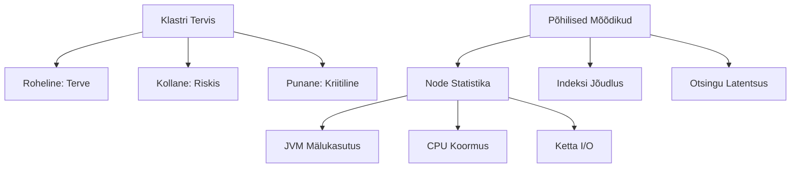

# Lecture 7: Elasticsearch Monitoring and Alerting

## Sissejuhatus
Elasticsearch'i klastri tervise ja jõudluse jälgimine on süsteemi usaldusväärsuse ja tõhususe säilitamisel ülioluline. See loeng tutvustab peamisi tööriistu ja tehnikaid Elasticsearch'i jälgimiseks ning häiresignaalide seadistamiseks.

## Jälgimistööriistad

### 1. Elasticsearch Monitooringu API

| Funktsioon | Kirjeldus |
|------------|-----------|
| Peamine otstarve | Sisseehitatud API klastri tervise ja jõudluse jälgimiseks |
| Põhimõõdikud | Node'ide statistika, indeksite jõudlus, JVM mälukasutus |
| Kasutamine | API päringud tõrkeotsinguks ja jõudluse optimeerimiseks |

### 2. Prometheus

| Omadus | Kirjeldus |
|---------|-----------|
| Tüüp | Avatud lähtekoodiga jälgimis- ja hoiatussüsteem |
| Võimalused | Kogub mõõdikuid ja salvestab ajaseeria andmebaasi |
| Integratsioon | Konfigureeritav Elasticsearch API-ga ühendumiseks |

### 3. Grafana

| Funktsioon | Kirjeldus |
|------------|-----------|
| Otstarve | Visualiseerimis- ja analüütikaplatvorm |
| Võimalused | Kohandatud armatuurlauad ja hoiatused |
| Kasutamine | Ühendub Prometheusega reaalajas visualiseerimiseks |

## Põhilised Mõõdikud



### Klastri Tervise Indikaatorid

| Staatus | Kirjeldus | Tegevus |
|---------|-----------|----------|
| 🟢 Roheline | Täielikult toimiv | Tavapärane jälgimine |
| 🟡 Kollane | Mõned probleemid | Uurimine vajalik |
| 🟥 Punane | Kriitilised probleemid | Kohene sekkumine |

## Täiendavad Võimalused

### Anomaaliate Tuvastamine

```javascript
// Näide anomaalia tuvastamise reeglist
{
  "monitor": {
    "name": "JVM mälu anomaalia",
    "type": "metric",
    "schedule": "0 */5 * * * ?",
    "inputs": [{
      "search": {
        "indices": [".monitoring-es-*"],
        "query": {
          "bool": {
            "must": [
              {"range": {"timestamp": {"gte": "now-1h"}}},
              {"term": {"type": "jvm_memory"}}
            ]
          }
        }
      }
    }],
    "triggers": [{
      "name": "JVM mälu kõrge",
      "severity": "high",
      "condition": {
        "script": {
          "source": "ctx.results[0].hits.hits[0]._source.jvm.mem.heap_used_percent > 85"
        }
      }
    }]
  }
}
```

### Soovitatavad Häiresignaalide Lävend

| Mõõdik | Hoiatus | Kriitiline |
|--------|----------|------------|
| CPU Kasutus | > 75% | > 90% |
| Mälu Kasutus | > 80% | > 90% |
| Ketta Kasutus | > 75% | > 85% |
| Otsingu Latentsus | > 500ms | > 1000ms |
