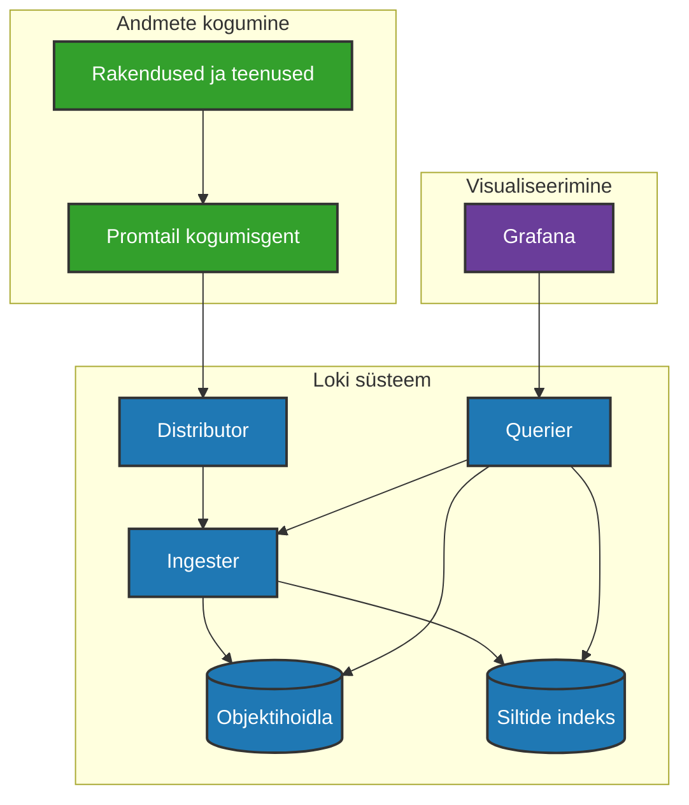

# Loki

## Mis on Loki?

Loki on lahe tööriist, mis aitab koguda, säilitada ja uurida logisid - ehk siis teated, mida su rakendused ja programmid kirjutavad oma tegevuse kohta. Loki teeb selle mega-efektiivseks ja odavaks!


*Joonis: Loki arhitektuur - logide voog läbi süsteemi*

## Loki arhitektuur lihtsas keeles

Loki töötab kolmes põhietapis:

1. **Kogumine** - Promtail nimeline agent kogub logisid erinevatest kohtadest
2. **Töötlemine ja salvestamine** - Loki töötleb ja salvestab logid väga nutikalt
3. **Päringud ja kuvamine** - Grafana abil saad logisid otsida ja visualiseerida

Siin on lihtne diagramm, mis näitab, kuidas Loki töötab:




## Loki vs teised lahendused - võrdlus

| Võrdlus | Ilma Lokita | Lokiga |
|--------|-------------|--------|
| Kettaruum | Palju ruumi vaja, sest kõik indekseeritakse | Vähe ruumi vaja, sest indekseeritakse ainult sildid |
| Kulud | Kallis, sest vaja palju ressursse | Odav, kuni 10x vähem kulusid kui teistel lahendustel |
| Kiirus | Võib olla aeglane, kui logisid on palju | Kiire ka suure logimahu korral |
| Skaleerumine | Raske kasvada, kui logisid tuleb juurde | Lihtne laiendada, kui vajadus kasvab |
| Ühilduvus | Tööriistade vahel liikumine keerukas | Töötab suurepäraselt koos Grafana ja Prometheusega |
| Paigaldamine | Keeruline seadistada | Lihtne paigaldada ja kasutama hakata |
| Otsimine | Tavaline tekstiotsing | Võimas LogQL päringukeel |

## Miks Loki on nii populaarne?

1. **Säästlik** - Kasutab vähe ressursse, mis teeb selle odavaks
2. **Lihtne alustada** - Kui tead Prometheust, siis Loki tundub tuttav
3. **Kergesti paigaldatav** - Ei pea olema IT-geenius, et seda tööle saada
4. **Grafana integratsioon** - Töötab suurepäraselt koos populaarse Grafana dashboardiga
5. **Tasuta ja avatud** - Pole vaja kallist litsentsi, kood on kõigile avatud
6. **Sobib kõigile** - Töötab sama hästi nii suurte kui väikeste süsteemidega
7. **Kasvab koos sinuga** - Kui su rakendused kasvavad, kasvab Loki koos nendega
8. **Väike jalajälg** - Ei võta palju mälu ega protsessori jõudlust

## LogQL päringute näited - kuidas logidest infot leida

LogQL on Loki päringukeel, mida kasutatakse logidest info leidmiseks. Siin on mõned lihtsad näited:

```
# Kõik logid rakendusest "myapp"
{app="myapp"}

# Kõik veateated tootmiskeskkonnas
{app="myapp", env="production"} |= "error"

# Loendab HTTP 500 veateateid viimase tunni jooksul
sum(count_over_time({app="myapp", status="500"}[1h]))
```

## Kuidas Loki lisatud meiel?

1. **Promtail konfiguratsioon** - `./data/promtail/config.yml` fail, mis sisaldab:

```yaml
server:
  http_listen_port: 9080

positions:
  filename: /tmp/positions.yaml

clients:
  - url: http://loki:3100/loki/api/v1/push

scrape_configs:
  - job_name: system
    static_configs:
      - targets:
          - localhost
        labels:
          job: varlogs
          __path__: /var/log/*log
  
  - job_name: docker
    docker_sd_configs:
      - host: unix:///var/run/docker.sock
        refresh_interval: 5s
    relabel_configs:
      - source_labels: ['__meta_docker_container_name']
        regex: '/(.*)'
        target_label: 'container'
```

2. **Grafanas Loki andmeallika lisamine**:
   - Ava Grafana (http://localhost:3000)
   - Mine Configuration > Data Sources
   - Kliki "Add data source"
   - Vali "Loki"
   - URL väljale sisesta: `http://loki:3100`
   - Kliki "Save & Test"

4. **Logide uurimine Grafanas**:
   - Kliki Grafana menüüst "Explore"
   - Vali andmeallikaks "Loki"
   - Kirjuta päring, näiteks `{container="zabbix-server"}`
   - Kliki "Run Query"

## Nipid ja trikid

- **Sildista targalt** - Ära lisa liiga palju silte, piisab 5-7 olulisest
- **Kasuta struktuurseid logisid** - JSON-formaadis logid on Lokis lihtsam uurida
- **Kombineeri Prometheusega** - Kasuta Prometheust mõõdikute ja Lokit logide jaoks
- **Logi olulist** - Ära logi kõike, vaid ainult seda, mis on tõesti tähtis

## Kasulikud lingid

- Ametlik dokumentatsioon: [https://grafana.com/docs/loki/latest/](https://grafana.com/docs/loki/latest/)
- GitHub: [https://github.com/grafana/loki](https://github.com/grafana/loki)
- Grafana Labs kogukonnafoorumid: [https://community.grafana.com/](https://community.grafana.com/)