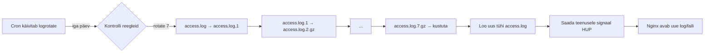
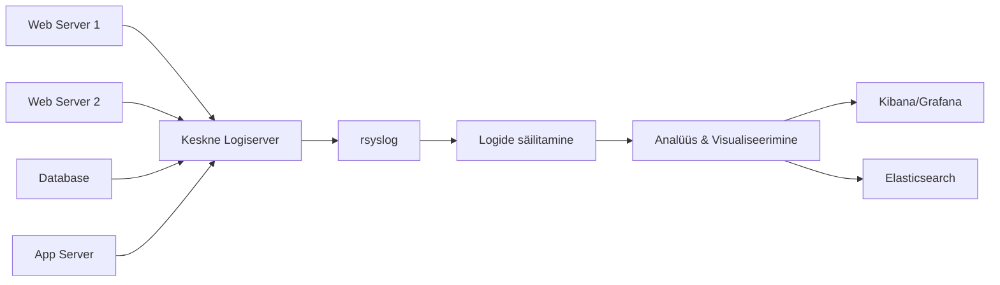

# Linux Logimine ja Haldamine: Põhitõed

**Eeldused:** Linux põhikäsud, terminali kasutamine • **Kestus:** 2h loeng • **Eesmärk:** Mõista Linux logimissüsteemi ja oskust logide haldamist

## Õpiväljundid

Pärast selle loengu läbimist õpilane:

1. **Selgitab** Linux logimissüsteemi põhimõtteid ja logifailide struktuuri
2. **Mõistab** rsyslog, logrotate ja journald rolli süsteemis
3. **Eristab** erinevaid logitasemeid (facility.severity) ja nende kasutust
4. **Kirjeldab** keskse logiserveri eeliseid ja arhitektuuri
5. **Rakendab** parimaid praktikaid logide turvalisuse ja halduse osas

---

# 1. Sissejuhatus Linux logimisse

## Mis on logimine?

Logimine on protsess, mille käigus salvestatakse süsteemi või rakenduse sündmused, tegevused ja teated. See on oluline osa igast operatsioonisüsteemist, sealhulgas Linuxist.

**Logimise põhiomadused:**
- Sündmuste kronoloogiline salvestamine
- Erinevate sündmuste kategooriatesse jagamine
- Automaatne ja pidev protsess

**Logisõnumi anatoomia:**
Tüüpiline logisõnum sisaldab järgmisi elemente:
1. Ajatempel: Millal sündmus toimus
2. Allikas: Milline süsteemi osa või rakendus logi genereeris
3. Sõnumi tüüp või tase: Näiteks INFO, WARNING, ERROR
4. Sõnumi sisu: Detailne kirjeldus sündmusest

Näide logisõnumist:
```
May 7 10:23:45 myserver sshd[12345]: Failed password for invalid user test from 192.168.1.100 port 54321 ssh2
```

## Miks on logimine oluline?

Kujuta ette: sinu firma veebileht on maas. Juht küsib: "Mis juhtus? Millal see algas? Kes tegi viimati muudatusi?" Ilma logideta vastad: "Ei tea." Logidega vastad: "Kell 14:32 hakkas andmebaas tagastama vigu, sest ketas sai täis. Viimane deployment oli kell 14:15 kasutaja admin poolt."

Logimine on kriitilise tähtsusega mitmel põhjusel:

**1. Vigade tuvastamine ja lahendamine**
- Kui rakendus crashib, logid näitavad täpset viga ja asukohta koodis
- Saad jälgida, millal probleem tekkis ja mis selle põhjustas
- Näide: "Database connection timeout" → vaata logi → näed, et ühenduste arv kasvas üle 100

**2. Turvalisuse tagamine**
- Näed kõiki sisselogimise katseid (õnnestunud ja ebaõnnestunud)
- Tuvastab brute-force rünnakuid
- Näide: 1000 ebaõnnestunud SSH sisselogimist 5 minutiga samalt IP-lt = rünnak

**3. Süsteemi jõudluse jälgimine**
- Näed, millal süsteem muutus aeglaseks
- Leiad kitsaskohad (näiteks aeglased päringud)
- Planeerid ressursse (kui palju mälu/CPU on vaja)

**4. Vastavus regulatsioonidele ja auditeerimise võimaldamine**
- GDPR nõuab logimist: kes milliseid isikuandmeid vaatas
- Panganduses: iga tehingu logi peab säilima 7 aastat
- Auditid: inspektorid küsivad "Näita, mis 15. märtsil kell 10:00 juhtus"

### Peamised logifailid Linuxis

| Logifail | Otstarve | Mida sealt leida |
|----------|----------|------------------|
| `/var/log/syslog` | Üldine süsteemilogi | Kõik süsteemi sündmused |
| `/var/log/auth.log` | Autentimise logid | SSH sisselogimised, sudo kasutamine |
| `/var/log/dmesg` | Kerneli logid | Riistvara, draiverid, boot protsess |
| `/var/log/boot.log` | Süsteemi käivitumine | Boot protsessi sündmused |
| `/var/log/cron` | Cron jobid | Ajastatud ülesannete täitmine |
| `/var/log/apache2/` | Apache veebserver | Veebipäringud, vead |
| `/var/log/nginx/` | Nginx veebserver | Access ja error logid |
| `/var/log/mysql/` | MySQL andmebaas | Päringud, vead, slow queries |

## Logimise ajalugu Linuxis

1. **Algne Unix syslog protokoll**
   - Loodud 1980. aastatel Eric Allman'i poolt
   - Põhiidee: standardiseeritud viis sõnumite saatmiseks ja töötlemiseks

2. **Linux-spetsiifilised täiendused**
   - klogd: kerneli logimisdeemon
   - syslogd: süsteemi logimisdeemon

3. **Kaasaegsed lahendused**
   - rsyslog: laiendatud võimalustega syslog
   - systemd journal: struktureeritud logimine

**Ajajoone näide:**
```
1980 - Unix syslog
  |
  v
1991 - Linux tuuma esmane versioon
  |
  v
2004 - rsyslog arendus algab
  |
  v
2010 - systemd (koos journald'iga) tutvustamine
```

### Kontrollküsimused

1. Milline on tüüpilise logisõnumi struktuur? Nimeta 4 põhikomponenti.
2. Kirjelda ühte reaalset olukorda, kus logid aitavad turvaintsidenti tuvastada.
3. Miks on vajalik logide pikaajaline säilitamine?

# 2. Linux logimise põhikomponendid

## 2.1 rsyslog

rsyslog (Rocket-fast System for Log processing) on mitmekülgne ja võimas logimise lahendus Linuxi süsteemides. See on vastutav logide kogumise, filtreerimise ja salvestamise eest.

### rsyslog töövoog

```mermaid
graph LR
    A[Rakendused] -->|logisõnumid| B[rsyslog Core]
    C[Kernel] -->|kernel logid| B
    D[Systemd] -->|teenuse logid| B
    B --> E{Reeglid<br/>facility.severity}
    E -->|auth.*| F[/var/log/auth.log]
    E -->|kern.*| G[/var/log/kern.log]
    E -->|*.*| H[Logiserver<br/>UDP/TCP 514]
```

### Põhiomadused

| Omadus | Kirjeldus | Miks oluline |
|--------|-----------|--------------|
| **Kiirus** | Mitmelõimeline töötlus | Suudab töödelda tuhandeid logisid sekundis |
| **Protokollid** | TCP, UDP, SSL, TLS | Turvaline logide edastamine võrgus |
| **Salvestamine** | Failid, andmebaasid | Paindlik - vali sobiv lahendus |
| **Filtreerimine** | Facility, severity, sisu | Suuna erinevad logid õigetesse kohtadesse |

### Konfiguratsioon

rsyslog'i peamine konfiguratsioonifail: `/etc/rsyslog.conf`  
Täiendavad konfid: `/etc/rsyslog.d/*.conf`

**Põhiline reeglite süntaks:**
```
facility.severity     action
```

Näide:
```bash
# /etc/rsyslog.conf näide
authpriv.*              /var/log/secure        # Kõik auth logid → secure
mail.*                  /var/log/maillog       # Kõik mail logid → maillog  
cron.*                  /var/log/cron          # Cron jobid → cron
*.emerg                 :omusrmsg:*            # Hädaabid kõikidele kasutajatele
```

### rsyslog moodulite tüübid

| Mooduli tüüp | Prefiks | Näide | Otstarve |
|--------------|---------|-------|----------|
| Sisendmoodulid | `im` | `imudp`, `imtcp` | Koguvad logisid erinevatest allikatest |
| Väljundmoodulid | `om` | `omfile`, `ommysql` | Saadavad logisid sihtkohtadesse |
| Filtreerimismoodulid | `fm` | `fmhash` | Filtreerivad sõnumeid |
| Parsimismoodulid | `pm` | `pmrfc3164` | Analüüsivad sõnumite formaati |

**Praktiline näide:** Kui tahad saata logisid MySQL andmebaasi, laed mooduli `ommysql`.

## 2.2 logrotate

logrotate on tööriist logifailide automaatseks haldamiseks, pööramiseks ja arhiveerimiseks. Ilma selleta täituvad logifailid kettaruumi ja süsteem ei tööta enam.

### Miks logrotate on vajalik?

**Probleem:** Nginx access.log on 50GB. Ketas on täis. Süsteem crashib.

**Lahendus:** logrotate pöörab logifaile automaatselt:
1. `access.log` → `access.log.1` (uus tühi fail luuakse)
2. `access.log.1` → `access.log.2.gz` (kompresseeritakse)
3. `access.log.7.gz` → kustutatakse (säilitatakse 7 päeva)

### Peamised konfiguratsioonivõimalused

| Parameeter | Väärtused | Kirjeldus | Näide |
|------------|-----------|-----------|-------|
| `daily/weekly/monthly` | - | Pööramise sagedus | `daily` = iga päev |
| `rotate` | number | Kui palju vanad logid säilitada | `rotate 7` = 7 faili |
| `compress` | - | Kompresseeri vanad logid | `.gz` lõpuga failid |
| `delaycompress` | - | Ära kompresseeri kõige uuemat | Võib veel kirjutada |
| `missingok` | - | Ei viska viga kui fail puudub | Turvaline |
| `notifempty` | - | Ei pööra tühje faile | Kokkuhoid |
| `create` | mode owner group | Uue faili õigused | `create 640 www-data adm` |
| `sharedscripts` | - | Käivita skript ainult üks kord | Efektiivne mitme faili puhul |

### Logrotate töövoog



Näide konfiguratsioonist:
```
/var/log/nginx/*.log {
    daily
    missingok
    rotate 52
    compress
    delaycompress
    notifempty
    create 0640 www-data adm
    sharedscripts
    postrotate
        [ -f /var/run/nginx.pid ] && kill -USR1 `cat /var/run/nginx.pid`
    endscript
}
```

## 2.3 journald

journald on osa systemd süsteemist ja pakub struktureeritud logimist. Erinevalt rsyslog'ist, mis salvestab tekstifailidesse, salvestab journald binaarformaadis andmebaasi.

### rsyslog vs journald

| Omadus | rsyslog | journald |
|--------|---------|----------|
| **Formaat** | Tekstifailid | Binaarfailid (andmebaas) |
| **Salvestamine** | `/var/log/*.log` | `/var/log/journal/` |
| **Vaatamine** | `tail`, `grep`, `less` | `journalctl` |
| **Struktureeritus** | Vabatekstiread | JSON-sarnane struktuur |
| **Otsing** | `grep` (aeglane) | Indekseeritud (kiire) |
| **Võrgutugi** | Jah (native) | Ei (vajab rsyslog'i) |

**Millal kasutada kumba?**
- **rsyslog** - keskne logiserver, võrgu üle logide edastamine
- **journald** - lokaalne logimine, kiire otsing, systemd teenused

### journald põhiomadused

**1. Binaarformaat** - ei saa käsitsi muuta (turvalisem), väiksem kettakasutus

**2. Struktureeritud** - iga logikirjel on väljad (timestamp, service, message, PID, jne)

**3. Automaatne** - systemd teenused logib automaatselt journald'i

### journalctl põhikäsud

```bash
# Kõigi logide vaatamine (värvides!)
journalctl

# Konkreetse teenuse logid
journalctl -u nginx.service

# Viimase tunni logid
journalctl --since "1 hour ago"

# Reaalajas jälgimine (nagu tail -f)
journalctl -f

# Ainult ERROR ja kõrgem
journalctl -p err

# Konkreetse protsessi logid
journalctl _PID=1234

# Boot logid
journalctl -b        # praegune boot
journalctl -b -1     # eelmine boot
```

**Praktiline näide:**
```bash
# Leia miks Nginx ei käivitu
journalctl -u nginx.service -p err --since today
```

## 2.4 auditd

auditd on Linuxi tuuma auditisubsüsteem, mis jälgib ja logib olulisi süsteemisündmusi turvalisuse seisukohalt. See on must-have tööriist, kui peab näitama, KES, MILLAL, MIDA tegi süsteemis.

### Miks on auditd vajalik?

**Stsenaarium 1:** Keegi kustutab `/etc/passwd` faili. Kellel on ligipääs? auditd näitab.

**Stsenaarium 2:** Auditor küsib: "Kes vaatas tundlikke faile 15. märtsil?" auditd vastab.

**Stsenaarium 3:** GDPR nõue: "Näita kes ja millal logi faile muutis." auditd säilitab.

### auditd vs rsyslog

| Aspekt | rsyslog | auditd |
|--------|---------|--------|
| **Eesmärk** | Üldised süsteemi logid | Turva-audit ja compliance |
| **Mida logib** | Teenuste logid, sõnumid | Failide muutmised, syscall'id |
| **Kui detailne** | Üldine | Äärmiselt detailne |
| **Kasutusjuht** | "Mida süsteem teeb?" | "Kes ja mida tegi?" |
| **Compliance** | Ei | Jah (GDPR, PCI-DSS) |

### Auditreeglite tüübid

| Reegli tüüp | Süntaks | Kasutusjuht | Näide |
|-------------|---------|-------------|-------|
| **File watch** | `-w path -p perms` | Jälgi faili/kausta | Kes muudab /etc/passwd |
| **System call** | `-a action,list -S syscall` | Jälgi süsteemikutseid | Kõik `open` kutsed |
| **User** | `-F uid=X` | Jälgi kasutajat | Kõik root tegevused |

### Praktilised näited

**1. Jälgi tundlikke konfigfaile:**
```bash
# Jälgi /etc/passwd muutmisi
auditctl -w /etc/passwd -p wa -k passwd_changes

# Jälgi SSH konfigi
auditctl -w /etc/ssh/sshd_config -p rwxa -k sshd_config
```

**Selgitus:**
- `-w` = watch (jälgi)
- `-p wa` = permissions: write + attribute change
- `-k` = key (märksõna otsinguks)

**2. Jälgi kasutaja tegevusi:**
```bash
# Jälgi kõiki root kasutaja tegevusi
auditctl -a always,exit -F uid=0

# Jälgi ebaõnnestunud sudo katseid
auditctl -a always,exit -F exe=/usr/bin/sudo -F success=0
```

**3. Otsi logidest:**
```bash
# Otsi kõiki passwd_changes sündmusi
ausearch -k passwd_changes

# Otsi konkreetse kasutaja tegevusi
ausearch -ua admin

# Otsi tänaseid sündmusi
ausearch -ts today -te now -i
```

### Reaalelu näide

```bash
# Seadista jälgimine
auditctl -w /var/www/html -p wa -k webroot_changes

# Keegi muudab veebileht faile...

# Hiljem uurid:
ausearch -k webroot_changes

# Tulemus näitab:
# type=SYSCALL msg=audit(1699012345.123:456): arch=x86_64 syscall=open 
# success=yes exit=3 pid=1234 uid=33 gid=33 comm="php-fpm" 
# exe="/usr/sbin/php-fpm8.1" key="webroot_changes"
```

**Tõlgendus:** PHP-FPM (UID 33 = www-data) avas faili webroot'is.

## 2.5 Kokkuvõte

Nende tööriistade kombinatsioon moodustab tervikliku logimise lahenduse Linuxis. Igal tööriistal on oma spetsiifiline roll:

- **rsyslog** - tegeleb üldise logimisega ja logide edastamisega
- **logrotate** - haldab logifailide suurust ja arhiveerimist
- **journald** - pakub struktureeritud ja indekseeritud logimist systemd süsteemides
- **auditd** - jälgib spetsiifilisi turvalisusega seotud sündmusi ja failisüsteemi muudatusi

Nende tööriistade efektiivne kasutamine aitab tagada süsteemi stabiilsuse, turvalisuse ja probleemide kiire tuvastamise. Laboris õpid neid praktiliselt kasutama.

### Kontrollküsimused

1. Mis vahe on rsyslog ja journald vahel? Millal kasutad kumba?
2. Selgita, miks on logrotate vajalik. Mis juhtub, kui seda ei kasuta?
3. Millistes olukordades on auditd eriti kasulik?
4. Nimeta 3 rsyslog moodulite tüüpi ja anna igale näide.

---

# 3. Logifailide haldamine

## 3.1 Logide vaatamine

Linuxis on mitmeid tööriistu logide vaatamiseks:

- `cat`: Kuvab kogu logifaili sisu
  ```bash
  cat /var/log/syslog
  ```

- `less`: Võimaldab logifaili sirvida
  ```bash
  less /var/log/syslog
  ```

- `tail`: Näitab logifaili viimaseid ridu, kasulik reaalajas jälgimiseks
  ```bash
  tail -f /var/log/syslog
  ```

- `journalctl`: systemd-põhiste süsteemide jaoks
  ```bash
  journalctl -xe
  ```

## 3.2 Logides otsimine

Efektiivseks logide analüüsiks on vajalik oskus neis otsida:

- `grep`: Otsib kindlaid mustreid
  ```bash
  grep "error" /var/log/syslog
  ```

- `awk`: Võimaldab keerukamaid otsinguid ja andmete töötlust
  ```bash
  awk '/error/ {print $1, $2, $3}' /var/log/syslog
  ```

### Keerukamad otsingud ja analüüsid

Linuxi käsurea tööriistad võimaldavad teha ka keerukamaid otsinguid ja analüüse, kombineerides erinevaid käske. Näiteks:

```bash
grep "GET" /var/log/apache2/access.log | awk '{print $1}' | sort | uniq -c | sort -nr
```

See käsk teeb järgmist:

1. `grep "GET"`: Filtreerib välja kõik read, mis sisaldavad "GET" (HTTP GET päringud).
2. `awk '{print $1}'`: Prindib välja iga rea esimese välja (tavaliselt IP-aadress).
3. `sort`: Sorteerib tulemused.
4. `uniq -c`: Loendab korduvad read ja eemaldab duplikaadid.
5. `sort -nr`: Sorteerib tulemused numbriliselt (`n`) ja pööratud järjekorras (`r`).

Tulemuseks on nimekiri IP-aadressidest, mis on teinud GET päringuid, sorteeritud päringute arvu järgi kahanevas järjekorras.

Seda käsku saab kasutada näiteks:
- Veebiserverite logide analüüsimiseks
- Populaarseimate külastajate IP-aadresside tuvastamiseks
- Potentsiaalselt kahtlase tegevuse tuvastamiseks (nt DDoS rünnakud)

## 3.3 Logide roteerumine

Logide roteerumine on oluline, et vältida kettaruumi täitumist.
Vaatame lähemalt tüüpilist Nginx logrotate konfiguratsiooni ja selgitame iga rea tähendust:

```bash
/var/log/nginx/*.log {
    daily
    missingok
    rotate 52
    compress
    delaycompress
    notifempty
    create 0640 www-data adm
    sharedscripts
    prerotate
        if [ -d /etc/logrotate.d/httpd-prerotate ]; then \
            run-parts /etc/logrotate.d/httpd-prerotate; \
        fi \
    endscript
    postrotate
        [ -s /run/nginx.pid ] && kill -USR1 `cat /run/nginx.pid`
    endscript
}
```

Selgitus:

1. `/var/log/nginx/*.log`: See rida määrab, milliseid logifaile roteeritakse (kõik .log laiendiga failid Nginx logikaustas).
2. `daily`: Logifaile roteeritakse iga päev.
3. `missingok`: Kui logifail puudub, jätkab logrotate ilma veateadet genereerimata.
4. `rotate 52`: Säilitatakse 52 roteeritud logifaili, mis tähendab umbes aasta jagu logisid (kui roteeritakse iga päev).
5. `compress`: Roteeritud logifailid kompresseeritakse.
6. `delaycompress`: Kompressimine lükatakse edasi järgmise rotatsioonitsüklini. See on kasulik, kui rakendus võib veel kirjutada eelmisesse logifaili.
7. `notifempty`: Tühje logifaile ei roteerita.
8. `create 0640 www-data adm`: Pärast rotatsiooni luuakse uus tühi logifail õigustega 0640, omanikuks www-data ja grupiks adm.
9. `sharedscripts`: Käivitab pre- ja post-rotatsiooniskriptid ainult üks kord, isegi kui roteeritakse mitu logifaili. See on efektiivsem kui käivitada skript iga faili jaoks eraldi.
10. `prerotate` ... `endscript`: Skript, mis käivitatakse enne logide roteerimist. Siin kontrollitakse, kas eksisteerib teatud kaust ja käivitatakse seal olevad skriptid.
11. `postrotate` ... `endscript`: Skript, mis käivitatakse pärast logide roteerimist. Siin saadetakse Nginx protsessile signaal USR1, mis põhjustab logifailide uuesti avamise.

See konfiguratsioon tagab, et Nginx logid roteeritakse regulaarselt, säilitades piisava ajaloo, hoides kettaruumi kontrolli all ja tagades, et Nginx jätkab korrektselt logimist pärast rotatsiooni.

### Praktiline näide: Logide analüüs

Kujuta ette, et kasutaja helistab: "Veebileht ei tööta!" Kuidas leiad probleemi?

**Samm 1:** Vaata viimased logid
```bash
tail -n 50 /var/log/nginx/error.log
```

**Samm 2:** Otsi vigu konkreetse aja kohta
```bash
grep "2024-10-09 14:" /var/log/nginx/error.log
```

**Samm 3:** Leia kõige sagedasemad vead
```bash
grep "error" /var/log/nginx/error.log | awk '{print $9}' | sort | uniq -c | sort -rn
```

**Tulemus:** Näed, et 500 errori on 342 korda, põhjus: "Connection to database failed"

### Kontrollküsimused

1. Millise käsuga vaatad logifaili viimast 20 rida reaalajas?
2. Kuidas leiad kõik ERROR taseme logid viimasest 24 tunnist?
3. Selgita logrotate konfiguratsiooni parameetreid: `daily`, `rotate 7`, `compress`
4. Miks on `delaycompress` kasulik?

# 4. Keskne logiserver

Keskne logiserver on professionaalse IT-taristu oluline komponent. See tähendab, et kõik süsteemid saadavad oma logid ühte kohta, kus neid saab analüüsida, säilitada ja monitoorida.

## 4.1 Keskse logiserveri eelised

**Turvalisus:** Kui süsteem häkitakse, ei saa ründaja logisid kustutada või muuta, sest need on juba turvaliselt teises serveris. Samuti saab piirata ligipääsu logidele - ainult administraatorid näevad tundlikke logisid.

**Analüüs ja korrelatsioon:** Kui sul on 50 serverit ja tahad näha, mis kell 14:30 juhtus, siis ühe keskse logiserveri puhul vaatad ühest kohast. Samuti saad korreleerida sündmusi - näiteks kui andmebaas crashib samal ajal kui webserver raporteerib vigu, näed kohe seost.

**Varundamine:** Lihtsam varundada ühte logiserveri kui 50 erinevat serverit. Samuti saad määrata pikema säilitusperioodi - näiteks 1 aasta logid keskserveris vs 1 kuu logid tootmisserverites (kettaruumi kokkuhoid).

**Ülevaade:** Üks koht, kus näed kogu infrastruktuuri seisundit. Saad luua dashboarde, mis näitavad, mis toimub kõikides süsteemides korraga.

## 4.2 Keskse logiserveri arhitektuur

Tüüpiline keskse logiserveri ülesehitus koosneb kolmest komponendist:

1. **Kliendid (log producers):** Serverid, mis genereerivad logisid (webserverid, andmebaasid, rakendused)
2. **Logiserver (log collector):** Keskne server, mis võtab logid vastu ja salvestab
3. **Analüüsi tööriistad:** Tööriistad logide otsimiseks ja analüüsimiseks



## 4.3 Keskse logiserveri seadistamine

### Logiserver (VM1) seadistamine

rsyslog serveris tuleb lubada logide vastuvõtmine võrgust. Vaikimisi rsyslog ei kuula võrku - see on turvakaalutlus.

```bash
# Redigeeri rsyslog konfiguratsioonifaili
sudo nano /etc/rsyslog.conf

# Lisa need read faili lõppu (või aktiveeri olemasolevad):
# UDP logide vastuvõtmiseks (port 514)
module(load="imudp")
input(type="imudp" port="514" address="0.0.0.0")

# TCP logide vastuvõtmiseks (usaldusväärsem)
module(load="imtcp")
input(type="imtcp" port="514" address="0.0.0.0")
```

**TÄHTIS:** 
- `address="0.0.0.0"` = kuula KÕIKIDEL võrguliidestel (sh väline võrk)
- `address="127.0.0.1"` = kuula AINULT localhost'il (testimiseks)
- Kui jätad `address` ära, vaikimisi kuulab 0.0.0.0

**Määra, kuhu klientide logid salvestada:**

```bash
# Uus RainerScript süntaks (soovitatav)
template(name="RemoteLogs" type="string" string="/var/log/remote/%HOSTNAME%/%PROGRAMNAME%.log")
*.* action(type="omfile" dynaFile="RemoteLogs")

# Peata logide töötlemine pärast salvestamist (väldi duplikaate)
& stop
```

**Selgitus:**
- `template(name="RemoteLogs"...)` - loob malli, kuidas logifaile nimetatakse
- `%HOSTNAME%` - kliendi hostnäme
- `%PROGRAMNAME%` - programmi nimi, mis logi saatis
- `action(type="omfile"...)` - salvestab faili
- `& stop` - lõpetab töötlemise (et sama logi ei läheks ka /var/log/syslog'i)

### Klient (VM2) seadistamine

Klientmasinates tuleb öelda rsyslog'ile, et saadaks logid keskserverisse.

```bash
# Loo uus konfiguratsioonifail
sudo nano /etc/rsyslog.d/50-send-to-server.conf

# Lisa järgmine rida (asenda keskse-logiserveri IP):
*.* action(type="omfwd" target="192.168.100.10" port="514" protocol="udp")

# Või TCP protokolliga (usaldusväärsem):
*.* action(type="omfwd" target="192.168.100.10" port="514" protocol="tcp")
```

**Vana süntaks (töötab ka, aga deprecated):**
```bash
# UDP
*.* @192.168.100.10:514

# TCP
*.* @@192.168.100.10:514
```

**Selgitus:**
- `*.*` - kõik facility'id ja severity'id
- `protocol="udp"` - kiire, aga võib pakette kaotada
- `protocol="tcp"` - aeglasem, aga usaldusväärsem (garanteerib kohaletoimetamise)

### Tulemüüri seadistamine

Logiserver peab lubama sissetulevad ühendused pordile 514:

```bash
# Ubuntu/Debian
sudo ufw allow 514/udp
sudo ufw allow 514/tcp

# RHEL/CentOS
sudo firewall-cmd --permanent --add-port=514/udp
sudo firewall-cmd --permanent --add-port=514/tcp
sudo firewall-cmd --reload
```

### Teenuste taaskäivitamine

```bash
# Mõlemas masinas
sudo systemctl restart rsyslog

# Kontrolli staatust
sudo systemctl status rsyslog

# Kontrolli kas rsyslog kuulab (serveris)
sudo ss -uln | grep 514
```

### Testimine

Klientmasinast saada testlog:

```bash
logger "Test message from client"
```

Logiserveris kontrolli:

```bash
# Vaata kliendi nimega kausta
ls -la /var/log/remote/
tail -f /var/log/remote/client-hostname/syslog.log
```

### Kontrollküsimused

1. Nimeta 3 peamist keskse logiserveri eelist. Selgita iga eelis praktilise näitega.
2. Mis vahe on UDP ja TCP protokollil logide saatmisel?
3. Miks rsyslog vaikimisi ei kuula võrgust? Mida tuleb teha, et ta hakkaks?
4. Kuidas testid, kas logide edastamine töötab?

# 5. Syslog protokoll: Facility ja Severity

Enne kui saad rsyslog reegleid kirjutada, pead mõistma syslog protokolli põhikontseptsioone: **facility** ja **severity**.

## 5.1 Mis on Facility ja Severity?

Iga logisõnum Linuxis koosneb kahest osast:

1. **Facility** (allikas) - KUS see sõnum tekkis
2. **Severity** (tase) - KUI oluline see sõnum on

```
facility.severity → kuhu.tähtsus
```

Näide: `auth.err` = autentimise viga, `mail.info` = mail serveri info

### Miks see on oluline?

**Stsenaarium:** Sul on üks `/var/log/syslog` fail kus on KÕIK logid - mail server, SSH, cron, kernel, jne. See on 10GB päevas ja on võimatu lugeda.

**Lahendus:** Kasuta facility/severity, et suunata erinevad logid erinevatesse failidesse:
- `auth.*` → `/var/log/auth.log` (kõik SSH/login logid)
- `mail.*` → `/var/log/mail.log` (mail server logid)
- `*.err` → `/var/log/errors.log` (KÕIK vead ühes kohas!)

## 5.2 Facility tüübid

| Facility | Number | Kasutus | Näide |
|----------|--------|---------|-------|
| `auth` / `authpriv` | 4 / 10 | Autentimine, turvalisus | SSH sisselogimine, sudo |
| `kern` | 0 | Kernel sõnumid | Riistvara vead, driver probleemid |
| `mail` | 2 | Mail server | Postfix, sendmail |
| `daemon` | 3 | Süsteemi deemonid | Apache, Nginx, MySQL |
| `user` | 1 | Kasutaja protsessid | Skriptid, rakendused |
| `cron` | 9 | Cron jobid | Ajastatud ülesanded |
| `syslog` | 5 | Syslog ise | rsyslog sisemised sõnumid |
| `local0-local7` | 16-23 | **Kohandatud kasutus** | Sinu oma rakendused |

**Praktiline näide:**
```bash
# Mail server kasutab 'mail' facility't
# Sinu custom rakendus võib kasutada 'local0'
```

## 5.3 Severity tasemed

| Severity | Number | Tähendus | Millal kasutada | Näide |
|----------|--------|----------|-----------------|-------|
| `emerg` | 0 | **Paanika** | Süsteem on unusable | Kernel panic |
| `alert` | 1 | **Kiire tegevus vajalik** | Andmed võivad kaduda | RAID disk failed |
| `crit` | 2 | **Kriitiline** | Oluline viga | Andmebaas ei käivitu |
| `err` | 3 | **Viga** | Midagi läks valesti | Connection failed |
| `warning` | 4 | **Hoiatus** | Võib probleemiks muutuda | Disk 80% täis |
| `notice` | 5 | **Tavaline aga oluline** | Tähtis info | User logged in |
| `info` | 6 | **Informatiivne** | Üldine info | Service started |
| `debug` | 7 | **Debug** | Arenduse info | Function called |

### Kuidas valida õige taset?

**Reeglid:**
- **emerg/alert** - ainult kui KOGU süsteem on ohus
- **crit** - teenus ei tööta
- **err** - midagi ebaõnnestus, aga teenus töötab
- **warning** - peaks tähelepanu pöörama
- **notice/info** - normaalne töö
- **debug** - ainult arenduses

## 5.4 Rsyslog reeglite kirjutamine

Nüüd kui tead facility/severity, saad kirjutada reegleid:

### Põhisüntaks
```
facility.severity    /path/to/logfile
```

### Praktilised näited

```bash
# 1. Kõik auth logid → auth.log
auth.*              /var/log/auth.log
authpriv.*          /var/log/auth.log

# 2. Kõik vead (err ja kõrgemad) → errors.log
*.err               /var/log/errors.log

# 3. Ainult mail serveri info → mail.log
mail.info           /var/log/mail.log

# 4. Cron jobid → cron.log
cron.*              /var/log/cron.log

# 5. Kõik DEBUG ja madalam MITTE kuskile
*.debug             /dev/null

# 6. Kernel paanilised sõnumid → konsool + fail
kern.emerg          /dev/console
kern.emerg          /var/log/kernel-panic.log

# 7. Custom rakendus → oma fail
local0.*            /var/log/myapp.log
```

### Reeglite kombinatsioonid

```bash
# Mitu facility't ühte faili
mail,daemon.err     /var/log/services-error.log

# Tase ja kõik kõrgemad (err = err+crit+alert+emerg)
*.err               /var/log/all-errors.log

# VÄLJA ARVATUD (none)
*.info;mail.none    /var/log/messages
# = Kõik info, aga MITTE mail (mail on omaette failis)
```

## 5.5 Logger käsk - testimiseks

`logger` käsk võimaldab saata testsõnumeid syslog'i. See on super kasulik:

### Põhikasutus

```bash
# Lihtne sõnum (vaikimisi: user.notice)
logger "Test message"

# Määra facility ja severity
logger -p auth.warning "Failed login attempt"
logger -p local0.err "Application error occurred"
logger -p mail.info "Mail queue processed"

# Lisa tag (kuvatakse kui programmi nimi)
logger -t myapp "Application started"

# Saada kohe võrku (kui on seadistatud)
logger -n 192.168.1.10 -P 514 "Remote log test"
```

### Praktiline kasutus

**1. Testimine: Kas logid jõuavad õigesse faili?**
```bash
# Saada test auth log
logger -p auth.info "TEST: SSH login test"

# Kontrolli kas jõudis
tail /var/log/auth.log | grep TEST
```

**2. Skriptides veakäsitlus:**
```bash
#!/bin/bash
if ! backup_database; then
    logger -p local0.err -t backup "Database backup FAILED"
    exit 1
fi
logger -p local0.info -t backup "Database backup completed"
```

**3. Debugging keskse logiserveri seadistust:**
```bash
# Kliendis
logger -p local0.info "Test from client"

# Serveris
tail -f /var/log/remote/client-hostname/syslog.log
```

### Kontrollküsimused

1. Mis vahe on `auth.err` ja `kern.err` vahel?
2. Millise severity taseme valid, kui disk on 90% täis?
3. Kirjuta rsyslog reegel: "Kõik mail serveri vead → /var/log/mail-errors.log"
4. Kuidas testida logger käsuga, kas logid jõuavad logiserveri?
5. Miks kasutatakse `local0-7` facility'd?

---

# 6. Parimad praktikad ja tõrkeotsing

## 6.1 Turvalisus

### Logifailide õigused

**Miks oluline:** Logid võivad sisaldada tundlikku infot (paroolid, IP-d, kasutajanimed).

```bash
# Õiged õigused
-rw-r----- syslog:adm /var/log/syslog
-rw------- syslog:syslog /var/log/auth.log  # Ainult syslog näeb

# VALED õigused (ära tee nii!)
-rw-r--r-- syslog:syslog /var/log/auth.log  # Kõik näevad!
```

**Parimad praktikad:**
- Logifailid: `640` või `600`
- Kataloogi: `750` või `700`
- Owner: `syslog:adm` või `root:adm`

### Võrgus edastamine

**Probleem:** UDP @ port 514 on krüptimata → keegi võib logisid lugeda või võltsida.

**Lahendus:**
```bash
# Kasuta TLS krüpteerimist (uus RainerScript süntaks)
# /etc/rsyslog.conf

# Lae TLS moodul
module(load="omfwd")

# Seadista TLS
global(
    defaultNetstreamDriver="gtls"
    defaultNetstreamDriverCAFile="/etc/ssl/ca.pem"
    defaultNetstreamDriverCertFile="/etc/ssl/client-cert.pem"
    defaultNetstreamDriverKeyFile="/etc/ssl/client-key.pem"
)

# Saada krüpteeritult
*.* action(
    type="omfwd"
    target="secure-logserver"
    port="6514"
    protocol="tcp"
    streamDriver="gtls"
    streamDriverMode="1"
    streamDriverAuthMode="x509/name"
)
```

## 6.2 Jõudlus

### Logi liiga palju = süsteem aeglustub

**Märgid:**
- Kettakasutus 100%
- I/O wait kõrge
- rsyslog CPU kasutus kõrge

**Lahendused:**

| Probleem | Lahendus | Näide |
|----------|----------|-------|
| Debug logid production'is | Muuda taset | `*.debug /dev/null` |
| Liiga suured failid | Tihenda logrotate | `hourly` vs `daily` |
| Ketas täis | Suurenda rotate count | `rotate 3` vs `rotate 30` |
| Aeglane võrk | Kasuta kohalikku puhvrit | `queue.size=10000` |

### Monitoori logimist

```bash
# Kontrolli logifailide suurusi
du -sh /var/log/*

# Vaata kiiresti kasvavaid faile
watch -n 5 'ls -lh /var/log/*.log'

# Kontrolli kettaruumi
df -h /var/log
```

## 6.3 Säilitamine

### Kui kaua säilitada?

| Logi tüüp | Säilitamine | Põhjus |
|-----------|-------------|--------|
| Auth logid | 1-2 aastat | Turvalisus, audit |
| Süsteemilogid | 30-90 päeva | Troubleshooting |
| Debug logid | 7 päeva | Kokkuhoid |
| Application logid | 90 päeva | Business vajadus |
| Audit logid | 7+ aastat | Regulatsioonid (GDPR, PCI-DSS) |

### Arhiveerimine

```bash
# Vana logide arhiveerimine
tar -czf /backup/logs-2024-01.tar.gz /var/log/archive/2024-01/
rm -rf /var/log/archive/2024-01/

# Automaatne cleanup (logrotate)
/var/log/myapp/*.log {
    daily
    rotate 90          # 3 kuud
    compress
    dateext            # lisa kuupäev failinimele
    postrotate
        # Arhiveeri vanad logid
        find /var/log/myapp -name "*.gz" -mtime +30 -exec mv {} /archive/ \;
    endscript
}
```

## 6.4 Tõrkeotsing - Kiire checklist

### Probleem 1: Logid ei ilmu

**Checklist:**
```bash
# 1. Kas rsyslog töötab?
systemctl status rsyslog
# Kui ei: systemctl start rsyslog

# 2. Kas konfiguratsioon on õige?
rsyslogd -N1    # Kontrolli süntaksit
# Kui viga: vaata /etc/rsyslog.conf

# 3. Kas õigused on korras?
ls -la /var/log/syslog
# Peaks olema: syslog:adm 640

# 4. Kas ketas on täis?
df -h /var/log
# Kui jah: puhasta vanu logisid

# 5. Kas tulemüür blokeerib (logiserver)?
sudo ufw status | grep 514
# Lisa: sudo ufw allow 514/udp
```

### Probleem 2: Logid jõuavad, aga valesse kohta

```bash
# Kontrolli reegleid
grep -r "myapp" /etc/rsyslog.d/

# Testi logger'iga
logger -p local0.info -t myapp "TEST MESSAGE"

# Otsi kus see on
grep -r "TEST MESSAGE" /var/log/
```

### Probleem 3: Keskne logiserver ei saa logisid

```bash
# Klient poolel:
# 1. Kas võrk toimib?
ping <logiserver-ip>

# 2. Kas rsyslog saadab?
grep "target=" /etc/rsyslog.d/*.conf

# 3. Testi käsitsi
logger -n <logiserver-ip> -P 514 "Manual test"

# Server poolel:
# 1. Kas rsyslog kuulab?
sudo ss -uln | grep 514

# 2. Kas tulemüür lubab?
sudo ufw status | grep 514

# 3. Kas logid saabuvad?
sudo tcpdump -i any port 514
```

### Probleem 4: journalctl annab "No journal files"

```bash
# Kontrolli kas journald töötab
systemctl status systemd-journald

# Kontrolli kas andmed on püsivad
ls -la /var/log/journal/

# Kui puudub, loo kaust
mkdir -p /var/log/journal
systemctl restart systemd-journald
```

### Kontrollküsimused

1. Milliseid turvameetmeid kasutad logifailide kaitseks?
2. Kui kaua peaksid säilitama authentication logisid? Miks?
3. Kasutaja helistab: "Logid ei ilmu serveris!" - nimeta 5 asja mida kontrollid.
4. Millal kasutad UDP ja millal TCP logide edastamiseks?

---

# 7. Kokkuvõte

## Mis me õppisime?

Selles loengus käsitlesime Linux logimise põhitõdesid:

1. **rsyslog** - peamine logimissüsteem, mis kogub, filtreerib ja salvestab logisid
2. **logrotate** - haldab logifailide suurust ja arhiveerib vanad logid
3. **journald** - systemd-põhine struktureeritud logimine
4. **auditd** - turva-audit ja compliance logid
5. **Facility/Severity** - kuidas logisid kategoriseerida ja filtreerida
6. **Keskne logiserver** - kuidas koguda logisid mitmest serverist
7. **Parimad praktikad** - turvalisus, jõudlus, troubleshooting

## Põhiteadmised sysadminile

| Teema | Peamine oskus |
|-------|---------------|
| **rsyslog** | Reeglite kirjutamine, facility/severity mõistmine |
| **logrotate** | Konfiguratsioonide loomine, parameetrite tundmine |
| **journald** | journalctl käsud, süsteemi logide vaatamine |
| **auditd** | File watching, turvalisuse jälgimine |
| **Keskne logiserver** | UDP/TCP seadistamine, klient-server arhitektuur |
| **logger** | Logide testimine, skriptides logimine |
| **Troubleshooting** | Kiire diagnostika, probleemide lahendamine |

## Järgmine samm

**Laboris** õpid praktiliselt:
- Seadistama keskse logiserveri (2 VM)
- Konfigureerima rsyslog'i klient → server edastust
- Kasutama logger käsku testimiseks
- Lugema ja analüüsima logifaile
- Lahendama levinumaid probleeme

**Lisapraktikas** (kui jõuad):
- Logide kategoriseerimine (auth, kern, daemon)
- logrotate seadistamine
- auditd praktilised näited
- Dashboard'i skriptimine

## Kasulikud viited

**Dokumentatsioon:**
- [rsyslog dokumentatsioon](https://www.rsyslog.com/doc/)
- [logrotate manual](https://linux.die.net/man/8/logrotate)
- [journalctl manual](https://www.freedesktop.org/software/systemd/man/journalctl.html)
- [auditd manual](https://linux.die.net/man/8/auditd)

**Näited ja õppematerjalid:**
- [rsyslog näited](https://www.rsyslog.com/doc/v8-stable/examples/index.html)
- [Linux logging best practices](https://www.loggly.com/ultimate-guide/linux-logging-basics/)

**Tööriistad:**
- `rsyslogd -N1` - kontrolli konfiguratsiooni süntaksit
- `logger` - testi logimist
- `journalctl` - vaata systemd logisid
- `ausearch` - otsi audit logidest

---

**Valmis järgmiseks laboriks!**

Laboris rakendad kõike, mida siin õppisid. Saad praktiliselt ehitada keskse logiserveri ja näha, kuidas see töötab.