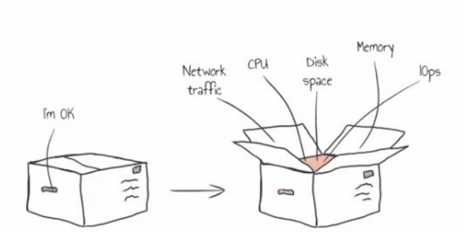
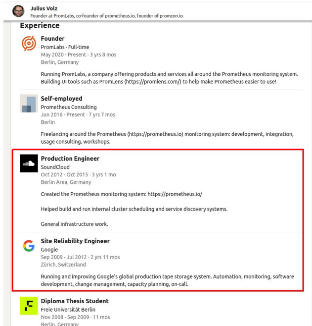
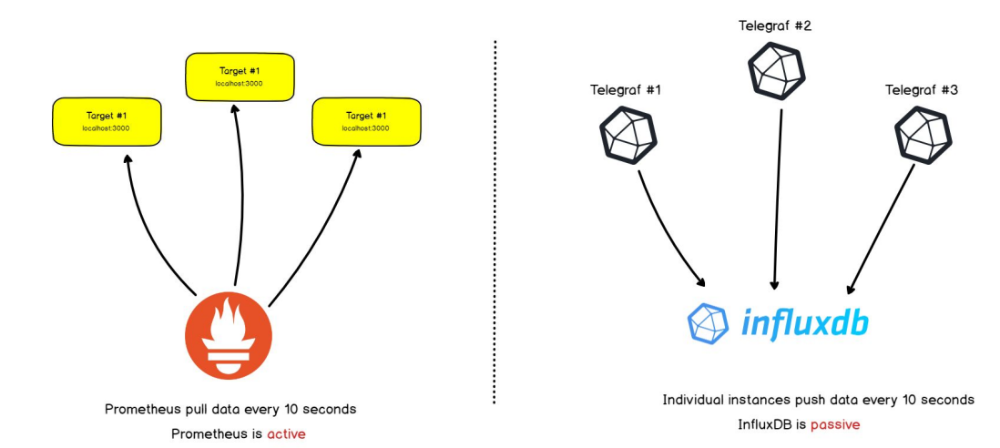
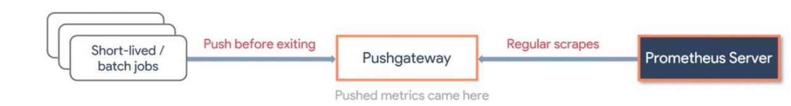
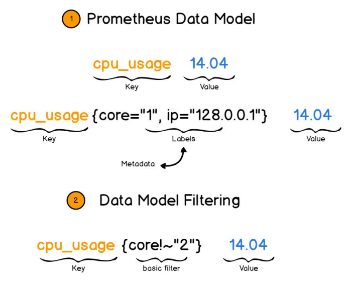

# Prometheus: Monitoring Made Simple

## 1. Observability Refresher

Before diving into Prometheus, let's briefly revisit the concept of observability that we discussed in our previous lesson.

### What is Observability?

Observability is the ability to understand what's happening inside your systems based on external outputs. It's composed of three pillars:

1. **Metrics** - Numerical measurements over time (what we'll focus on today)
2. **Logs** - Detailed records of events that occurred
3. **Traces** - Following requests as they travel through distributed systems

<div class="mermaid">
graph TD
    A[Monitoring] --> B[Metrics]
    A --> C[Logs]
    A --> D[Tracing]
    
    B --> B1[Prometheus]
    B --> B2[TICK]
    
    C --> C1[ELK]
    C --> C2[Loki]
    
    D --> D1[Tempo]
    D --> D2[Jaeger]
</div>

**Example:** A user reports that your application is slow. With proper observability:
- **Metrics** tell you that database latency spiked right when the issue occurred 
- **Logs** show specific database errors happening during that time
- **Traces** reveal that particular user requests are taking long in the database layer

Today we'll focus on metrics with Prometheus, but remember that all three pillars work together for complete observability.

### Monitoring Approaches

#### Black Box vs. White Box Monitoring



When discussing monitoring strategies, there are two fundamental approaches:

#### Black Box Monitoring
- **What it is**: Monitoring a system from the outside, testing only what's externally visible

#### White Box Monitoring
- **What it is**: Monitoring a system from the inside, looking at internal components

### Study Case with Prometheus: Website Slowdown Investigation

Let's make this concrete with a real-world scenario. Imagine a popular website with:
- 2 web servers
- Each with 8 cores and 8GB RAM
- Running Apache, PHP, MySQL

**Problem:** The site becomes slow during peak hours

**Black Box approach (without proper monitoring):**
```
1. We see: Users report pages loading in 30+ seconds
2. Solution attempt: Restart the server
3. Result: Works temporarily, but problem returns next day
4. Next attempt: Add more web servers
5. Result: Still having issues because the real problem is elsewhere
```

**White Box approach (with Prometheus):**
```
1. We see detailed metrics showing: 
   - CPU usage normal (around 30%)
   - Memory usage normal (around 40%)
   - MySQL queries taking 5x longer than normal
   - Specific database tables experiencing high I/O
2. Root cause identified: Slow database queries on specific tables
3. Solution based on data:
   - Add indexes to the problematic tables
   - Optimize the slowest queries
   - Add result caching
4. Result: Performance improves by 90%, no hardware upgrades needed
```

This example demonstrates why internal system metrics are crucial for effective troubleshooting and optimization.

## 2. Prometheus: History and Overview

### The History of Prometheus

Prometheus has an interesting origin story:

- **2012**: Initially developed at SoundCloud by ex-Google engineers
- **2015**: Released as an open-source project
- **2016**: Became the second project (after Kubernetes) to join the Cloud Native Computing Foundation (CNCF)
- **2018**: Reached "graduated" status in the CNCF, indicating maturity and adoption
- **Today**: One of the most popular monitoring solutions, especially in cloud-native environments

Prometheus was inspired by Google's internal monitoring system called Borgmon. The creators took what they learned at Google and applied it to create an open-source solution that could work for organizations of all sizes.

**Example:** SoundCloud was growing rapidly and needed a monitoring system that could scale with them. Traditional monitoring tools at the time couldn't handle their dynamic cloud environment, where servers were constantly being added and removed. This led them to create Prometheus, which was specifically designed for such dynamic environments.

### Key Differentiators of Prometheus

What makes Prometheus stand out from other monitoring tools:

| Feature | Description | Example |
|---------|-------------|---------|
| Pull model | Prometheus pulls metrics from targets | Prometheus scrapes a web server every 15s to get its metrics |
| Time series database | Purpose-built for storing time-based metrics efficiently | Efficiently stores CPU usage data points over time |
| PromQL | Powerful query language for time series | `rate(http_requests_total[5m])` calculates request rate |
| Service discovery | Automatically finds targets to monitor | Automatically detects new pods in Kubernetes |
| No reliance on distributed storage | Simple, single-server architecture | Easier to operate than complex distributed systems |
| Multi-dimensional data model | Labels provide context for flexible querying | Filter metrics by server, application, and endpoint |

### What is Prometheus?


At its core, Prometheus is an open-source monitoring and alerting system:
- Written in Go language
- Focuses on reliability and simplicity
- Works well in dynamic environments (like Kubernetes)
- Stores all data as time series
- De facto standard for cloud-native application monitoring

**Example:** A tech startup runs their application on Kubernetes with dozens of microservices. With Prometheus, they can automatically discover and monitor all services as they scale up and down. When a new service is deployed, Prometheus automatically detects it and begins collecting metrics without manual configuration.

## 3. Prometheus Architecture and Components

### Core Components



Prometheus consists of several key components that work together:

1. **Prometheus Server**
   - The central component that does data collection
   - Stores metrics in a time-series database
   - Evaluates alerting rules
   - Serves queries through its API and web interface
   
   **Example:** The Prometheus server is configured to scrape metrics from 100 different targets every 15 seconds. It stores this data and allows you to query things like "what was the average CPU usage across all web servers over the last 6 hours?"
   
2. **Exporters**
   - Small programs that collect metrics from various systems
   - Convert metrics to Prometheus format
   - Expose metrics over HTTP for Prometheus to scrape
   
   **Example:** The Node Exporter runs on each of your Linux servers and exposes metrics about CPU, memory, disk, and network usage on an HTTP endpoint (typically port 9100). Prometheus regularly scrapes this endpoint to collect these metrics.
   
3. **AlertManager**
   - Handles alerts from Prometheus server
   - Groups similar alerts to reduce noise
   - Routes notifications to the right receivers
   
   **Example:** Prometheus detects high CPU usage on 5 different servers within 2 minutes. Instead of sending 5 separate alerts, AlertManager groups them into one notification saying "High CPU on 5 servers" and sends it to the operations team's Slack channel.

4. **Web UI**
   - Built-in interface for running queries
   - Viewing metrics and alerts
   - Creating basic graphs
   
   **Example:** An operator uses the Prometheus web UI to quickly check if a spike in CPU usage correlates with increased request latency.

### How Prometheus Works: The Pull Model



One of the fundamental aspects of Prometheus is its pull-based architecture:

1. **Pull vs Push**:
   - Prometheus actively scrapes (pulls) metrics from targets
   - Targets expose metrics on an HTTP endpoint (usually /metrics)
   - This happens at regular intervals (default is 15 seconds)

**Example Configuration:**
```yaml
scrape_configs:
  - job_name: 'webapp'
    scrape_interval: 15s
    static_configs:
      - targets: ['server1:9090', 'server2:9090']
```

This configuration tells Prometheus to scrape metrics from both server1 and server2 on port 9090 every 15 seconds, using the job name 'webapp'.

### Advantages of the Pull Model

The pull approach has several benefits, illustrated with this diagram:

<div class="mermaid">
graph LR
    A[Prometheus Server] -->|Pull metrics| B[Web Servers]
    A -->|Pull metrics| C[Database Servers]
    A -->|Pull metrics| D[Cache Servers]
    style A fill:#f96,stroke:#333
    style B fill:#99f,stroke:#333
    style C fill:#99f,stroke:#333
    style D fill:#99f,stroke:#333
</div>

- **Centralized control**: Configuration is managed in one place
  
  **Example:** When you need to change the scrape interval from 15s to 30s for all services, you only need to update the Prometheus configuration, not each individual target.

- **Better security**: Targets don't need outbound network access
  
  **Example:** Your database servers can be configured to only accept connections from the Prometheus server, improving security by limiting network exposure.

- **Health checking**: If a target is down, Prometheus knows immediately
  
  **Example:** When a server crashes, Prometheus records that it can't scrape metrics from it, providing an implicit "up/down" monitoring without additional configuration.

- **Consistency**: Metrics are collected at precise intervals
  
  **Example:** Every metric is collected exactly every 15 seconds, making rate calculations more accurate than with variable intervals.

### The Pushgateway for Short-lived Jobs



While Prometheus primarily uses a pull model, it includes a component called Pushgateway for special cases:

- **Purpose**: Allows short-lived jobs to push their metrics before terminating
- **Use cases**: 
  - Batch jobs that don't run long enough to be scraped
  - Services behind firewalls that can't be reached by Prometheus

**Example:** You have a daily database backup job that runs for 2 minutes. Since it might complete between Prometheus scrape intervals, it pushes metrics like "backup_duration_seconds" and "backup_size_bytes" to the Pushgateway when it finishes. Prometheus can then scrape these metrics from the Pushgateway at its regular interval.

- **How it works**:
  1. Short-lived job pushes metrics to Pushgateway
  2. Prometheus scrapes metrics from Pushgateway
  3. Metrics persist in Pushgateway even after the job ends

Remember: The Pushgateway is not meant to replace the pull model for long-running services.

## 4. Prometheus Versioning and Compatibility

**Historical Major Versions:**
- Prometheus 1.x (legacy)
- Prometheus 2.x (current) - introduced significant performance improvements and new storage engine

### Version Compatibility

When updating Prometheus, consider compatibility between components!!!

**Example Scenario:** A team upgrading from Prometheus 2.25 to 2.30 needs to:
1. Check the release notes for breaking changes (usually minimal within same major version)
2. Test their alerting rules and dashboards
3. Update exporters if needed
4. Plan for a short downtime during the upgrade

## 5. Prometheus Data Model

### Understanding Time Series Data



Prometheus stores all data as time series - sequences of timestamped values. Each time series is identified by:

- **Metric name**: Describes what is being measured (e.g., `http_requests_total`)
- **Labels**: Key-value pairs that add dimensions (e.g., `{method="GET", endpoint="/api/v1/users"}`)

This combination of metric name and labels uniquely identifies a time series.

**Example metric:**
```
http_requests_total{method="POST", endpoint="/login", status="200"} 2345
```

Here:
- `http_requests_total` is the metric name (what we're counting)
- `method="POST"`, `endpoint="/login"`, and `status="200"` are labels (how we're categorizing)
- `2345` is the current value (how many we've counted)

**Real-world example:** An e-commerce site tracks requests to its API. Instead of just counting total requests (which wouldn't be very useful), they use labels to track:
- Which endpoint is being called (product listings, cart, checkout)
- Which HTTP method (GET, POST, PUT)
- What status code is returned (200, 404, 500)

This allows them to answer questions like:
- "How many failed checkout attempts have we had in the last hour?"
- "Are product listing requests slower than other types of requests?"
- "Which API endpoint gets the most traffic?"

The power of this model is that it allows for multi-dimensional data analysis. By adding labels, you can slice and dice your metrics in countless ways without having to create a new metric for each combination.

### Metric Types

Prometheus supports four core metric types, each designed for different use cases:

#### Counter
```
# Example: HTTP request count
http_requests_total{method="GET"} 1234
```
- Only increases over time (never decreases)
- Resets to zero when the process restarts

**Real-world example:** A web service tracks the total number of requests it has received since starting. This number only ever goes up. When analyzing this data, you typically look at the rate of increase rather than the absolute value.

**When to use:** Counters are perfect for events that happen: requests served, errors encountered, emails sent, jobs completed. Anything you want to count over time.

#### Gauge
```
# Example: Memory usage
memory_usage_bytes{server="web-1"} 2345678
```
- Can go up or down over time
- Represents a current value at a point in time

**Real-world example:** A system monitors the number of active connections to a database. This number increases as new connections are established and decreases as connections close. At any point, the gauge shows exactly how many active connections exist.

**When to use:** Gauges are ideal for measurements that can increase or decrease: temperature, memory usage, concurrent connections, queue size.

#### Histogram
```
# Example: Request durations
http_request_duration_seconds_bucket{le="0.1"} 2345
http_request_duration_seconds_bucket{le="0.5"} 3456
http_request_duration_seconds_bucket{le="1.0"} 4567
http_request_duration_seconds_sum 5432.1
http_request_duration_seconds_count 7890
```
- Samples observations and counts them in configurable buckets
- Also provides sum and count of all observations

**Real-world example:** An API service measures how long each request takes to process. Rather than storing every individual request time (which would be overwhelming), it counts how many requests completed in under 0.1s, how many under 0.5s, how many under 1.0s, etc. This gives you a distribution of response times.

**When to use:** Histograms are perfect for measuring distributions: request durations, response sizes, queue processing times.

#### Summary
```
# Example: Request duration quantiles
http_request_duration_quantile{quantile="0.5"} 0.052
http_request_duration_quantile{quantile="0.9"} 0.17
http_request_duration_quantile{quantile="0.99"} 0.45
http_request_duration_sum 5432.1
http_request_duration_count 7890
```
- Similar to histogram but calculates streaming φ-quantiles on the client side
- Provides count and sum like histogram

**Real-world example:** Like the histogram example, but instead of buckets, it directly reports that 50% of requests complete in under 0.052 seconds, 90% complete in under 0.17 seconds, etc.

**When to use:** Summaries are useful when you need precise percentiles and know exactly which percentiles you want in advance.

### Comparing Metric Types

| Metric Type | Direction | Reset | Example Use Case | When To Choose |
|-------------|-----------|-------|------------------|----------------|
| Counter | Increases only | Yes | HTTP requests count | When tracking events that happen |
| Gauge | Up & Down | No | CPU usage percentage | When measuring current state |
| Histogram | N/A | No | Request duration distribution | When needing percentiles/distribution with server-side calculation |
| Summary | N/A | No | Pre-calculated percentiles | When needing precise percentiles calculated client-side |

**Practical example:** Imagine monitoring a web application:
- **Counters:** Total requests, 404 errors, successful logins
- **Gauges:** Current memory usage, active users, connection pool size
- **Histograms:** API response times, file upload sizes
- **Summaries:** Precisely calculated API response time percentiles

## 6. Security and Authentication in Prometheus

### The Authentication Challenge

One significant limitation of Prometheus is its lack of built-in authentication and authorization:

- **Default behavior**: No authentication for the web UI or API
- **No user management**: No concept of users, roles, or permissions
- **No encryption**: Communications are not encrypted by default

**Real-world problem:** A company deployed Prometheus with default settings, exposing it directly to the internet. This allowed anyone to access their internal metrics, including sensitive information about server load, error rates, and potentially business metrics.

### Security Best Practices

Since Prometheus doesn't have built-in security features, you need to implement security at other layers:

#### 1. Network-level Security

<div class="mermaid">
graph LR
    A[Internet] -->|Blocked| B[Firewall]
    B -->|Allowed| C[Internal Network]
    C --> D[Prometheus]
    style A fill:#ddf,stroke:#333
    style B fill:#f96,stroke:#333
    style C fill:#ddf,stroke:#333
    style D fill:#99f,stroke:#333
</div>

**Best practices:**
- Run Prometheus on a private network
- Use firewall rules to restrict access
- Only allow specific IPs to connect

**Example configuration:**
```
# iptables rules to restrict access
iptables -A INPUT -p tcp -s 10.0.0.0/8 --dport 9090 -j ACCEPT  # Allow internal network
iptables -A INPUT -p tcp --dport 9090 -j DROP                  # Block everything else
```

#### 2. Reverse Proxy Authentication

<div class="mermaid">
graph LR
    A[User] -->|HTTPS + Auth| B[Reverse Proxy]
    B -->|HTTP| C[Prometheus]
    style A fill:#ddf,stroke:#333
    style B fill:#f96,stroke:#333
    style C fill:#99f,stroke:#333
</div>

**Best practices:**
- Place Prometheus behind a reverse proxy (Nginx, Apache)
- Configure TLS/SSL on the proxy
- Implement authentication on the proxy

**Example Nginx configuration:**
```nginx
server {
    listen 443 ssl;
    server_name prometheus.example.com;

    ssl_certificate /path/to/cert.pem;
    ssl_certificate_key /path/to/key.pem;

    auth_basic "Prometheus";
    auth_basic_user_file /etc/nginx/.htpasswd;

    location / {
        proxy_pass http://localhost:9090;
        proxy_set_header Host $host;
        proxy_set_header X-Real-IP $remote_addr;
    }
}
```

#### 3. Using a Third-party Authentication Proxy

For more advanced authentication needs:

- **OAuth Proxy**: Implement OAuth2 authentication (with providers like Google, GitHub)
- **OIDC**: Use OpenID Connect for single sign-on
- **Commercial solutions**: Products like Auth0 or Okta can provide authentication

**Example scenario:** A company uses an OAuth proxy in front of Prometheus, allowing all employees to authenticate with their Google Workspace accounts, while restricting sensitive metrics to specific teams.

#### 4. API Access Security

For programmatic access:

- Use API tokens generated by your proxy or auth system
- Implement IP-based restrictions for API calls
- Create separate read-only and admin access levels

**Real-world example:** A team wants their monitoring dashboards to access Prometheus, but without exposing all metrics. They:
1. Create a service account with read-only access
2. Configure the auth proxy to only allow specific metrics for that account
3. Use this service account for dashboard applications

### Security for AlertManager

AlertManager has similar security considerations:

- Secure access to the AlertManager UI and API
- Protect alert definitions which might contain sensitive information
- Ensure secure delivery of notifications (e.g., use HTTPS for webhooks)

### Handling Metrics with Sensitive Data

Be careful about what data is exposed in metrics:

- Avoid including PII (Personally Identifiable Information) in metrics
- Don't put sensitive business data in metric names or labels
- Consider aggregating sensitive metrics to hide specific details

**Example:** Instead of tracking `login_attempts_total{username="user@example.com"}`, use `login_attempts_total{user_type="external"}` to avoid exposing specific user identities.

## 7. Data Collection with Exporters

### What are Exporters?

Exporters are specialized applications that collect metrics from a specific system and expose them in Prometheus format. They bridge the gap between systems that don't natively support Prometheus and the Prometheus server.

<div class="mermaid">
graph LR
    A[System/Application] -->|Native metrics| B[Exporter]
    B -->|Prometheus format| C[Prometheus Server]
    style A fill:#ddf,stroke:#333
    style B fill:#fdd,stroke:#333
    style C fill:#f96,stroke:#333
</div>

**Example:** MySQL doesn't natively expose Prometheus metrics. The MySQL Exporter connects to the database, collects various statistics (connections, queries, cache hits, etc.), and exposes them in Prometheus format for scraping.

### Common Exporters

There are exporters for almost everything you might want to monitor:

| Exporter | Purpose | Typical Port | Example Metrics |
|----------|---------|--------------|-----------------|
| Node Exporter | System metrics (CPU, memory, disk, network) | 9100 | node_cpu_seconds_total, node_memory_MemFree_bytes |
| MySQL Exporter | MySQL database metrics | 9104 | mysql_global_status_queries, mysql_global_status_connections |
| Blackbox Exporter | Probing endpoints (HTTP, HTTPS, DNS, etc.) | 9115 | probe_http_status_code, probe_dns_lookup_time_seconds |
| NGINX Exporter | NGINX web server metrics | 9113 | nginx_http_requests_total, nginx_connections_active |
| Redis Exporter | Redis database metrics | 9121 | redis_connected_clients, redis_commands_processed_total |

**Example:** A company monitors their infrastructure with several exporters:
- Node Exporter on all servers for system metrics
- MySQL Exporter on database servers
- NGINX Exporter on web servers
- Blackbox Exporter to check external API endpoints they depend on

### Node Exporter in Detail

Node Exporter is one of the most commonly used exporters, providing detailed system-level metrics:

**Example of metrics exposed:**
```
# HELP node_cpu_seconds_total Seconds the CPUs spent in each mode.
# TYPE node_cpu_seconds_total counter
node_cpu_seconds_total{cpu="0",mode="idle"} 8043232.29
node_cpu_seconds_total{cpu="0",mode="system"} 27083.1
node_cpu_seconds_total{cpu="0",mode="user"} 18700.84
...

# HELP node_memory_MemFree_bytes Memory information field MemFree_bytes.
# TYPE node_memory_MemFree_bytes gauge
node_memory_MemFree_bytes 2.1372928e+09
```

These metrics allow you to monitor:
- CPU usage across different modes (user, system, idle, etc.)
- Memory usage (free, available, cached, etc.)
- Disk I/O and space usage
- Network traffic and errors
- System load and uptime

**Real-world example:** An operations team notices that one of their application servers is responding slowly. Using Node Exporter metrics, they can see that the CPU usage is normal, but the disk I/O wait time is abnormally high. This leads them to discover that a backup job is running during peak hours, causing disk contention.

## 8. Introduction to PromQL

PromQL (Prometheus Query Language) is Prometheus's powerful query language designed specifically for time series data.

### Basic Queries

The simplest query is just a metric name:
```
node_cpu_seconds_total
```

This returns all time series with this metric name.

To filter by label:
```
node_cpu_seconds_total{mode="idle", cpu="0"}
```

This returns only the idle CPU time for CPU 0.

### Label Matching Operators

| Operator | Description | Example |
|----------|-------------|---------|
| `=` | Exact match | `{instance="localhost:9100"}` |
| `!=` | Not equal | `{instance!="localhost:9100"}` |
| `=~` | Regex match | `{instance=~"server[1-3]:9100"}` |
| `!~` | Regex not match | `{instance!~"test.*"}` |

**Example:** To get metrics for all production servers but not staging:
```
node_memory_MemFree_bytes{instance=~"prod-.*", instance!~".*-staging"}
```

### Working with Counters

Counters continuously increase until reset. To get meaningful data, use rate functions:

```
# Rate of HTTP requests per second over 5 minutes
rate(http_requests_total[5m])
```

**Example:** A website wants to track how many requests they get per second. The raw counter `http_requests_total` just shows an ever-increasing number, but `rate(http_requests_total[5m])` shows the average requests per second over the last 5 minutes.

Common counter functions:

| Function | Purpose | Example |
|----------|---------|---------|
| `rate()` | Per-second average rate of increase | `rate(http_requests_total[5m])` |
| `increase()` | Total increase over time period | `increase(http_requests_total[1h])` |
| `irate()` | Instant rate based on last two points | `irate(http_requests_total[5m])` |

### Aggregation Operators

To combine data from multiple time series:

```
# Sum HTTP requests across all endpoints
sum(http_requests_total)

# Average CPU idle time by instance
avg by(instance) (node_cpu_seconds_total{mode="idle"})

# Count how many instances are up
count(up)
```

**Real-world example:** A team wants to know which of their API endpoints is the slowest. They use:
```
avg by(endpoint) (rate(api_request_duration_seconds_sum[5m]) / rate(api_request_duration_seconds_count[5m]))
```

This calculates the average request duration for each endpoint over the last 5 minutes.

### Practical Examples

#### CPU Usage Percentage
```
100 - (avg by(instance) (rate(node_cpu_seconds_total{mode="idle"}[5m])) * 100)
```

#### Memory Usage Percentage
```
100 * (1 - node_memory_MemAvailable_bytes / node_memory_MemTotal_bytes)
```

#### Disk Space Usage Percentage
```
100 * (1 - node_filesystem_avail_bytes{mountpoint="/"} / node_filesystem_size_bytes{mountpoint="/"})
```

#### Top 5 Processes by CPU Usage
```
topk(5, sum by(process_name) (rate(process_cpu_seconds_total[5m])))
```

**Example context:** A system administrator notices that one server is running at high CPU. Using this query, they can immediately see which processes are consuming the most resources, without having to SSH into the server and run commands like `top`.

## 9. Prometheus Storage and Retention

### Storage Architecture

Prometheus uses a custom time-series database (TSDB) optimized for metrics:

- **Local storage**: Data is stored on the local disk by default
- **Block-based**: Data is organized into 2-hour blocks
- **Compression**: Efficient data compression reduces disk usage
- **No distributed storage**: Single-node architecture by default

**Storage directory structure:**
```
/var/lib/prometheus/
├── chunks_head/       # Most recent samples
├── wal/               # Write-ahead log
└── blocks/            # Older data in 2-hour blocks
    ├── 01F3R5S8N3JH/
    ├── 01F3R6CJP5QZ/
    └── ...
```

**Example scenario:** A Prometheus instance collecting 10,000 metrics every 15 seconds might use 1-2GB of disk space per day after compression.

### Data Retention

By default, Prometheus keeps data for 15 days, but this is configurable:

**Time-based retention:**
```yaml
storage:
  tsdb:
    retention.time: 30d  # Keep data for 30 days
```

**Size-based retention:**
```yaml
storage:
  tsdb:
    retention.size: 100GB  # Keep up to 100GB of data
```

You can also set both limits; whichever is reached first will trigger cleanup.

**Trade-offs to consider:**
- Longer retention requires more disk space
- More metrics require more storage per day
- Higher scrape frequency increases storage needs

**Example sizing:** A medium deployment with:
- 50,000 time series
- 15-second scrape interval
- 30 days retention
- Might need ~500GB of storage

### Storage Best Practices

1. **Monitor your monitoring**
   - Track Prometheus's own disk usage
   - Set alerts for storage approaching capacity
   
   ```
   # Alert when less than 20% disk space remains
   (node_filesystem_avail_bytes{mountpoint="/var/lib/prometheus"} / node_filesystem_size_bytes{mountpoint="/var/lib/prometheus"}) * 100 < 20
   ```

2. **Optimize storage usage**
   - Use appropriate scrape intervals (not everything needs 15s)
   - Limit high-cardinality labels
   - Use recording rules for frequently used queries

3. **Plan for growth**
   - Allocate 2-3x your initial storage needs
   - Implement cleanup policies
   - Consider remote storage for long-term data

### Dealing with Storage Limitations

For environments where local storage isn't sufficient:

1. **Federation**
   - Multiple Prometheus servers feeding into a central one
   - Good for reducing load, but doesn't solve long-term storage
   - Hierarchical structure for large deployments
   
   **Example configuration for federation:**
   ```yaml
   scrape_configs:
     - job_name: 'federate'
       scrape_interval: 15s
       honor_labels: true
       metrics_path: '/federate'
       params:
         'match[]':
           - '{job="node"}'
       static_configs:
         - targets:
           - 'prometheus-server-1:9090'
           - 'prometheus-server-2:9090'
   ```
   
   **Common federation pattern:**
<div class="mermaid">
graph TD
     A[Global Prometheus] -->|Federates from| B[Region A Prometheus]
     A -->|Federates from| C[Region B Prometheus]
     B -->|Scrapes| D[Region A Services]
     C -->|Scrapes| E[Region B Services]
     style A fill:#f96,stroke:#333
     style B fill:#99f,stroke:#333
     style C fill:#99f,stroke:#333
     style D fill:#ddf,stroke:#333
     style E fill:#ddf,stroke:#333
</div>

2. **Remote Storage Integration**
   - Send metrics to external long-term storage
   - Many supported backends (Thanos, Cortex, InfluxDB, etc.)
   - Allows for longer retention without local disk constraints
   
   **Example remote write configuration:**
   ```yaml
   remote_write:
     - url: "http://remote-storage-adapter:9201/write"
       queue_config:
         max_samples_per_send: 10000
         capacity: 500000
         max_shards: 30
   
   remote_read:
     - url: "http://remote-storage-adapter:9201/read"
       read_recent: true
   ```
   
   **Real-world example:** A company keeps 2 weeks of high-resolution metrics in local Prometheus for fast querying, while sending all data to a remote storage system for long-term retention (6-12 months) at a lower resolution.

3. **Thanos and Cortex**
   - Open-source solutions for global view and long-term storage
   - Allow querying across multiple Prometheus instances
   - Support for object storage backends (S3, GCS)
   
   **Thanos architecture:**
<div class="mermaid">
   graph TD
     A[Thanos Querier] -->|Queries| B[Thanos Store Gateway]
     A -->|Queries| C[Prometheus + Thanos Sidecar]
     B -->|Reads from| D[Object Storage]
     C -->|Uploads to| D
     style A fill:#f96,stroke:#333
     style B fill:#99f,stroke:#333
     style C fill:#99f,stroke:#333
     style D fill:#ddf,stroke:#333
</div>
   
   **When to use:** When you need global querying, high availability, and long-term storage for Prometheus metrics.

## 10. Alerting with Prometheus

### Alert Rules

Alert rules in Prometheus are defined in YAML configuration files:

```yaml
groups:
- name: example
  rules:
  - alert: HighCPULoad
    expr: 100 - (avg by(instance) (rate(node_cpu_seconds_total{mode="idle"}[5m])) * 100) > 80
    for: 5m
    labels:
      severity: warning
    annotations:
      summary: "High CPU usage ({{ $value }}%)"
      description: "CPU usage has been above 80% for 5 minutes on {{ $labels.instance }}"
```

This alert:
1. Triggers when CPU usage exceeds 80%
2. Must persist for 5 minutes before firing
3. Is labeled as "warning" severity
4. Includes contextual information in the notification

**Real-world example:** A team sets up different alerts with different thresholds and durations:
- HighCPUWarning: >70% for 10 minutes (sends to Slack)
- HighCPUCritical: >90% for 5 minutes (sends to Slack and pages on-call)
- MemoryLow: <10% free for 5 minutes (sends to Slack)
- DiskSpaceCritical: <5% free (immediate page to on-call)

### AlertManager

AlertManager handles the alert notifications:
- Receives alerts from Prometheus
- Groups similar alerts to reduce noise
- Routes notifications to different receivers based on labels
- Handles deduplication and silencing

**Example configuration:**
```yaml
route:
  group_by: ['alertname', 'instance']
  group_wait: 30s
  group_interval: 5m
  repeat_interval: 3h
  receiver: 'slack-notifications'
  routes:
  - match:
      severity: critical
    receiver: 'pagerduty-critical'
    continue: true

receivers:
- name: 'slack-notifications'
  slack_configs:
  - channel: '#alerts'
    
- name: 'pagerduty-critical'
  pagerduty_configs:
  - routing_key: 'your-pagerduty-key'
```

This configuration:
1. Groups alerts by name and instance
2. Waits 30s before sending grouped notifications
3. Sends all alerts to Slack
4. Additionally sends critical alerts to PagerDuty

**Example scenario:** A database server starts having problems at 3 AM. The AlertManager:
1. Detects high CPU, high memory usage, and slow queries
2. Groups these related alerts into one notification
3. Routes it to both Slack and PagerDuty (because it's critical)
4. Pages the on-call engineer, who can quickly see all the related symptoms

### Alert Notification Channels

AlertManager supports multiple notification channels:

| Channel | Best For | Example Use |
|---------|----------|-------------|
| Email | Non-urgent notifications | Weekly summary reports |
| Slack/Teams | Team awareness, medium urgency | Most day-to-day alerts |
| PagerDuty/OpsGenie | Critical alerts, on-call rotation | Production outages |
| Webhook | Custom integrations | Triggering automated remediation |

**Practical example:** A company uses a tiered approach:
- Level 1 (Info): Logged in Prometheus, visible in UI
- Level 2 (Warning): Sent to Slack during business hours
- Level 3 (Critical): Sent to PagerDuty 24/7
- Level 4 (Emergency): Sent to PagerDuty and calls senior staff

## 11. Prometheus for Beginners: Getting Started

For beginners, here's a simple roadmap to get started with Prometheus:

### 1. Start Small

Begin with the basics:
- Install Prometheus (we'll do this in the lab)
- Set up Node Exporter on a single server
- Learn to navigate the Prometheus UI
- Try simple queries (up, node_cpu_seconds_total)

**Example of a minimal setup:**
```yaml
# Simple prometheus.yml
global:
  scrape_interval: 15s

scrape_configs:
  - job_name: 'prometheus'
    static_configs:
      - targets: ['localhost:9090']
      
  - job_name: 'node'
    static_configs:
      - targets: ['localhost:9100']
```

### 2. Expand Your Monitoring

Gradually add more monitoring targets:
- Add more servers with Node Exporter
- Monitor specific applications (MySQL, NGINX, etc.)
- Set up basic alerting for critical issues

**Example growth path:**
1. Start with system monitoring (CPU, memory, disk)
2. Add application-specific metrics
3. Create basic dashboards
4. Implement essential alerts

### 3. Common Beginner Mistakes to Avoid

| Mistake | Better Approach | Example |
|---------|-----------------|---------|
| Monitoring everything | Focus on what matters | Start with CPU, memory, disk space, and application availability |
| Too many alerts | Only alert on actionable issues | Alert on service down, not on every spike |
| No context in alerts | Include helpful information | "MySQL server example.com has been down for 5 minutes" |
| Exposing Prometheus publicly | Secure your installation | Use a reverse proxy with authentication |

### 4. Essential Queries Every Beginner Should Know

```
# Check if targets are up
up

# CPU usage
100 - (avg by(instance) (rate(node_cpu_seconds_total{mode="idle"}[5m])) * 100)

# Memory usage
100 * (1 - node_memory_MemAvailable_bytes / node_memory_MemTotal_bytes)

# Disk space
100 * (1 - node_filesystem_avail_bytes / node_filesystem_size_bytes)

# Network traffic
rate(node_network_receive_bytes_total[5m])
```

**Example learning path:** A beginner starts by running these queries, then gradually learns to modify them for specific needs, like filtering by instance or changing the time range.

## 12. Best Practices

### Naming Conventions

Good metric names are critical for usability:

```
# GOOD
http_requests_total
process_cpu_seconds_total
node_memory_MemFree_bytes

# BAD
requests
cpu
free_memory
```

**Best practices:**
- Use lowercase with underscores
- Include units in the name (_bytes, _seconds, _total)
- Be specific but not verbose
- Use consistent naming patterns across similar metrics
- For counters, use _total suffix

**Example:** A team standardizes all their application metrics:
- `app_requests_total` - Request counter
- `app_request_duration_seconds` - Request duration histogram
- `app_connections_active` - Active connections gauge
- `app_jobs_pending` - Pending jobs gauge

### Label Best Practices

Labels add dimensions to your metrics but must be used carefully:

| Practice | Good Example | Bad Example |
|----------|--------------|-------------|
| Use labels for dimensions | `http_requests_total{method="GET", status="200"}` | `http_requests_get_200_total` |
| Keep cardinality under control | `http_requests_total{status="200"}` | `http_requests_total{user_id="12345"}` |
| Use consistent label names | Always use `instance` for the server name | Mixing `server`, `host`, `instance` |
| Avoid redundant labels | `{env="prod"}` | `{env="prod", datacenter="prod-dc1", region="prod-west"}` |

**Real-world problem:** A team added a `request_id` label to their metrics, generating millions of unique time series. This crashed their Prometheus server due to memory exhaustion. They fixed this by removing the high-cardinality label and keeping only useful dimensions.

### Instrumentation Tips

When adding custom metrics to your applications:

1. **Choose the right metric type**
   - Counters for events (requests, errors)
   - Gauges for states (connections, queue size)
   - Histograms for distributions (latencies)

2. **Add useful labels**
   - Include dimensions you'll want to query by
   - Avoid too many unique combinations

3. **Standard metrics for all services**
   - Request count, duration, and errors
   - Resource usage (memory, connections)
   - Business-specific metrics

**Example:** A team standardizes that all their microservices must expose:
- `service_requests_total{method, endpoint, status}`
- `service_request_duration_seconds{method, endpoint}`
- `service_errors_total{type}`
- `service_up`

### Performance Considerations

To keep Prometheus performing well:

| Issue | Recommendation | Example |
|-------|----------------|---------|
| Too many metrics | Limit cardinality, use recording rules | Keep under 1M time series per server |
| High scrape load | Adjust scrape intervals | Use 30s instead of 15s for less critical targets |
| Query performance | Use recording rules for complex queries | Pre-calculate CPU usage percentages |
| Memory usage | Monitor Prometheus itself | Set alerts on Prometheus memory consumption |

**Real-world performance tips:**
- For larger deployments (>1M series), increase RAM (16GB+)
- Use RAID for storage to improve I/O performance
- Consider sharding metrics across multiple Prometheus instances
- Use `--storage.tsdb.retention.size` to prevent disk exhaustion

## 13. Prometheus in Production

### High Availability Strategies

For mission-critical monitoring, consider these HA approaches:

1. **Multiple Prometheus Instances**
   - Run identical Prometheus servers scraping the same targets
   - Independent failure domains
   - Manual failover if needed
   
   **Pros:** Simple setup
   **Cons:** No data consistency guarantee

2. **Prometheus + Thanos/Cortex**
   - More sophisticated HA solution
   - Consistent view across instances
   - Global query capability
   
   **Example:** A company runs Prometheus instances in multiple data centers with Thanos providing a unified view.

### Prometheus Scalability Limits

Understanding the limits helps plan your deployment:

| Resource | Typical Limit | Recommendation |
|----------|---------------|----------------|
| Time series | ~1-2M per instance | Shard across multiple instances if needed |
| Disk I/O | Depends on hardware | Use SSDs for better performance |
| Memory | ~1-2GB per 100k series | 16GB+ RAM for larger deployments |
| CPU | 1-2 cores for typical load | 4+ cores for heavy query load |

**Real-world example:** A large organization with 5M+ time series deploys:
- 5 Prometheus servers (1M series each)
- Federated global Prometheus for overview
- Thanos for long-term storage and global queries

### Planning for Growth

As your environment grows, consider these strategies:

1. **Functional sharding**
   - Split by function (e.g., one Prometheus for databases, another for web servers)
   - Reduces load on each instance
   
2. **Hierarchical federation**
   - Team/service level Prometheus instances
   - Department/regional level federation
   - Global overview federation
   
3. **Automated scaling**
   - In Kubernetes, use the Prometheus Operator
   - Dynamically adjust resources and configuration

### Additional Resources

- **Official Documentation**: https://prometheus.io/docs/
- **Prometheus GitHub**: https://github.com/prometheus/prometheus
- **Prometheus Book**: "Prometheus: Up & Running" by Brian Brazil
- **Community**: Join the #prometheus channel on Kubernetes Slack
