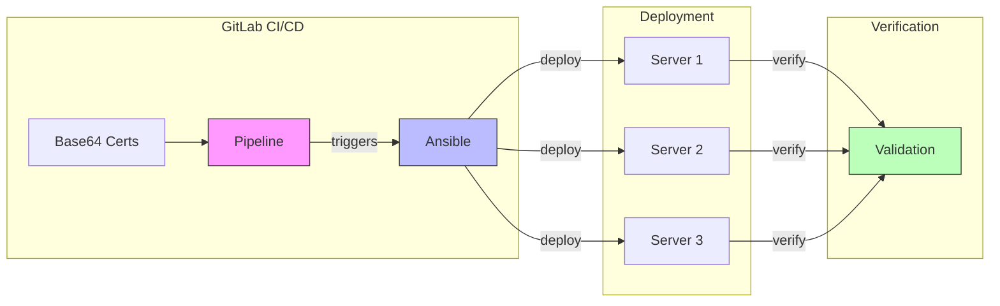

# Certificate Automation with GitLab and Ansible

## Table of Contents
1. [GitLab CI/CD Configuration](#gitlab-cicd-configuration)
2. [Storing Certificates in GitLab](#storing-certificates-in-gitlab)
3. [Ansible Integration](#ansible-integration)
4. [Deployment Examples](#deployment-examples)

## Automation Flow


## GitLab CI/CD Configuration

### Basic Pipeline
```yaml
# .gitlab-ci.yml
variables:
  VAULT_ADDR: "https://vault.example.com"

stages:
  - generate
  - deploy

deploy_certificates:
  stage: deploy
  script:
    - mkdir -p /app/certs
    # Deploy certificates from Base64
    - echo "$KEYSTORE_BASE64" | base64 -d > /app/certs/keystore.p12
    - echo "$TRUSTSTORE_BASE64" | base64 -d > /app/certs/truststore.jks
```

## Storing Certificates in GitLab

### Converting Certificates to Base64
```bash
# Convert keystore to Base64
base64 -w 0 keystore.p12 > keystore.b64

# Convert truststore to Base64
base64 -w 0 truststore.jks > truststore.b64
```

### GitLab Variables Setup
1. Navigate to Settings -> CI/CD -> Variables
2. Add variables:
   - KEYSTORE_BASE64
   - TRUSTSTORE_BASE64
   - KEYSTORE_PASSWORD
   - TRUSTSTORE_PASSWORD

## Ansible Integration

### Basic Playbook
```yaml
# deploy_certs.yml
---
- name: Deploy certificates
  hosts: all
  tasks:
    - name: Create certificates directory
      file:
        path: /app/certs
        state: directory
        mode: '0700'

    - name: Deploy keystore
      copy:
        content: "{{ lookup('env', 'KEYSTORE_BASE64') | b64decode }}"
        dest: /app/certs/keystore.p12
        mode: '0600'
```

### Vault Integration
```yaml
# playbook_with_vault.yml
---
- name: Deploy with Vault secrets
  hosts: all
  vars:
    vault_addr: "https://vault.example.com"
    role_id: "{{ lookup('env', 'VAULT_ROLE_ID') }}"
  tasks:
    - name: Get secrets from Vault
      community.hashi_vault.vault_read:
        path: secret/data/certs/myapp
      register: cert_data
```

## Deployment Examples

### Combined GitLab and Ansible
```yaml
# .gitlab-ci.yml
deploy_with_ansible:
  stage: deploy
  script:
    - ansible-playbook deploy_certs.yml

# deploy_certs.yml with verification
---
- name: Deploy and verify certificates
  hosts: all
  tasks:
    - name: Deploy certificates
      block:
        - name: Deploy keystore
          copy:
            content: "{{ lookup('env', 'KEYSTORE_BASE64') | b64decode }}"
            dest: /app/certs/keystore.p12
            mode: '0600'
          
        - name: Verify keystore
          shell: |
            keytool -list \
              -keystore /app/certs/keystore.p12 \
              -storepass {{ lookup('env', 'KEYSTORE_PASSWORD') }} \
              -storetype PKCS12
          register: keystore_verify
          changed_when: false
```

### Best Practices
1. Use masked variables in GitLab
2. Implement proper error handling
3. Verify certificates after deployment
4. Implement rollback procedures
5. Maintain audit logs