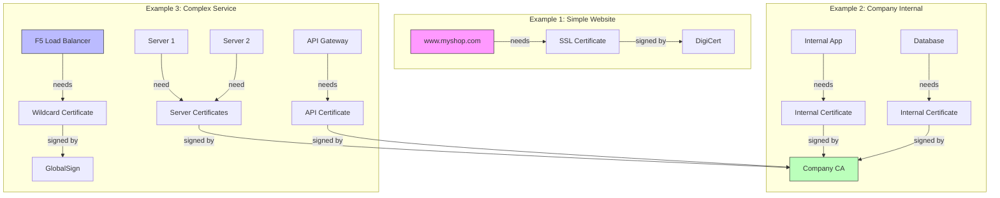
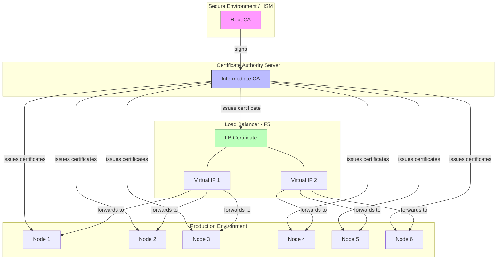
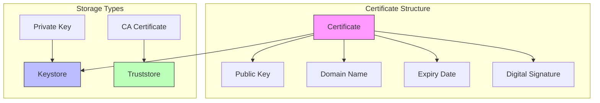
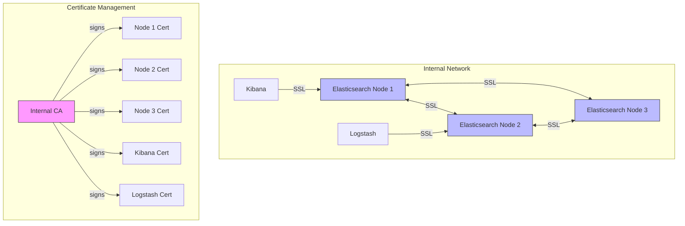
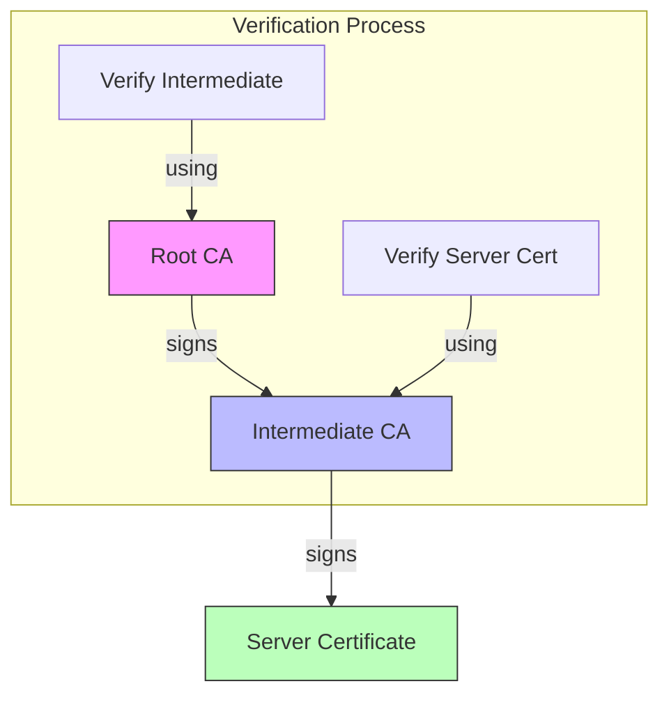

# Understanding Certificates, Keystore, and Truststore

## Certificate Distribution and Multi-Node Setup

### Understanding Certificate Complexity



### Real-World Examples

1. **Simple Online Shop**
   ```
   Situation: www.myshop.com
   What you need: SSL Certificate for your website
   Where to get it: DigiCert, Let's Encrypt, etc.

   What you'll receive:
   1. Your certificate (myshop_com.crt)
   2. Your private key (myshop_com.key)
   3. Intermediate certificate (DigiCert_intermediate.crt)
   ```

2. **Company Internal Applications**
   ```
   Situation: Internal HR system hr.internal.company.com
   What you need: Internal SSL Certificate
   Options:
   1. Buy from CA (expensive for internal use)
   2. Create your own CA (common for internal use)

   If creating own CA:
   1. Root CA certificate (keep extremely secure!)
   2. Intermediate CA certificate (for signing)
   3. Server certificates (for each service)
   ```

3. **Complex Service with Load Balancer**
   ```
   Situation: Large service with F5
   What you need:
   1. Certificate for F5 VIP (*.company.com)
   2. Certificates for backend servers

   Example structure:
   - F5 Load Balancer: *.company.com
     └─ api.company.com points to:
        ├─ backend1.internal
        ├─ backend2.internal
        └─ backend3.internal
   ```

### Understanding Certificate Types

1. **Public-facing Services**
   ```
   If your service is: public website
   You need: SSL certificate from trusted CA
   Example providers: DigiCert, Let's Encrypt
   What you'll get:
   - Certificate file (.crt)
   - Private key file (.key)
   - Intermediate certificate
   ```

2. **Internal Services**
   ```
   If your service is: internal application
   You need: Internal certificate from your company CA
   What you'll get:
   - Service certificate
   - Internal CA certificate (for trust)
   ```

3. **Multiple Servers Same Service**
   ```
   Two options:
   1. Same certificate for all:
      - Easier to manage
      - Less secure
   
   2. Different certificates for each:
      - More secure
      - More complex to manage
   
   Example F5 setup:
   - F5: wildcard cert *.company.com
   - Backend servers: individual certificates
     server1.internal.company.com
     server2.internal.company.com
   ```

### Common Confusion Points Explained

1. **Why Intermediate Certificates?**
   ```
   Chain of Trust:
   Browser -> DigiCert Root CA -> DigiCert Intermediate -> Your Certificate

   Like a chain of references:
   - Browser trusts DigiCert
   - DigiCert trusts their Intermediate
   - Intermediate signs your certificate
   ```

2. **Public vs Private CA**
   ```
   Public CA (like DigiCert):
   - Trusted by browsers
   - Costs money
   - Good for public services

   Private CA (your company):
   - Not trusted by browsers
   - Free to create certificates
   - Good for internal services
   ```

3. **Different Types of Certificates**
   ```
   Single Domain: www.company.com
   Wildcard: *.company.com
   Multi-domain: company.com, www.company.com, shop.company.com
   ```

### Example of Complex Setup

```plaintext
Company Service Setup:
1. Public website (www.company.com)
   └─ Public SSL from DigiCert
      
2. Load Balancer
   └─ Wildcard cert *.company.com
      
3. Internal Services
   ├─ HR system (hr.internal)
   ├─ Finance app (finance.internal)
   └─ All using internal CA certificates

What you maintain:
1. Public certificates (from DigiCert)
2. Company CA for internal certs
3. Individual service certificates
4. Load balancer certificates
```

### CA Storage Architecture


## Introduction
Digital certificates are essential for securing communications and establishing trust in computer networks. This document provides detailed instructions for manual certificate operations and management.

## Components

### Certificate Components
- **Private Key**: Used for encryption and signing
- **Public Key**: Used for decryption and verification
- **Digital Signature**: Verifies certificate authenticity
- **Validity Period**: Defines certificate lifetime
- **Subject**: Entity the certificate is issued to
- **Issuer**: Entity that issued the certificate
- **Serial Number**: Unique identifier
- **Extensions**: Additional certificate properties

### Digital Signatures
Example of a digital signature in a certificate:
```
Signature Algorithm: sha256WithRSAEncryption
45:bd:1e:ab:c4:12:3f:55:8f:9a:2d:3c:76:91:0f:43:1e:0a
b4:91:e7:88:5f:e2:1b:33:87:5d:bc:91:8c:7f:b2:0e:3d:84
```

## Types of Storage

### Keystore (.p12, .pfx, .jks)
- Stores private keys and certificates
- Password protected
- Used for server authentication
- Common formats:
  - PKCS#12 (.p12, .pfx)
  - Java Keystore (.jks)

### Truststore (.jks, .p12)
- Stores trusted CA certificates
- Used for client verification
- Can use same formats as keystore
- Typically contains only public certificates

## Manual Certificate Operations

### 1. Creating a Root CA
```bash
# Create directory structure
mkdir -p ~/ca/{root-ca,intermediate-ca}/{private,certs,newcerts,crl}
mkdir -p ~/ca/{root-ca,intermediate-ca}/csr
touch ~/ca/{root-ca,intermediate-ca}/index.txt
echo 1000 > ~/ca/{root-ca,intermediate-ca}/serial

# Generate root CA private key
openssl genrsa -aes256 -out ~/ca/root-ca/private/ca.key 4096

# Create root CA certificate
openssl req -config openssl.cnf -key ~/ca/root-ca/private/ca.key \
    -new -x509 -days 7300 -sha256 -extensions v3_ca \
    -out ~/ca/root-ca/certs/ca.crt \
    -subj "/C=RU/ST=Moscow/L=Moscow/O=MyCompany/CN=Root CA"
```

### 2. Creating an Intermediate CA
```bash
# Generate intermediate CA key
openssl genrsa -aes256 \
    -out ~/ca/intermediate-ca/private/intermediate.key 4096

# Create CSR for intermediate CA
openssl req -config openssl.cnf -new -sha256 \
    -key ~/ca/intermediate-ca/private/intermediate.key \
    -out ~/ca/intermediate-ca/csr/intermediate.csr \
    -subj "/C=RU/ST=Moscow/L=Moscow/O=MyCompany/CN=Intermediate CA"

# Sign intermediate certificate with root CA
openssl ca -config openssl.cnf -extensions v3_intermediate_ca \
    -days 3650 -notext -md sha256 \
    -in ~/ca/intermediate-ca/csr/intermediate.csr \
    -out ~/ca/intermediate-ca/certs/intermediate.crt
```

### 3. Creating Server Certificates
```bash
# Generate private key
openssl genrsa -out server.key 2048

# Create CSR
openssl req -new -key server.key -out server.csr \
    -subj "/C=RU/ST=Moscow/L=Moscow/O=MyCompany/CN=myserver.com"

# Sign with intermediate CA
openssl ca -config openssl.cnf \
    -extensions server_cert -days 375 -notext -md sha256 \
    -in server.csr \
    -out server.crt
```

### 4. Creating Client Certificates
```bash
# Generate client key
openssl genrsa -out client.key 2048

# Create client CSR
openssl req -new -key client.key -out client.csr \
    -subj "/C=RU/ST=Moscow/L=Moscow/O=MyCompany/CN=user@example.com"

# Sign with intermediate CA
openssl ca -config openssl.cnf \
    -extensions usr_cert -days 375 -notext -md sha256 \
    -in client.csr \
    -out client.crt
```

## Working with Different Formats

### 1. PKCS#12 (.p12) Operations
```bash
# Create PKCS#12 file
openssl pkcs12 -export \
    -in server.crt \
    -inkey server.key \
    -out keystore.p12 \
    -name "server-alias" \
    -chain \
    -CAfile chain.pem

# View PKCS#12 content
openssl pkcs12 -info -in keystore.p12

# Extract certificate from PKCS#12
openssl pkcs12 -in keystore.p12 -nokeys -out cert.pem

# Extract private key from PKCS#12
openssl pkcs12 -in keystore.p12 -nocerts -out key.pem
```

### 2. Java Keystore (.jks) Operations
```bash
# Convert PKCS#12 to JKS
keytool -importkeystore \
    -srckeystore keystore.p12 \
    -srcstoretype PKCS12 \
    -destkeystore keystore.jks \
    -deststoretype JKS

# List certificates in JKS
keytool -list -v -keystore keystore.jks

# Import certificate into JKS
keytool -import -trustcacerts \
    -file server.crt \
    -alias server-alias \
    -keystore keystore.jks

# Export certificate from JKS
keytool -export \
    -alias server-alias \
    -file server.crt \
    -keystore keystore.jks
```

### 3. PEM Format Operations
```bash
# Convert DER to PEM
openssl x509 -inform der -in certificate.der -out certificate.pem

# Convert PEM to DER
openssl x509 -outform der -in certificate.pem -out certificate.der

# Combine certificate and key into PEM
cat server.crt server.key > combined.pem

# Create certificate chain
cat server.crt intermediate.crt root.crt > fullchain.pem
```

## Troubleshooting

### 1. Certificate Verification
```bash
# Verify certificate against CA
openssl verify -CAfile ca.crt server.crt

# Verify certificate chain
openssl verify -CAfile chain.pem server.crt

# Check certificate expiration
openssl x509 -in server.crt -noout -enddate

# View certificate details
openssl x509 -in server.crt -text -noout
```

### 2. Common Issues
```bash
# Check private key matches certificate
openssl x509 -noout -modulus -in server.crt | openssl md5
openssl rsa -noout -modulus -in server.key | openssl md5

# Test SSL connection
openssl s_client -connect host:port -showcerts

# Check certificate chain order
openssl s_client -connect host:port -showcerts | openssl x509 -noout -text
```

## Best Practices

### 1. Key Management
- Use strong key sizes (RSA 2048+ bits)
- Protect private keys (chmod 600)
- Regular key rotation
- Secure backup procedures

### 2. Certificate Organization
```bash
# Recommended directory structure
/etc/ssl/
├── certs/          # Public certificates
├── private/        # Private keys
└── ca/             # CA certificates
    ├── root/
    └── intermediate/
```

### 3. Security Measures
- Use secure protocols (TLS 1.2+)
- Regular security audits
- Monitor certificate expiration
- Implement certificate revocation
- Document all procedures

### 4. Certificate Renewal
```bash
# Check expiration date
openssl x509 -in server.crt -noout -enddate

# Create new CSR using existing key
openssl req -new -key server.key -out server_new.csr

# Sign new certificate
openssl ca -config openssl.cnf \
    -extensions server_cert -days 375 -notext -md sha256 \
    -in server_new.csr \
    -out server_new.crt
```

### 5. Backup Procedures
```bash
# Backup certificates and keys
tar czf certs_backup.tar.gz \
    --transform 's,^,cert_backup/,' \
    /etc/ssl/certs/* \
    /etc/ssl/private/* \
    /etc/ssl/ca/*

# Encrypt backup
openssl enc -aes-256-cbc -salt \
    -in certs_backup.tar.gz \
    -out certs_backup.tar.gz.enc
```

## Internal Certificate Usage

### Internal Usage Flow


### What is Internal Usage?
- Certificates used within a closed network or organization
- No external client trust required
- Used for internal service communication

### Examples of Internal Usage
1. Data encryption between Elastic Stack nodes (Transport Layer)
2. Internal client-server communication (e.g., Kibana → Elasticsearch)
3. DevOps automation (e.g., Jenkins, Ansible)

### Why Self-Signed Certificates Work for Internal Use
- Cost-effective and easily generated
- Suitable for isolated or secure networks
- Pre-configured trust relationships

### Internal Setup Configuration
```yaml
# Example Elasticsearch SSL configuration
xpack.security.transport.ssl:
  enabled: true
  verification_mode: certificate
  certificate: /path/to/node.crt
  certificate_authorities: [ "/path/to/ca.crt" ]
  key: /path/to/node.key
```

## Certificate Verification and Checks

### Viewing Certificate Content
```bash
# View certificate details
openssl x509 -in server.crt -text -noout

# Check certificate expiration
openssl x509 -in server.crt -noout -enddate
```

### Trust Chain Verification
```bash
# Verify against CA
openssl verify -CAfile rootCA.crt server.crt

# Verify certificate chain
openssl verify -CAfile chain.pem server.crt
```

### Keystore/Truststore Content Verification
```bash
# Check PKCS#12 content
openssl pkcs12 -info -in keystore.p12 -password pass:yourpassword

# Check JKS content
keytool -list -keystore truststore.jks -storepass yourpassword
```

### Chain File Management
- **chain.pem**: Contains full certificate chain (Root CA and intermediates)
- Order matters: server certificate → intermediate CA → root CA

### Certificate Chain Visualization
