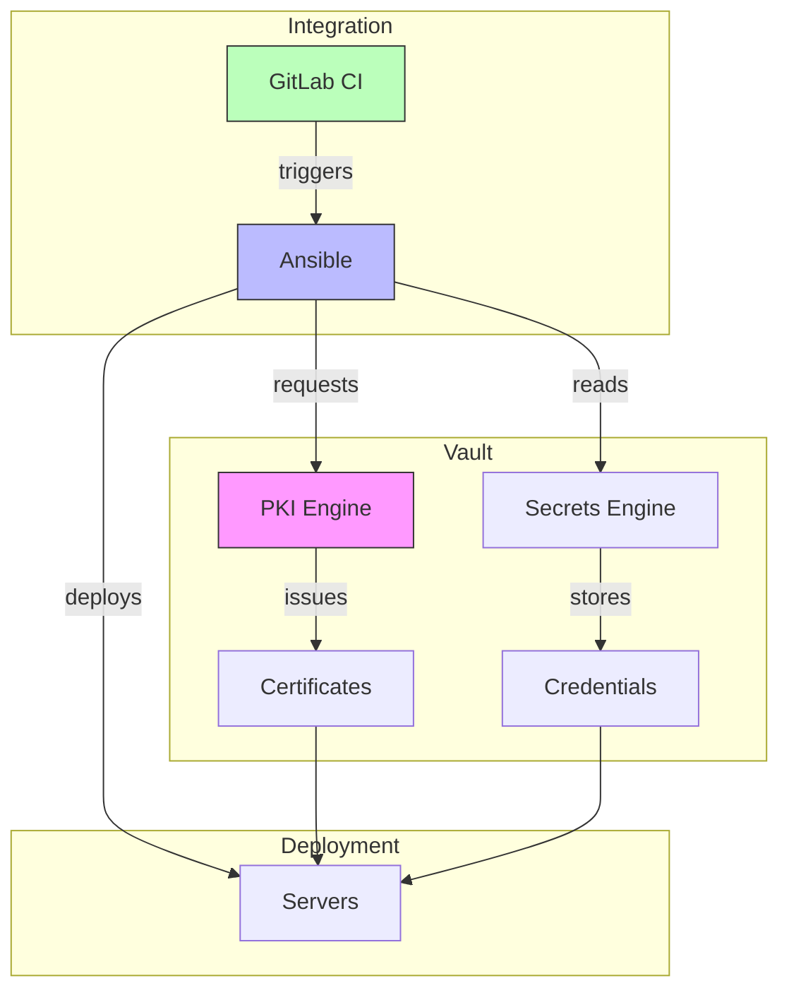

# HashiCorp Vault Integration for Certificate Management

## Vault Integration Architecture


## Vault Setup

### PKI Configuration
```hcl
# Enable PKI engine
path "pki" {
  capabilities = ["read", "list"]
}

# Create role for issuing certificates
resource "vault_pki_secret_backend_role" "role" {
  backend = vault_mount.pki.path
  name    = "my-role"
  
  allowed_domains  = ["example.com"]
  allow_subdomains = true
  max_ttl         = "72h"
}
```

### AppRole Setup
```bash
# Create AppRole for automation
vault write auth/approle/role/ansible \
    secret_id_ttl=10m \
    token_num_uses=10 \
    token_ttl=20m \
    token_max_ttl=30m
```

## Ansible Integration

### Using hvac Library
```bash
# Install hvac
pip install hvac
```

### Ansible Configuration
```yaml
# ansible.cfg
[defaults]
vault_addr = https://vault.example.com

# playbook.yml
---
- name: Get secrets from Vault
  hosts: all
  vars:
    vault_addr: "https://vault.example.com"
    role_id: "{{ lookup('env', 'VAULT_ROLE_ID') }}"
    secret_id: "{{ lookup('env', 'VAULT_SECRET_ID') }}"
  
  tasks:
    - name: Authenticate with Vault
      community.hashi_vault.vault_auth:
        auth_method: approle
        role_id: "{{ role_id }}"
        secret_id: "{{ secret_id }}"
      register: vault_auth

    - name: Get certificate
      community.hashi_vault.vault_read:
        path: secret/data/certs/myapp
      register: cert_data
```

### Using Lookup Plugin
```yaml
# group_vars/all.yml
---
vault_secrets:
  keystore_password: "{{ lookup('community.hashi_vault.hashi_vault', 'secret/data/myapp/keystore:password') }}"
  truststore_password: "{{ lookup('community.hashi_vault.hashi_vault', 'secret/data/myapp/truststore:password') }}"
```

## GitLab Integration

### Pipeline Configuration
```yaml
# .gitlab-ci.yml
deploy:
  stage: deploy
  script:
    - export VAULT_ADDR="https://vault.example.com"
    - export VAULT_ROLE_ID=$CI_VAULT_ROLE_ID
    - export VAULT_SECRET_ID=$CI_VAULT_SECRET_ID
    - ansible-playbook deploy_with_vault.yml
```

### Error Handling
```yaml
# playbook_with_error_handling.yml
---
- name: Deploy with error handling
  hosts: all
  tasks:
    - name: Get Vault secrets
      community.hashi_vault.vault_read:
        path: secret/data/myapp
      register: vault_secrets
      failed_when: false
      
    - name: Handle Vault errors
      fail:
        msg: "Failed to get secrets: {{ vault_secrets.msg }}"
      when: vault_secrets is failed
```

## Common Patterns

### Certificate Rotation
```yaml
# cert_rotation.yml
---
- name: Rotate certificates
  hosts: all
  tasks:
    - name: Check certificate expiration
      command: openssl x509 -in /etc/ssl/certs/server.crt -noout -enddate
      register: cert_expiration
      
    - name: Request new certificate
      when: cert_expiration.rc != 0
      community.hashi_vault.vault_read:
        path: pki/issue/my-role
        data:
          common_name: "{{ inventory_hostname }}"
```

### Best Practices
1. Use temporary tokens with minimal privileges
2. Implement proper error handling
3. Clean up secrets after use
4. Regular credential rotation
5. Audit logging
6. Backup procedures

### Security Considerations
1. Limit access to Vault tokens
2. Use appropriate TTLs
3. Implement proper access controls
4. Monitor Vault audit logs
5. Regular security reviews