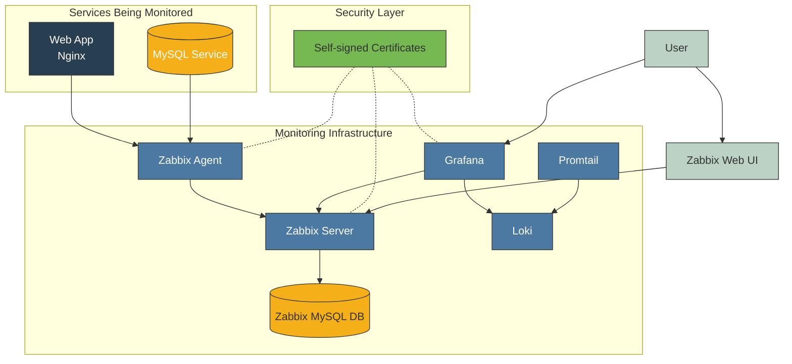

# 🚀 Part 1: Basic Manual Setup

## 🔍 What is this lab about?

This lab sets up a complete monitoring environment using Docker containers with Zabbix, Grafana, and Loki. You'll create a self-contained environment for learning modern monitoring practices.

**⏱️ Time allocation:** 45 minutes total
- Docker Environment Preparation: 15 minutes
- Certificate Generation: 10 minutes
- Container Deployment: 20 minutes

## 🛠️ Manual Setup Commands

### 1️⃣ Environment Preparation

Copy and paste each command block into your terminal. Type or copy each command separately to understand what you're executing.

```bash
# Update system and install prerequisites
sudo apt-get update
```
**What?** Updates package repositories.  
**Why?** Ensures you have the latest package information.

```bash
# Install required packages
sudo apt-get install -y apt-transport-https ca-certificates curl software-properties-common
```
**What?** Installs Docker dependencies.  
**Why?** These packages enable secure downloads and are required for Docker.

Now add Docker's repository:

```bash
# Add Docker's GPG key
curl -fsSL https://download.docker.com/linux/ubuntu/gpg | sudo apt-key add -
```

```bash
# Add Docker repository
sudo add-apt-repository "deb [arch=amd64] https://download.docker.com/linux/ubuntu $(lsb_release -cs) stable"
```

```bash
# Update package database with Docker packages
sudo apt-get update
```

```bash
# Install Docker and Docker Compose
sudo apt-get install -y docker-ce docker-compose
```

```bash
# Add your user to the docker group
sudo usermod -aG docker $USER
```

```bash
# Apply group membership
newgrp docker
```

Verify installation:

```bash
# Check Docker version
docker --version
```

```bash
# Check Docker Compose version
docker-compose --version
```

Now create the directory structure:

```bash
# Create main project directory
mkdir -p monitoring-lab
```

```bash
# Create subdirectories
mkdir -p monitoring-lab/{certs,zabbix,grafana,data,web-app}
```

```bash
# Navigate to project directory
cd monitoring-lab
```

### 2️⃣ Certificate Generation

Now you'll generate certificates for secure communications. Type or copy each command separately:

```bash
# Navigate to certs directory
cd certs
```

```bash
# Generate CA private key
openssl genrsa -out ca.key 4096
```
**What?** Creates a 4096-bit RSA private key for your Certificate Authority.  
**Why?** The CA key is used to sign all service certificates.

```bash
# Generate self-signed CA certificate
openssl req -x509 -new -nodes -key ca.key -sha256 -days 365 -out ca.crt -subj "/CN=Monitoring Lab CA"
```
**What?** Creates a self-signed CA certificate valid for one year.  
**Why?** This establishes your root of trust for all service certificates.

For the Zabbix server certificate:

```bash
# Generate Zabbix server private key
openssl genrsa -out zabbix-server.key 2048
```

```bash
# Create certificate signing request
openssl req -new -key zabbix-server.key -out zabbix-server.csr -subj "/CN=zabbix-server"
```

```bash
# Sign the certificate with your CA
openssl x509 -req -in zabbix-server.csr -CA ca.crt -CAkey ca.key -CAcreateserial -out zabbix-server.crt -days 365 -sha256
```

For the Zabbix agent certificate:

```bash
# Generate Zabbix agent private key
openssl genrsa -out zabbix-agent.key 2048
```

```bash
# Create certificate signing request
openssl req -new -key zabbix-agent.key -out zabbix-agent.csr -subj "/CN=zabbix-agent"
```

```bash
# Sign the certificate with your CA
openssl x509 -req -in zabbix-agent.csr -CA ca.crt -CAkey ca.key -CAcreateserial -out zabbix-agent.crt -days 365 -sha256
```

For the Grafana certificate:

```bash
# Generate Grafana private key
openssl genrsa -out grafana.key 2048
```

```bash
# Create certificate signing request
openssl req -new -key grafana.key -out grafana.csr -subj "/CN=grafana"
```

```bash
# Sign the certificate with your CA
openssl x509 -req -in grafana.csr -CA ca.crt -CAkey ca.key -CAcreateserial -out grafana.crt -days 365 -sha256
```

Set proper permissions:

```bash
# Set certificate permissions
chmod 644 *.crt ca.crt
```

```bash
# Set private key permissions
chmod 600 *.key ca.key
```

```bash
# Return to main directory
cd ..
```

### 3️⃣ Configuration Files

Create the configuration files for different services.

For Zabbix Agent:

```bash
# Create zabbix directory if not already created
mkdir -p zabbix
```

```bash
# Create Zabbix agent config file
nano zabbix/agent.conf
```

Now copy and paste this configuration into the nano editor:

```
# Zabbix Agent 2 configuration
Server=zabbix-server
ServerActive=zabbix-server
Hostname=zabbix-agent

# TLS parameters
TLSConnect=cert
TLSAccept=cert
TLSCAFile=/etc/ssl/certs/ca.crt
TLSCertFile=/etc/ssl/certs/zabbix-agent.crt
TLSKeyFile=/etc/ssl/private/zabbix-agent.key

# Enable remote commands
EnableRemoteCommands=1
LogRemoteCommands=1

# Enable Docker monitoring
Plugins.Docker.Endpoint=unix:///var/run/docker.sock

# Monitor host filesystem
HostMetadata=linux
HostInterface=0.0.0.0
```

Save the file by pressing `Ctrl+X`, then `Y`, then `Enter`.

**What?** Creates configuration for the Zabbix agent.  
**Why?** Tells the agent how to securely connect to the server and what to monitor.

For Promtail (log collector):

```bash
# Create promtail config directory
mkdir -p data/promtail
```

```bash
# Create Promtail config file
nano data/promtail/config.yml
```

Copy and paste this configuration:

```yaml
server:
  http_listen_port: 9080
  grpc_listen_port: 0

positions:
  filename: /etc/promtail/positions.yaml

clients:
  - url: http://loki:3100/loki/api/v1/push

scrape_configs:
  - job_name: system
    static_configs:
      - targets:
          - localhost
        labels:
          job: varlogs
          __path__: /var/log/*.log

  - job_name: docker
    static_configs:
      - targets:
          - localhost
        labels:
          job: docker
          __path__: /var/lib/docker/containers/*/*.log
```

Save the file by pressing `Ctrl+X`, then `Y`, then `Enter`.

**What?** Creates configuration for Promtail (log collector).  
**Why?** Defines what logs to collect and where to send them (to Loki).

Create a sample web application:

```bash
# Create web-app directory
mkdir -p web-app
```

```bash
# Create sample web page
nano web-app/index.html
```

Copy and paste this HTML:

```html
<!DOCTYPE html>
<html>
<head>
    <title>Monitoring Lab Sample Web App</title>
    <style>
        body {
            font-family: Arial, sans-serif;
            margin: 40px;
            line-height: 1.6;
        }
        h1 {
            color: #333;
        }
        .status {
            padding: 20px;
            background-color: #f9f9f9;
            border-radius: 5px;
            border: 1px solid #ddd;
            margin-top: 20px;
        }
    </style>
</head>
<body>
    <h1>Monitoring Lab Sample Web Application</h1>
    <p>This is a sample web application for monitoring with Zabbix.</p>
    <div class="status">
        <h2>Server Status</h2>
        <p>Server Time: <span id="server-time"></span></p>
        <p>Status: <span style="color: green; font-weight: bold;">ONLINE</span></p>
    </div>
    <script>
        function updateTime() {
            document.getElementById("server-time").textContent = new Date().toLocaleString();
        }
        updateTime();
        setInterval(updateTime, 1000);
    </script>
</body>
</html>
```

Save the file by pressing `Ctrl+X`, then `Y`, then `Enter`.

**What?** Creates a simple web page to monitor.  
**Why?** Provides a real service to monitor with the tools.

Create the Grafana data directory with the right permissions:

```bash
mkdir -p grafana/data
sudo chown -R 472:472 grafana/data
```
So, double check, make sure all required directories and certificates exist:
```bash
mkdir -p grafana/data data/mysql data/mysql-service data/promtail zabbix/alertscripts zabbix/externalscripts
```
Verify SSL certificates exist and have proper permissions:
```bash
ls -la certs/
chmod 644 certs/*.crt
chmod 600 certs/*.key
```

### 4️⃣ Create Docker Compose File

Now create the Docker Compose file that defines all services:

```bash
# Create docker-compose.yml
nano docker-compose.yml
```
For Docker Compose configuration, see [docker-compose.yml](./docker-compose.yml)


Save the file by pressing `Ctrl+X`, then `Y`, then `Enter`.

**What?** Creates the configuration for all Docker containers.  
**Why?** Defines how services connect to each other in an isolated network.

### 5️⃣ Deploy and Verify

Start all the containers:

```bash
# Start all containers
docker-compose up -d
```
**What?** Launches all the services defined in docker-compose.yml.  
**Why?** Starts the entire monitoring environment in one command.

This process may take several minutes as Docker downloads the necessary images.

Verify that all services are running:

```bash
# Check if all containers are running
docker-compose ps
```
**What?** Shows the status of all containers.  
**Why?** Verifies that everything started correctly.

If any container shows a status other than "Up" or "(healthy)", check its logs:

```bash
# Check logs of a specific container (replace container-name with the actual name)
docker-compose logs zabbix-server
```

### 6️⃣ Configure Test Database

Let's breakdown of the database configuration command with explanations for each step:

```bash
# Configure the test database
docker-compose exec mysql-service mysql -u root -pmysql_pwd -e "
```

mysql_pwd - This is the root password for the MySQL service container. Please change it.

**What:** This line connects to the MySQL service container using Docker Compose.  
**Why:** It allows you to execute MySQL commands directly in the container without manually logging in.  
**How:** `docker-compose exec` runs a command in a running container, `mysql-service` is the container name, and the MySQL command connects as root with the specified password.

```bash
USE testdb;
```
**What:** Selects the database "testdb" to work with.  
**Why:** This specifies which database will contain our monitoring tables.  
**How:** The `USE` statement in MySQL changes the current working database.

```bash
CREATE TABLE test_data (
  id INT AUTO_INCREMENT PRIMARY KEY,
  name VARCHAR(100) NOT NULL,
  value DECIMAL(10,2) NOT NULL,
  timestamp TIMESTAMP DEFAULT CURRENT_TIMESTAMP
);
```
**What:** Creates a new table called "test_data" with four columns.  
**Why:** This table will store sample metrics that we'll monitor.  
**How:**
- `id`: An auto-incrementing unique identifier for each row
- `name`: A descriptive name for the metric (up to 100 characters)
- `value`: A numeric value with 2 decimal places precision
- `timestamp`: Automatically records when the entry was created

```bash
INSERT INTO test_data (name, value) VALUES 
  ('Server CPU', 45.5),
  ('Server Memory', 78.2),
  ('Database Connections', 125),
  ('Active Users', 1250),
  ('Response Time', 0.85);
```
**What:** Adds five sample records to the test_data table.  
**Why:** Provides initial data for testing monitoring capabilities.  
**How:** Each INSERT statement creates a record with a metric name and value representing common server metrics. Timestamps are automatically added by MySQL.

```bash
CREATE USER 'monitor'@'%' IDENTIFIED BY 'monitor_pwd';
```
monitor_pwd - This is the password set for the newly created 'monitor' user. You can change it.

**What:** Creates a dedicated MySQL user for monitoring purposes.  
**Why:** Following security best practices by using a separate user with limited permissions rather than the root user.  
**How:** The `'monitor'@'%'` syntax creates a user named 'monitor' that can connect from any host (% is a wildcard).

```bash
GRANT SELECT, PROCESS, SHOW DATABASES, REPLICATION CLIENT ON *.* TO 'monitor'@'%';
```
**What:** Gives the monitor user specific permissions.  
**Why:** Provides only the minimum privileges needed for monitoring (principle of least privilege).  
**How:** Grants four specific permissions across all databases and tables:
- `SELECT`: Ability to read data
- `PROCESS`: Ability to view server processes
- `SHOW DATABASES`: Ability to list databases
- `REPLICATION CLIENT`: Ability to check replication status

```bash
FLUSH PRIVILEGES;"
```
**What:** Reloads the privilege tables in MySQL.  
**Why:** Ensures the new user and permissions take effect immediately.  
**How:** The `FLUSH PRIVILEGES` command forces MySQL to reload the grant tables from the system tables in the mysql database.

This configuration follows database monitoring best practices by:
1. Creating structured data to monitor
2. Using a dedicated monitoring user with minimal permissions
3. Providing sample metrics that represent real-world monitoring scenarios

### 7️⃣ Accessing Services

Now that all services are running, you can access them through your web browser:

```
# Zabbix Web Interface
https://your-server-ip:8443
Username: Admin
Password: zabbix
```

```
# Grafana Web Interface
http://your-server-ip:3000
Username: admin
Password: admin
```

```
# Sample Web Application
http://your-server-ip:8080
```

**Note:** Since you're using self-signed certificates, your browser will show a security warning. For this lab environment, you can safely proceed by accepting the risk.

## 🔍 Understanding the Components

1. **Centralized Monitoring**: Zabbix Server acts as the central hub for collection and analysis of all metrics from different services.

2. **Agent-Based Collection**: Zabbix Agent efficiently collects detailed system-level data from monitored hosts and containers.

3. **Separation of Concerns**:
   - Zabbix handles infrastructure monitoring and alerts
   - Grafana provides visualization dashboards
   - Loki focuses on log aggregation
   - Each service has its dedicated database for optimal performance

4. **Security Layer**: Self-signed certificates secure communication between components to protect sensitive monitoring data.

5. **Complete Visibility**: The setup provides monitoring for both infrastructure (servers, networks) and applications (web app, database).

6. **Containerization Benefits**:
   - Isolated environments prevent conflicts
   - Easy deployment and scaling
   - Consistent environment across different systems
   - Simple backup and restoration

This architecture provides a comprehensive monitoring solution that can detect issues, visualize performance metrics, and analyze logs - all essential for maintaining reliable systems.

## ⚠️ Troubleshooting Tips

If you encounter issues:

```bash
# If Docker gives permission errors
newgrp docker
```

```bash
# Check container logs
docker-compose logs <container-name>
```

```bash
# Access a container's shell
docker-compose exec <container-name> bash
```

```bash
# Fix volume permissions if needed
sudo chown -R 1000:1000 ./data
sudo chmod -R 755 ./data
```

## 🎯 Next Steps

After completing this lab, explore these advanced topics:

- Create custom Zabbix triggers and notifications
- Build Grafana dashboards to visualize metrics
- Configure alert thresholds for key metrics
- Add additional services to monitor
- Set up notification channels (email, Slack, etc.)

