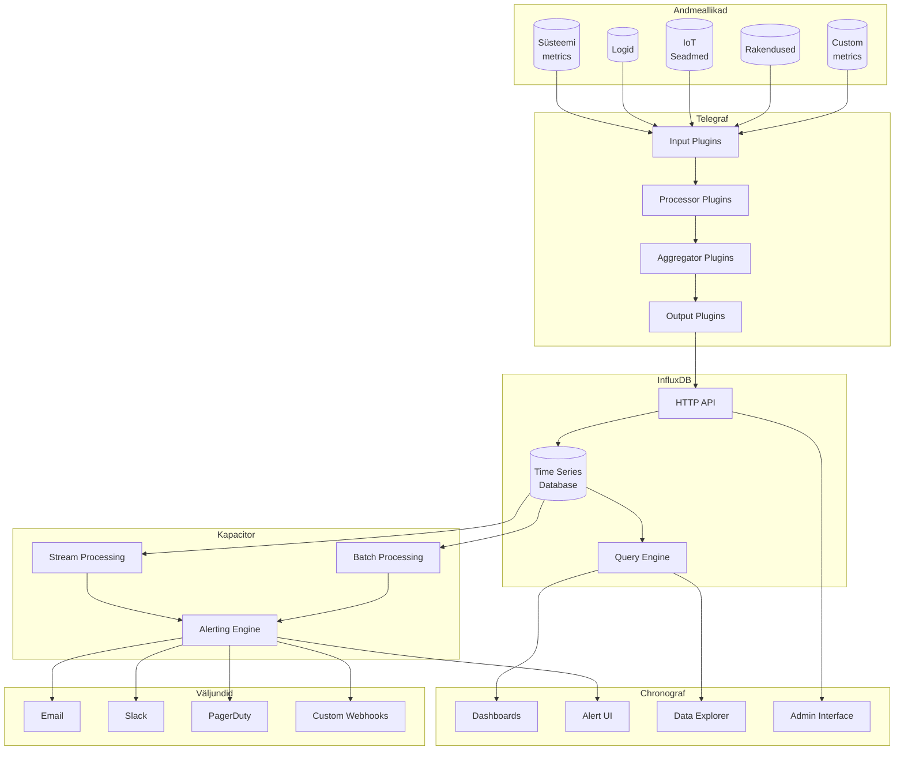

# TICK Stack


## Intro to InfluxDB - training webinar slides

[Intro to InfluxDB - SlideShare](https://www.slideshare.net/influxdata/intro-to-influxdb)

# Ajaseeria Andmebaaside ja InfluxDB Ülevaade

## Mis on ajaseeria andmebaas?

Ajaseeria andmebaas (Time Series Database, TSDB) on spetsialiseeritud andmebaas, mis on optimeeritud ajatempliga andmete käsitlemiseks. 

### Peamised omadused:
1. **Ajaline järjestus**: Andmed on organiseeritud aja järgi
2. **Kõrge kirjutamiskiirus**: Optimeeritud pidevaks andmete lisamiseks
3. **Tõhus päringumootor**: Kiire ajaliste andmete analüüs
4. **Automaatne vananemine**: Vanemate andmete automaatne arhiveerimine või kustutamine

## Milleks kasutatakse?

- **Monitooring**: Serverite, rakenduste jõudluse jälgimine
- **IoT seadmed**: Sensorite andmete kogumine
- **Finantsteenused**: Aktsiahinnad, tehingud
- **Teadusuuringud**: Mõõtmistulemused, eksperimendid
- **Ilmavaatlused**: Temperatuur, niiskus, tuul

## InfluxDB eelised

### 1. Tehniline üleolek
- Võimaldab miljoneid kirjutamisoperatsioone sekundis
- Optimeeritud kompressioon ajaseeria andmete jaoks
- Skaleeruv arhitektuur

### 2. Kasutajasõbralikkus
- HTTP API liides
- SQL-sarnane päringukeel (InfluxQL)
- Graafiline kasutajaliides (läbi Chronograf'i)

### 3. Paindlikkus
```sql
// Näide lihtsast päringust
SELECT mean("cpu_usage")
FROM "system"
WHERE time >= now() - 1h
GROUP BY time(5m)
```

## Võrdlus teiste lahendustega

| Omadus | InfluxDB | Traditsioonilised SQL | MongoDB |
|--------|----------|----------------------|----------|
| Ajaseeria optimeeritud | ✅ | ❌ | ❌ |
| Automaatne vananemine | ✅ | ❌ | ✅ |
| Kõrge kirjutamiskiirus | ✅ | ❌ | ✅ |
| SQL-sarnane süntaks | ✅ | ✅ | ❌ |

## Ajalugu ja areng

TICK Stack (Telegraf, InfluxDB, Chronograf, ja Kapacitor) on ajaseeria andmete haldamise tööriistakomplekt, mis loodi vastuseks kaasaegsete süsteemide kasvavatele nõudmistele. See võimaldab andmete kogumist, salvestamist, visualiseerimist ja analüüsi ühes integreeritud ökosüsteemis. TICK Stack sai alguse 2013. aastal, kui ettevõte InfluxData (siis veel tuntud kui Errplane) alustas InfluxDB arendamist. Selle eesmärk oli pakkuda kiiret, paindlikku ja skaleeruvat ajaseeria andmebaasi, mis toetaks IoT, monitoorimist ja analüüsi hajussüsteemides.

### Olulised verstapostid:
- **2013**: Esimese versiooni InfluxDB väljalase – Paul Dix ja tema meeskond arendasid selle välja vajadusest modernse ajaseeria andmebaasi järele.
- **2014**: Telegraf'i tutvustamine, mis lihtsustas andmete kogumist erinevatest allikatest.
- **2015**: TICK Stack kuulutati ametlikult välja, andes kogukonnale tervikliku ökosüsteemi.
- **2016**: Chronograf kujundati täielikult ümber, et parandada kasutajakogemust ja visuaalset interaktiivsust.
- **2019**: InfluxDB 2.0 väljalase tõi kaasa **Fluxi**, uue ja võimsa päringukeele, mis andis kasutajatele suurema paindlikkuse andmete analüüsimisel.
- **2020**: TICK Stack jõudis märkimisväärse verstapostini, kui kasutajate arv ületas 500,000 piiri.
- **2023**: Üle 650,000 aktiivse paigalduse globaalselt, mis kinnitab TICK Stacki positsiooni juhtiva lahendusena ajaseeria andmete haldamisel.

# Tuntud Kasutajad ja Kaasused

Source: [InfluxData Case Studies](https://www.influxdata.com/_resources/?pg=20&ct=case_study)

## Suured Tehnoloogiaettevõtted
- **Cisco**: Kasutab InfluxDB-d IT operatsioonide ja võrgu monitoorimiseks
- **PayPal**: Kasutab InfluxDB platvormi oma süsteemide jälgimiseks
- **IBM**: Integreeritud InfluxDB Cloud teenustega

## Tööstusettevõtted
- **Tesla**: Kasutab InfluxDB-d tootmisliinide jälgimiseks
- **Siemens**: Kasutab IoT seadmete andmete kogumiseks
- **Worldsensing**: Kasutab infrastruktuuri monitooringus

## Teadus ja Uuringud
- **CERN**: Kasutab peamiselt InfluxDB-d, mitte tingimata kogu TICK Stack'i
- **NASA JPL**: Kasutab kosmoseuuringute andmete töötlemiseks

## Finantsteenused
- **Capital One**: Kasutab pilveteenuste monitooringus
- **Saxo Bank**: Kasutab finantsandmete töötlemiseks

## Telekommunikatsioon
- **Vodafone**: Kasutab võrguteenuste monitooringus
- **Orange**: Võrguinfrastruktuuri jälgimiseks

Täpsustus: Paljud ettevõtted kasutavad just InfluxDB-d eraldiseisvalt, mitte tingimata kogu TICK Stack'i. See on tavaline praktika, kus organisatsioonid valivad komponente vastavalt oma vajadustele ja integreerivad neid oma olemasolevate süsteemidega.

Eesti kontekst: Kuigi avalikud andmed puuduvad, on tõenäoline, et mitmed Eesti tehnoloogiaettevõtted kasutavad InfluxDB-d või selle komponente, arvestades selle populaarsust IT-monitooringu valdkonnas.

---

## Populaarsuse põhjused

### Tehniline üleolek:

1. **Skaleeruvus**:  
   TICK Stack suudab töötleda miljoneid kirjutamisoperatsioone sekundis, mis teeb selle ideaalseks suurte ajarealiste andmehulkade töötlemiseks.  
   *Võrdlus:* Erinevalt traditsioonilistest SQL-andmebaasidest, nagu MySQL või PostgreSQL, on TICK Stack loodud spetsiaalselt ajaseerialiste andmete jaoks, pakkudes oluliselt suuremat jõudlust ja skaleeruvust.

2. **Paindlikkus**:  
   Toetab paljusid andmeallikaid, nagu IoT-seadmed, süsteemilogid ja võrguseadmed, ning võimaldab andmete visualiseerimist ja analüüsi erinevates formaatides.  
   *Võrdlus:* Näiteks Prometheus on tugev alternatiiv monitooringusüsteemide jaoks, kuid selle andmemudel on piiratum võrreldes InfluxDB paindlikkusega.

3. **Lihtne seadistamine**:  
   "Battery-included" lähenemine tähendab, et TICK Stack sisaldab kõiki vajalikke komponente kohe alguses (andmekogumine, salvestamine, visualiseerimine ja automatiseeritud analüüs).  
   *Võrdlus:* Elasticsearchi põhised lahendused, nagu ELK Stack, nõuavad sageli rohkem seadistamist ja komponentide integreerimist.

### Ärilised eelised:

1. **Avatud lähtekood**:  
   Tasuta ja avatud lähtekoodiga lahendus, mis võimaldab väikestel ettevõtetel ja alustavatel projektidel alustada ilma suurte kulutusteta.  
   *Võrdlus:* Kommertsmonitooringu lahendused, nagu Datadog või New Relic, võivad algajate jaoks olla kulukad.

2. **Tugev kogukond**:  
   Aktiivne kogukond ja ulatuslik dokumentatsioon pakuvad kiiret tuge probleemide lahendamisel ja uusi ideid lahenduste arendamiseks.  
   *Võrdlus:* Näiteks Zabbixil on samuti aktiivne kogukond, kuid see on enamasti suunatud traditsiooniliste IT-infrastruktuuride monitooringule.

3. **Tasuta alustada**:  
   Sobiv nii väikestele kui suurtele projektidele, võimaldades alustada tasuta ja skaleerida vajadusel tasuliste lahendusteni.  
   *Võrdlus:* Amazon Web Services (AWS) pakub ka tasuta monitooringu taset, kuid see on piiratud funktsionaalsusega võrreldes TICK Stacki põhikomplektiga.

---

import React from 'react';
import { Card } from '@/components/ui/card';

const ComparisonTable = () => {
  const features = [
    {
      category: "Performance",
      tick: "High performance for time-series data",
      prometheus: "Good for metrics, limited by single node",
      elk: "Resource intensive, good for logs",
      datadog: "Excellent, but depends on plan",
      newrelic: "Very good, especially for APM"
    },
    {
      category: "Setup Complexity",
      tick: "Moderate - Complete stack included",
      prometheus: "Simple for basic monitoring",
      elk: "Complex - Multiple components",
      datadog: "Very simple - SaaS based",
      newrelic: "Simple - SaaS based"
    },
    {
      category: "Cost",
      tick: "Free open-source, paid enterprise",
      prometheus: "Free open-source",
      elk: "Free open-source, paid hosted",
      datadog: "Expensive per host/service",
      newrelic: "Expensive per host/service"
    },
    {
      category: "Data Model",
      tick: "Flexible time-series",
      prometheus: "Label-based metrics",
      elk: "Document-based",
      datadog: "Metrics, logs, traces",
      newrelic: "Metrics, logs, traces"
    },
    {
      category: "Scalability",
      tick: "High - Clustered",
      prometheus: "Limited - Single node",
      elk: "High - Clustered",
      datadog: "Very high - Managed",
      newrelic: "Very high - Managed"
    },
    {
      category: "Use Case",
      tick: "IoT, Metrics, General monitoring",
      prometheus: "Container monitoring",
      elk: "Log analysis, Search",
      datadog: "Enterprise monitoring",
      newrelic: "APM focused monitoring"
    },
    {
      category: "Storage",
      tick: "Optimized time-series DB",
      prometheus: "Local storage, limited retention",
      elk: "Document store, high volume",
      datadog: "Cloud-based, unlimited",
      newrelic: "Cloud-based, unlimited"
    }
  ];

  return (
    <Card className="w-full p-4 overflow-x-auto">
      <div className="min-w-full">
        <table className="min-w-full divide-y divide-gray-200">
          <thead className="bg-gray-50">
            <tr>
              <th className="px-6 py-3 text-left text-sm font-medium text-gray-500">Feature</th>
              <th className="px-6 py-3 text-left text-sm font-medium text-gray-500">TICK Stack</th>
              <th className="px-6 py-3 text-left text-sm font-medium text-gray-500">Prometheus</th>
              <th className="px-6 py-3 text-left text-sm font-medium text-gray-500">ELK Stack</th>
              <th className="px-6 py-3 text-left text-sm font-medium text-gray-500">Datadog</th>
              <th className="px-6 py-3 text-left text-sm font-medium text-gray-500">New Relic</th>
            </tr>
          </thead>
          <tbody className="bg-white divide-y divide-gray-200">
            {features.map((feature, index) => (
              <tr key={index} className={index % 2 === 0 ? 'bg-gray-50' : 'bg-white'}>
                <td className="px-6 py-4 text-sm font-medium text-gray-900">{feature.category}</td>
                <td className="px-6 py-4 text-sm text-gray-500">{feature.tick}</td>
                <td className="px-6 py-4 text-sm text-gray-500">{feature.prometheus}</td>
                <td className="px-6 py-4 text-sm text-gray-500">{feature.elk}</td>
                <td className="px-6 py-4 text-sm text-gray-500">{feature.datadog}</td>
                <td className="px-6 py-4 text-sm text-gray-500">{feature.newrelic}</td>
              </tr>
            ))}
          </tbody>
        </table>
      </div>
    </Card>
  );
};

export default ComparisonTable;


# TICK Stack

## TICK Stack arhitektuur


Source: [opensource.com](https://opensource.com)*

TICK Stack on avatud lähtekoodiga platvormi komplekt, mis on mõeldud ajaseeria andmete kogumiseks, salvestamiseks, analüüsimiseks ja visualiseerimiseks. See koosneb neljast peamisest komponendist:

## Komponendid



### 📊 Telegraf (Collect)
Telegraf on agent, mis kogub ja saadab meetrika andmeid erinevatest süsteemidest ja teenustest.

**Tehnilised omadused:**
- Kirjutatud Go keeles
- Väike mälukasutus (~20MB)
- Üle 200 sisend-plugina
- Toetab mitmeid väljundformaate

**Konfiguratsiooninäide:**
```toml
[[inputs.cpu]]
  percpu = true
  totalcpu = true
  collect_cpu_time = false
  report_active = false

[[outputs.influxdb_v2]]
  urls = ["http://localhost:8086"]
  token = "your-token"
  organization = "your-org"
  bucket = "your-bucket"
```

### 💾 InfluxDB (Store)
InfluxDB on võimas ajaseeria andmebaas, optimeeritud kõrge läbilaskevõimega operatsioonideks.

- **Kõrge jõudlusega andmebaas**: Spetsiaalselt disainitud ajaseeria andmete jaoks.
- **Lihtne API**: Kõrge jõudlusega HTTP(S) kirjutamise ja päringute API-d.
- **Laiendatavus**: Pistikprogrammide tugi teistele andmeallikatele nagu Graphite ja collectd.
- **SQL-sarnane päringukeel**: Lihtne viis agregeeritud andmete pärimiseks.
- **Kiire otsing siltide abil**: Seeriad indekseeritakse siltide abil kiireks ja efektiivseks pärimiseks.
- **Automaatne andmete eemaldamine**: Säilitamispoliitikad eemaldavad efektiivselt aegunud andmed.
- **Pidevad päringud**: Automaatne agregeeritud andmete arvutamine muudab sagedased päringud efektiivsemaks.

**Päringute näited:**
```sql
// InfluxQL näide
SELECT mean("usage_idle") 
FROM "cpu" 
WHERE time > now() - 1h 
GROUP BY time(5m)
```

### 📈 Chronograf
Chronograf on TICK stack'i veebiinterface monitooringu, visualiseerimise ja haldamise jaoks.

#### Põhifunktsioonid

- **Andmete Visualiseerimine**: Võimaldab luua interaktiivseid graafikuid ja dashboarde.
- **Andmebaasi Haldamine**: Lihtne viis InfluxDB andmebaasi seadistamiseks ja haldamiseks.
- **Infrastruktuuri Ülevaade**: Annab tervikliku ülevaate kogu süsteemi infrastruktuurist.
- **Häirete Haldamine**: Võimaldab seadistada ja hallata teavitusi ning häireid.

#### Eelised

- Intuitiivne kasutajaliides
- Lihtne integratsioon teiste TICK stack'i komponentidega
- Kohandatavad dashboardid
- Reaalajas monitooring
- Kiire seadistamine ja käivitamine

#### Kasutamine

Chronograf on ideaalne tööriist neile, kes soovivad:
- Visualiseerida ajaseeria andmeid
- Hallata InfluxDB andmebaasi graafilise liidese kaudu
- Jälgida süsteemi tervist
- Seadistada automaatseid teavitusi


Source: [InfluxData](https://docs.influxdata.com/img/chronograf/1-6-g-dashboard-possibilities.png)

### ⚡ Kapacitor

Kapacitor on raamistik ajaseeria andmete töötlemiseks, monitooringuks ja teavituste haldamiseks.

#### Põhifunktsioonid

- **Paindlik Andmetöötlus**: Töötleb nii voogedastus- kui ka pakktöötlusandmeid.
- **Planeeritud Päringud**: Võimaldab pärida andmeid InfluxDB-st ajagraafiku alusel ja saada andmeid reaalajas.
- **InfluxQL Transformatsioonid**: Teostab kõiki InfluxQL-is võimalikke andmetransformatsioone.
- **Andmete Salvestamine**: Salvestab töödeldud andmed tagasi InfluxDB-sse.
- **Kohandatud Funktsioonid**: Toetab kasutaja määratud funktsioone anomaaliate tuvastamiseks.
- **Lihtne DSL**: Kasutab lihtsasti mõistetavat DSL-i (Domain Specific Language) andmetöötluse töövoogude defineerimiseks.
- **Laialdane Integratsioon**: Ühildub paljude platvormidega nagu HipChat, OpsGenie, Alerta, Sensu, Slack jt.

#### TICKscript Näide

```javascript
stream
    |from()
        .measurement('app')
    |eval(lambda: 'errors' / 'total')
        .as('error_percent')
    // Kirjuta töödeldud andmed InfluxDB-sse
    |influxDBOut()
        .database('app')
        .retentionPolicy('1d')
        .measurement('errors')
        .tag('kapacitor', 'true')
        .tag('version', '0.2')
```

#### Kasutusvaldkonnad

- Automaatne andmete töötlemine
- Reaalajas monitooring
- Hoiatuste ja teavituste haldamine
- Anomaaliate tuvastamine
- Andmete transformeerimine ja rikastamine

## Resources

- [Official Documentation](https://docs.influxdata.com/)
- [Telegraf Plugins](https://docs.influxdata.com/telegraf/latest/plugins/)
- [Kapacitor Alerts](https://docs.influxdata.com/kapacitor/latest/guides/alerts/)
- [Chronograf Dashboards](https://docs.influxdata.com/chronograf/latest/guides/dashboard-template-variables/)

---

<div align="center">
  <p>Made with ❤️ for time series data</p>
</div>